## 自然语言处理（NLP）

### NLP入门
- NLP：自动化对人类语言(“自然语言” )的分析、 生成和获取
- 理想情况下，NLP是语言中立的
  - 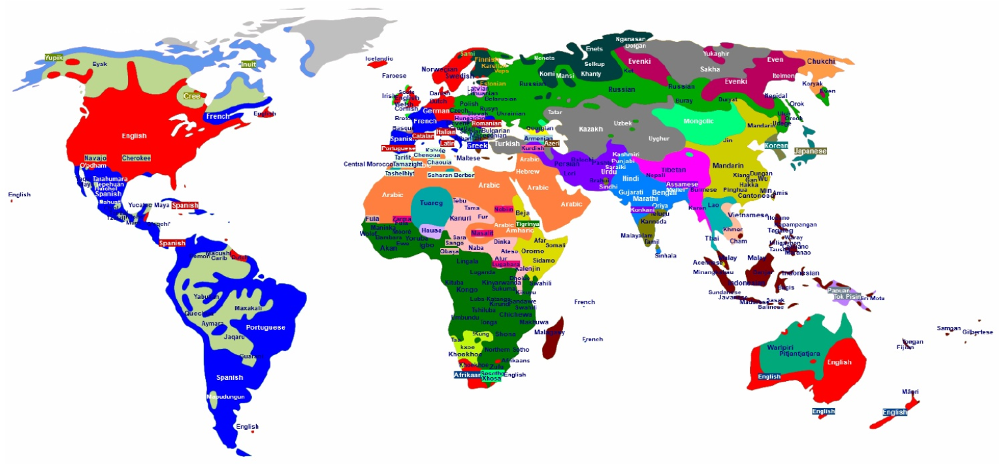
  - 实际上，某些语言的NLP得到了更好的发展
    - 更有趣：用户，市场， …
    - 更多资源：开发人员、数据、计算机
  - 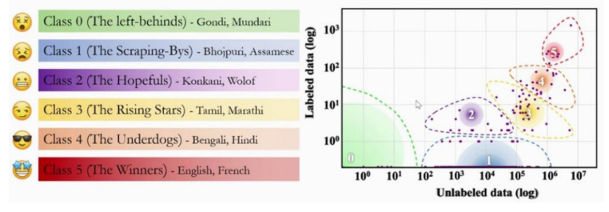
- 如何表示自然语言?
  - 理想情况下，是一种表达性强的形式语言
    - 一阶谓词逻辑
    - 编程语言
    - 神经元表示
    - 在实际场景中，取决于应用
      - 标签、特征、指令
- 相关领域 
  - 机器学习
    - ML是NLP中一个强大的(但不是唯一的)工具
    - NLP是ML的灵感来源
  - 语言学
    - 科学 vs. 工程
    - NLP <=> 计算语言学
  - 人工智能
    - NLP是AI的一个子领域
    - NLP是AI皇冠上的宝石
    - 解决NLP需要强大的AI
  - 语音处理
    - 很大程度上与NLP分离，但也有一些重叠
  - 认知科学/神经科学
    - 人类:唯一有效的NLP原型!
  - 逻辑、知识表示和推理
    - NLP分析NL， 并从逻辑语言生成NL
  - 计算理论
    - 学习形式语言和语法
    - 为NLP提供了大量的工具
- 应用
  - 聊天机器人
  - 机器翻译
  - 信息提取
  - 中文输入法
  - 语法检查器
  - 新闻聚类
  - 文本摘要
  - 新闻生成
  - 作文评分
  - 艺术创作
- NLP是困难的
  - 语言学
    - 语音学
    - 音韵学
    - 正字法
    - NLP相关
      - 形态学
      - 语法学
      - 语义学
      - 语篇分析
      - 语用学
  - 情感分析 
  - 世界知识
  - 歧义
  - AI研究面临的共同挑战
    - 高准确率
    - 噪声输入
    - 稀缺数据
    - 隐变量
    - 空间和时间上的计算复杂度
    - 泛化能力
    - 形式化验证
    - 可解释性
- 方法论
  - 符号主义
    - 1970s-1990s：符号主义主导，依赖形式文法和人工规则，只能处理有限、规整的语言场景。
    - “Whenever I fire a linguist, our system performance improves.” – Jelinek, 1988
  - 统计方法
    - 1990s-2010s：统计方法崛起，N-gram 模型、隐马尔可夫模型（HMM）等方法在语音识别、机器翻译等任务中取得突破，验证了数据驱动方法的优势。
    - “…I think the sequence model is very
effective, but at the same time I don't think it will be the ultimate natural language solution. In any case, we will eventually return to the non-sequence model and express many more interesting structures
than the sequence.” –Chris Manning, 2018
  - 联结主义
    - 2010s 后：联结主义（深度学习）复兴，神经网络、Transformer 模型进一步推动 NLP 发展，形成了现在的主流范式。
    - 2015: Deep Learning
    - 2017: Transformer
    - 2018: Pre-training
    - 2022: Large Language Model
  - Future of NLP
    - 语言结构
    - 符号化表示与逻辑推理
    - 数据需求少、计算效率高
    - 可解释性强
    - 扎实的理论根基
- 大纲
  - Basics（基础模块）
    - Text normalization：文本归一化（如分词、大小写统一、去停用词等预处理）
    - Text representation：文本表示（如 TF-IDF、词向量等）
    - Text classification：文本分类（如情感分析、主题分类）
    - Text clustering：文本聚类（如无监督话题聚合）
  - Sequences（序列模块）
    - Language modeling：语言模型（如 N-gram、RNN、Transformer 语言模型）
    - Sequence to sequence：序列到序列模型（如机器翻译、文本生成）
    - Pretrained language models：预训练语言模型（如 BERT、GPT 系列）
    - Large language models：大语言模型（LLM，如 GPT-4、LLaMA 等）
  - Structures（结构模块）
    - Sequence labeling：序列标注（如 NER 命名实体识别、词性标注）
    - Constituency parsing：成分语法分析（构建短语结构树）
    - Dependency parsing：依存语法分析（构建词与词的依存关系）
    - Semantic analysis：语义分析（如语义角色标注、词义消歧）
    - Discourse analysis：语篇分析（如篇章连贯、指代消解）

### 文本归一化

- 文本归一化
  - 分词Tokenizing (segmenting) words
  - 归一化单词格式 Normalizing word formats
  - 分句Segmenting sentences
- 分词
  - 基于空格的分词Space-based tokenization
    - 一种非常简单的分词方法，基于空格得到词元token
    - 对于在单词之间使用空格字符的语言，如基于书写系统的阿拉伯语、西里尔语、希腊语、拉丁语等，在空格(和标点符号)实例之间分割
    - 缺陷
      - 不能一味地去掉标点符号:
        - 连字符`-` 
        - 缩写：m.p.h.， Ph.D.， AT&T, cap'n
        - 价格与百分比($45.55)
        - 日期(01/02/06)
        - 网址(https://www.google.com)
        - 邮箱地址(someone@gmail.com)
        - 标签(#ilovenlp)
        - 省略号...
        - 应当正确地得到独立词元separate token
      - 语缀clitic
        - are” 在we're中， 法语“je” 在j'ai中， “le” 在l'honneur中
      - 多词表达multiword expressions (MWE)
        - New York, rock'n'roll
  - 基于正则表达式的分词Tokenization with regular expressions  
    - 正则表达式(RE)
      - RE编写一个匹配所有可能的词元但不匹配任何非词元的模式，输出所有不重叠的匹配
      - 可能内部有连字符的词
        - \w+(-\w+)*
      - 缩写词
        - ([A-Z]\.)+ 
      - 价格与百分比
        - \$?\d+(\.\d+)?%?
      - 省略号
        - \.\.\.
      - 独立词元
        - [][.,;"'?():\-_`]
  - 无空格语言的分词Tokenization in languages without spaces
    - 许多语言(如中文、日语、泰语)不使用空格来分隔单词
    - 一些西方语言的复合名词也一样
      - 德语:Freundschaftsbezeigungen(友好表示)
      - 社交媒体上的话题标签：#TrueLoveInFourWords
    - 分词方式不唯一
      - 姚明/进入/总决赛
      - 姚/明/进入/总/决赛
      - 姚/明/进/入/总/决/赛（单字分割）
    - 歧义
      - 南京市/长江大桥
      - 南京市长/江大桥
    - 通常由序列标注+监督学习解决（后续详细讨论）
  - 子词分词Subword tokenization
    - 子词词元可以是词的一部分，也可以是整个单词
    - 优势
      - 子词有时是有意义的
        - 词缀affix，（前缀prefix、后缀suffix），词干stem……
        - Ex: postprocessing→post, process, ing
      - 词汇量小得多
      - 避免词汇外(OOV)的单词
      - 能从数据中自动学习，不需要额外人工
    - 算法：
      - Byte-Pair Encoding (BPE) (Sennrich et al., 2016)
      - Unigram language modeling tokenization (Kudo, 2018)
      - WordPiece (Schuster and Nakajima, 2012)
      - 都由2部分组成:
        - 词元学习器，采用原始训练语料库归纳出词汇表(一组词元)。
        - 词元分割器，取原始测试句并根据词汇表对其进行分词
      - BPE
        - 算法 
          - 词汇表是所有单个字符的集合= {A, B, C, D， …， A, B, C, D ....}
          - 选择训练语料库中最频繁相邻的两个符号(比如‘A’ 、‘B’ )
          - 在词汇表中添加一个新的合并符号merge'AB'
          - 将语料库中相邻的'A' 'B'替换为'AB'。
          - 进行k次合并结束。
          - 在测试数据上，按照词汇被学习的顺序，用贪婪法运行从训练数据中学习到的每个合并符号
        - Ex
          - 原始语料库：low low low low low lowest lowest newer newer newer newer newer newer wider wider wider new new
          - 对原始语料库运行基于空格的分词算法
          - 添加词尾标记end-of-word tokens“_”，强调后缀
          - 产生词汇表:
            - 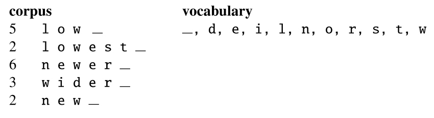
          - (e，r)数量最多，合并e，r到er 
            - 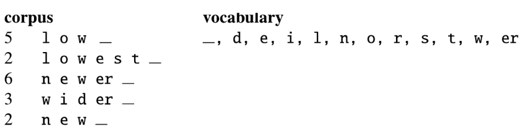
          - 合并(er，_)到er_
            - 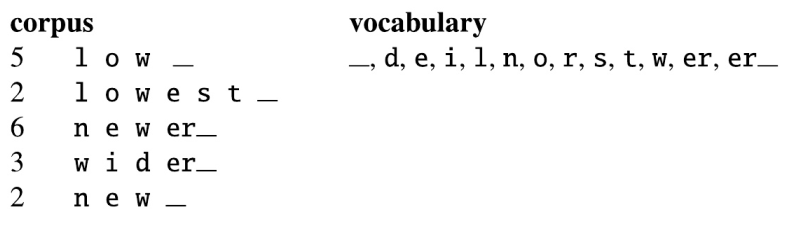
          - 合并(n，e)到ne
            - 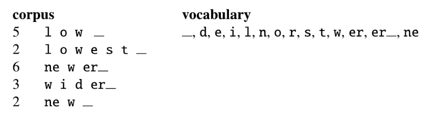
          - 依次进行
            - 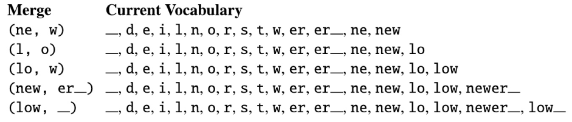
          - 在测试集上，将每个(e，r)合并到er，然后将(er，_)合并到er_，等等
          - 测试集“n e w er_” 将被分词为一个完整的单词
          - 测试集“low er_” 将是两个词元:“low er_”
        - BPE词元的属性
          - 经常包括频繁词和频繁子词
            - 比如-est或-er这样的语素Morphemes
          - 语素是语言中最小的意义承载单位
            - unbreakable有3个语素un-， -break-和-able
- 单词归一化
  - 以标准格式放置单词/词元
    - U.S.A. or USA
    - uhhuh or uh-huh
    - Putting or putting
    - am, is, be, are
  - 大小写折叠Case folding
    - 将所有字母缩写为小写
    - 在某些场景下很好
      - 信息检索:用户倾向于使用小写
    - 在其他情况下不太好
      - Ex:General Motors, Fed, US -> general motors, fed, us引发歧义
  - 词根化Lemmatization
    - 将所有单词表示为它们共有的词根，即字典词目格式dictionary headword form
    - 字典匹配是一个简单的方法
  - 词干分析Stemming
    - 由形态分析Morphological Parsing完成词根化
      - 语素Morphemes:
        - 构成单词的小的有意义的单位
        - 词干:承载核心意义的单位
          - 可以用来恢复词根lemma
        - 词缀affix:附着在词干上的部分，通常带有语法功能
      - 形态解析器Morphological Parsers:
        - 将猫解析成两个语素cat和s
        - 把unbelievable解析成un, believe和able三个语素 
    - 将词语简化为词干，粗切词缀
      -是词根化的一种简单粗暴的方法
    - Porter Stemmer
      - 基于一系列串联运行的重写规则
        - 级联，其中每个通道的输出馈送到下一个通道
        - 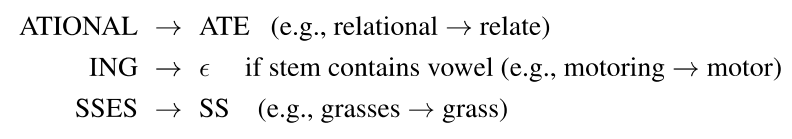
  - Ex
    - Sentence:
      - This was not the map we found in Billy Bones's chest.
    - Case folding：
      - this was not the map we found in billy bones's chest.  
    - Stemming:
      - Thi wa not the map we found in Billi Bone s chest.
    - Lemmatizing:
      - This be not the map we find in Billy Bones 's chest.
- 分句
  - !，?大多数情况无歧义，但句号.是非常模棱两可的
    - 不同句子的分隔
    - 像Inc.或Dr.这样的缩写。
    - 像0.02%或4.3这样的数字
  - 常用算法
    - 以分词为主
      - 在分词中，句号被分类为单词或句子的一部分
    - 基于分词，分句通常可以通过规则来完成
      - 标点符号：被分词出来的句号一般是真正的句末句号
      - 大写字母：句号后的token开头为大写字母，大概率是新句子

### 文本表示

- 单词表示
  - 基本概念
    - Ludwig Wittgenstein (1953): The meaning of a word is its use in the language
    - 我们该如何定义“使用” ?
    - 对“使用”的一个定义:在什么样的上下文中出现
    - Zellig Harris (1954): If A and B have almost identical environments we say that they are synonyms.
    - 上下文context就是环境
    - Ex
      - “青菜”是什么意思?
      - 假设你看到这些句子:
        - 青菜和大蒜一起炒，味道很美味。 
        - 青菜配米饭吃，味道超棒。
        - 配咸酱吃的青菜叶子。
      - 你也见过这些:
        - 菠菜和大蒜一起炒，配米饭吃。
        - 生菜的茎和叶都很美味。
        - 甘蓝和其他带咸味的绿叶蔬菜
      - 你可以推断：青菜是一种可烹饪食用的绿叶蔬菜
  - 而在传统的NLP中，我们将单词视为离散符号
    - 没有天然的相似性概念
      - 汽车旅馆vs酒店：语义上高度相关，但在传统表示中完全不相关。
    - 可能依赖于一个词库，例如WordNet，来衡量相似性，但是编译或更新同义词库需要大量的工作，存在以下缺点: 
      - 对于低资源语言/领域不可用
      - 容易过时
      - 经常缺少许多单词和短语
- 词向量
  - 用向量表示向量空间中的每个单词
    - 如果将离散符号进行独热编码，则彼此等价
    - 应当采用通用向量
      - 初始向量进行独热编码（或使用数字索引，不会生成真实独热向量，但数学本质仍是独热），通过可学习变换得到通用向量 
      - 可以用通用向量的相似度捕获词之间的相似度
      - 在许多ML系统中更容易处理
      - 可以从数据中学习
  - 类型
    - 稀疏向量表示
      - 共现矩阵co-occurrence matrices
        - Word-word matrix
          - 又称term-term矩阵
          - Word-word matrix是|V|x|V|
          - 每个单元格:单词共现的计数
          - 不在整篇文章中计数共现，使用较小的上下文
            - 段落
            - 前后k个单词的窗口
          - 单词现在由一个向量来表示，向量由单词共现的计数决定
          - Ex（前后7个单词的窗口）
            - 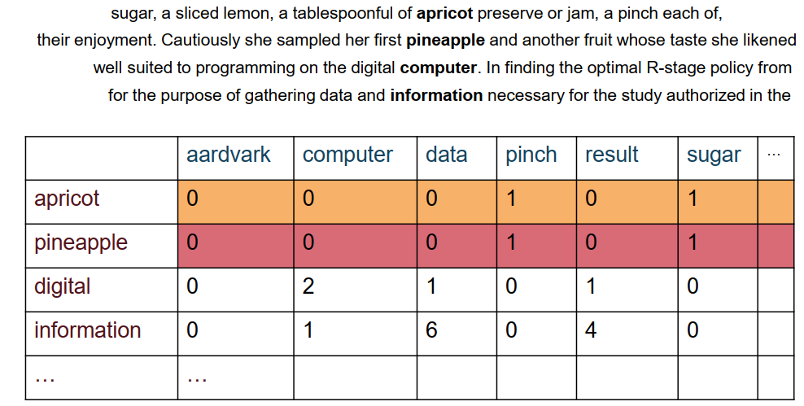
          - 我们只展示了4x6，但真正的矩阵是50000 x50000
          - 所以Word-word matrix是非常稀疏的，大多数值都是0。
            - 对于稀疏矩阵，有很多高效的算法。
          - 窗口的大小取决于目标。
            - 窗口越短(k=1-3)，向量表示越倾向于表示单词的语法
            - 窗口越长(k=4-10)，向量表示越倾向于表示单词的语义
        - 共现频率悖论 
          - 共现矩阵的每个单元格是共现频率
          - 共现频率显然是有用的:如果糖与菠萝的共现频率高，那是有用的信息。
          - 但原始频率是一个糟糕的表示:
            - 过于频繁的单词，比如the,it等不能很好地提供上下文信息。然而，它们的数量经常主导向量
          - 如何处理这种悖论?
        - PMI(点对互信息，Pointwise Mutual Information)
          - 将单词作为基本事件。事件x和y共同出现的次数比它们独立出现的次数多还是少? 
            \[
            PMI(X, Y) = \log_2 \frac{P(X, Y)}{P(X)P(Y)}
            \]
        - PPMI（正点对互信息，Positive Pointwise Mutual Information）
          - PMI 的取值范围为 $(-\infty, +\infty)$
          - 但PMI的负值存在明显问题
            - PMI的负值表示两个事物的共现频率低于随机预期值
            - 在没有大规模语料库的情况下，负值并不可靠
              - 假设词 $w_1$ 和 $w_2$ 的出现概率均为 $10^{-6}$
              - 此时很难判断 $P(w_1, w_2)$ 是否显著低于 $10^{-12}$
              - \(10^{-12}\) 这个概率极小，哪怕有 100 亿词的语料，期望共现次数也只有 10 次。实际语料中，两个词一次都没共现，完全可能只是样本不足
            - 此外，语言学中“负相关性”的定义本身并不明确
              - 自然语言中，词与词之间的强负相关几乎不存在，大部分 “不共现” 只是语义无关，而不是相互排斥。 
          - 因此直接将 PMI 的负值替换为 0
          - 词 $w_1$ 和 $w_2$ 之间的正点互信息（PPMI）定义为：
            \[
            PPMI(w_1, w_2) = \max\left(\log_2 \frac{P(w_1, w_2)}{P(w_1)P(w_2)}, 0\right)
            \]
          - Ex
            - 共现矩阵：W行C列的矩阵F
              - 行:一个单词
              - 列:一个上下文(也是一个单词)- fij是wi在context cj中出现的次数
              - $$
                p_{ij} = \frac{f_{ij}}{\sum_{i=1}^{W} \sum_{j=1}^{C} f_{ij}}
                $$
                $$
                p_{i*} = \frac{\sum_{j=1}^{C} f_{ij}}{\sum_{i=1}^{W} \sum_{j=1}^{C} f_{ij}}
                $$
                $$
                p_{*j} = \frac{\sum_{i=1}^{W} f_{ij}}{\sum_{i=1}^{W} \sum_{j=1}^{C} f_{ij}}
                $$
                $$
                PMI_{ij} = \log_2 \frac{p_{ij}}{p_{i*} \, p_{*j}}
                $$
                $$
                PPMI_{ij} =
                \begin{cases}
                PMI_{ij}, & PMI_{ij} > 0 \\
                0, & \text{otherwise}
                \end{cases}
                $$
              - 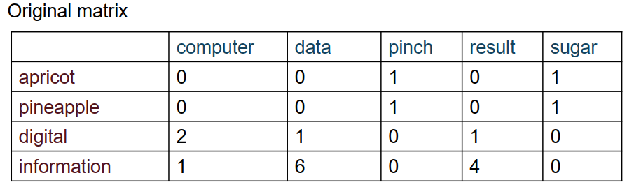
              - 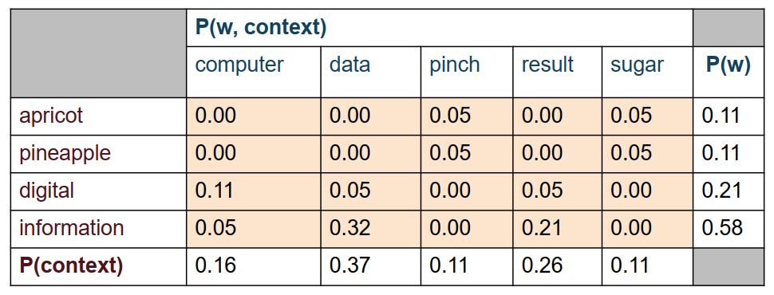 
              - 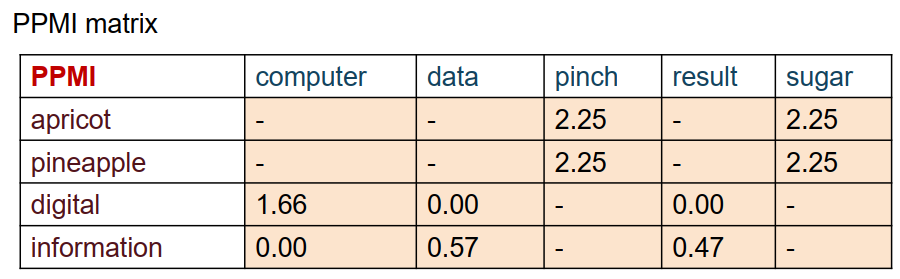
        - 加权PMI
          - PMI偏向于罕见事件
            - 非常罕见的单词具有非常高的PMI值
          - 两种解决方案
            - 给稀有词稍高的概率
            - 使用add-k拉普拉斯平滑(效果类似)
            - 只平滑非零和有效的PPMI值  
            - Ex
            - 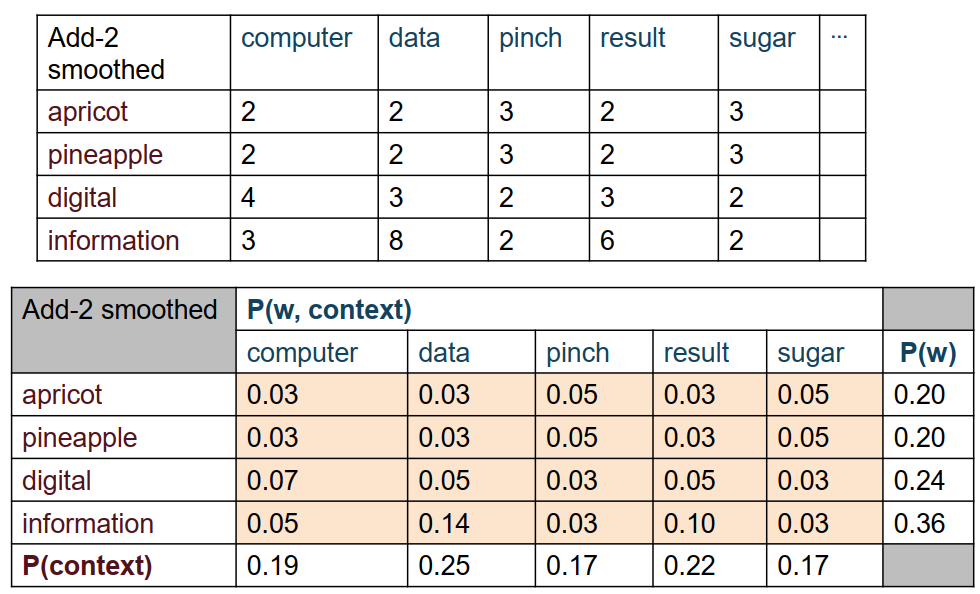
            - 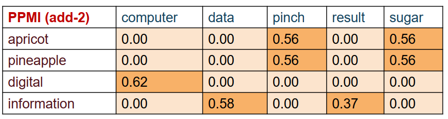
    - 稠密向量表示（也称词嵌入word embeddings）
      - 稠密向量通常比稀疏向量效果更好
        - 维度更低，消除了表示不重要信息的维度，降低噪声
        - 语义稠密，泛化能力更强
        - 更少的维度使模型参数总量变少，更容易训练和使用
      - 奇异值分解SVD
        - 是一种通用矩阵分解、降维算法，能把任意矩阵拆成3个正交矩阵的乘积，常用来对高维稀疏语义矩阵做压缩，生成低维稠密向量。 
        - 任意实数矩阵 $\boldsymbol{A}_{m\times n}$，均可分解：
          $$
          \boldsymbol{A} = \boldsymbol{U}\boldsymbol{\Sigma}\boldsymbol{V}^\top
          $$
          - $\boldsymbol{U}$：左奇异向量矩阵，代表词的稠密表示
          - $\boldsymbol{\Sigma}$：奇异值对角矩阵，数值越大代表承载语义信息越多
          - $\boldsymbol{V}$：右奇异向量矩阵，代表上下文表示
        - 原始稀疏 PPMI 矩阵 \(\boldsymbol{A}\)
        - SVD 拆分：\(\boldsymbol{A}=\boldsymbol{U}\boldsymbol{\Sigma}\boldsymbol{V}^\top\)
        - 舍弃小奇异值噪声维度，截取前 2 维核心分量
        - 矩阵相乘得到低维稠密词向量
        - Latent Semantic Analysis (LSA)
          - PCA（主成分分析） 基于 SVD
            - 将轴旋转到一个新空间
            - 在这个空间中，最高阶维度捕捉到原始数据集中最多的方差，下一个维度捕捉到下一个最多的方差，等等。
            - 舍弃低信息维度，使用更少的维度近似数据集 
          - LSA 是将 SVD 应用于term-document matrix的一种PCA (Deerwester et al, 1988)（也可以应用于term-term matrix，此处以term-term matrix为示例）
          - PPMI矩阵
          $$
          \boldsymbol{A}=
          \begin{bmatrix}
          0 & 1.32 & 1.32 & 0 & 0 & 0 & 0\\
          1.32 & 0 & 0 & 0.74 & 1.32 & 0 & 0\\
          1.32 & 0 & 0 & 0.74 & 1.32 & 0 & 0\\
          0 & 0.74 & 0.74 & 0 & 0 & 1.74 & 0\\
          0 & 1.32 & 1.32 & 0 & 0 & 0 & 0\\
          0 & 0 & 0 & 1.74 & 0 & 0 & 3.32\\
          0 & 0 & 0 & 0 & 0 & 3.32 & 0
          \end{bmatrix}
          $$

          - 左奇异矩阵$\boldsymbol{U}$
          $$
          \boldsymbol{U}=
          \begin{bmatrix}
          -0.610 & 0.002 & -0.215 & 0.108 & -0.053 & 0.021 & -0.009\\
          -0.502 & 0.301 & 0.422 & -0.206 & 0.101 & -0.042 & 0.018\\
          -0.502 & 0.301 & 0.422 & -0.206 & 0.101 & -0.042 & 0.018\\
          -0.201 & -0.603 & 0.105 & 0.412 & -0.203 & 0.083 & -0.034\\
          -0.201 & 0.301 & -0.527 & -0.304 & 0.152 & -0.061 & 0.025\\
          0.302 & -0.603 & -0.317 & -0.412 & -0.203 & -0.083 & 0.034\\
          0.604 & 0.002 & -0.105 & 0.108 & 0.053 & 0.021 & 0.009
          \end{bmatrix}
          $$

          - 奇异值对角矩阵$\boldsymbol{\Sigma}$
          $$
          \boldsymbol{\Sigma}=
          \begin{bmatrix}
          4.250 & 0 & 0 & 0 & 0 & 0 & 0\\
          0 & 2.180 & 0 & 0 & 0 & 0 & 0\\
          0 & 0 & 0.860 & 0 & 0 & 0 & 0\\
          0 & 0 & 0 & 0.410 & 0 & 0 & 0\\
          0 & 0 & 0 & 0 & 0.220 & 0 & 0\\
          0 & 0 & 0 & 0 & 0 & 0.090 & 0\\
          0 & 0 & 0 & 0 & 0 & 0 & 0.030
          \end{bmatrix}
          $$

          - 右奇异转置矩阵$\boldsymbol{V}^\top$
          $$
          \boldsymbol{V}^\top=
          \begin{bmatrix}
          -0.608 & -0.501 & -0.501 & -0.200 & -0.200 & 0.301 & 0.602\\
          0.001 & 0.300 & 0.300 & -0.601 & 0.300 & -0.601 & 0.001\\
          -0.213 & 0.420 & 0.420 & 0.103 & -0.525 & -0.315 & -0.103\\
          0.106 & -0.204 & -0.204 & 0.410 & -0.302 & -0.410 & 0.106\\
          -0.052 & 0.100 & 0.100 & -0.201 & 0.150 & -0.201 & 0.052\\
          0.020 & -0.041 & -0.041 & 0.081 & -0.060 & -0.081 & 0.020\\
          -0.008 & 0.017 & 0.017 & -0.033 & 0.024 & 0.033 & 0.008
          \end{bmatrix}
          $$
          - 截取二维子矩阵
          $$
          \boldsymbol{U}_2=
          \begin{bmatrix}
          -0.610 & 0.002\\
          -0.502 & 0.301\\
          -0.502 & 0.301\\
          -0.201 & -0.603\\
          -0.201 & 0.301\\
          0.302 & -0.603\\
          0.604 & 0.002
          \end{bmatrix},\quad
          \boldsymbol{\Sigma}_2=
          \begin{bmatrix}
          4.250 & 0\\
          0 & 2.180
          \end{bmatrix}
          $$
          - 稠密向量计算式
          $$\boldsymbol{Emb} = \boldsymbol{U}_2 \boldsymbol{\Sigma}_2$$
          - 最终稠密向量
          $$
          \boldsymbol{Emb}=
          \begin{bmatrix}
          -2.5925 & 0.0044\\
          -2.1335 & 0.6562\\
          -2.1335 & 0.6562\\
          -0.8543 & -1.3145\\
          -0.8543 & 0.6562\\
          1.2835 & -1.3145\\
          2.5670 & 0.0044
          \end{bmatrix}
          $$   
      - 神经网络方法
        - 静态词嵌入
          - word2vec
            - Word2vec (Mikolov et al. 2013)是一个学习词向量的框架
            - 算法:
              - 我们有一个很大的文本语料库
              - 遍历文本中的每个位置t， 它有一个中心
              单词c和几个上下文(“外部” )单词o
              - 假设每个单词都由一个向量表示
              - 使用c和o的词向量的相似性来计算给定c时o的概率（skip-grams）
              - 也可使用c和o的词向量的相似性来计算给定o时c的概率(CBOW)
              - 不断调整单词向量，使这个概率最大
            - skip-grams
              - 给定中心单词,预测上下文(“外部” )单词(位置无关，不区分上下文词的左右位置)
              - 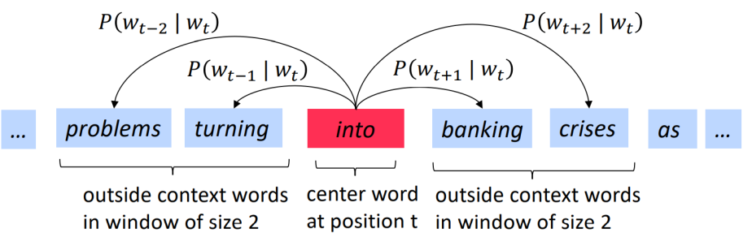 
              - 如何计算𝑃(𝑤𝑡+𝑗|𝑤𝑡)
              - 每个单词w有两个向量:
                - vw（w是中心词）
                - uw（w是上下文词）
              - 对于中心词c和上下文词o
                $$
                P(o|c) = \frac{\exp(u_o^T v_c)}{\sum_{w \in V} \exp(u_w^T v_c)}
                $$
                - 这被称为softmax函数
                  - 将任意值映射到概率分布
                  - “max”，因为它放大了最大值
                  - “soft”，因为它仍然保留了较小的值
                - 对于文本序列中的每个位置 $t=1,\dots,T$，给定中心词 $w_t$，预测固定窗口 $m$ 内的上下文词。
                - 似然函数（Likelihood）
                  $$
                  L(\theta) = \prod_{t=1}^{T} \prod_{\substack{-m \le j \le m \\ j \ne 0}} P(w_{t+j} \mid w_t; \theta)
                  $$
                  - 其中$\theta$是所有待优化的参数
                  - 目标函数（也称代价函数或损失函数）
                    $$
                    J(\theta) = -\frac{1}{T} \log L(\theta) = -\frac{1}{T} \sum_{t=1}^{T} \sum_{\substack{-m \le j \le m \\ j \ne 0}} \log P(w_{t+j} \mid w_t; \theta)
                    $$
                - 核心关系
                  $$
                  \text{最小化目标函数 } J(\theta) \iff \text{最大化预测准确率}
                  $$
              - softmax目标函数需要归一整个词汇表，对于大词汇表来说很昂贵
              - 共现概率目标函数
                - 对中心词 $c$ 和上下文词 $o$，模型直接建模共现概率：
                  $$
                  P(\text{co-occur} \mid c, o) = \sigma(\boldsymbol{u}_o^T \boldsymbol{v}_c)
                  $$
                  其中 $\sigma(z) = \frac{1}{1+e^{-z}}$ 为 sigmoid 函数。
                - 转化任务为二分类任务，无需对归一整个词汇表
                - 但是，如果只最大化训练语料中所有 $(c,o)$ 对的 $P(\text{co-occur} \mid c, o)$，模型为了让任意两个共现词的内积都大，会把所有向量都推向同一个方向，失去区分度。
                - 之前的 softmax 目标不会出现这个问题，因为它需要对所有词的概率做归一化，天然存在竞争。
                - 解决方案：负采样
                  - 对每个中心词 $c$，根据词频分布采样 $K$ 个负样本 $o$（未在窗口中出现的词）。
                  - 最大化正样本共现概率，同时最小化负样本的共现概率。
                  - 对于每对c-o
                    $$
                    \begin{aligned}
                    J(\theta, c, o) &= -\log P(\text{co-occur} \mid c, o) - \log \prod_{k=1}^{K} \left(1 - P(\text{co-occur} \mid c, o_k)\right) \\
                    &= -\log\left(\sigma(\boldsymbol{u}_o^T \boldsymbol{v}_c)\right) - \sum_{k=1}^{K} \log\left(1 - \sigma(\boldsymbol{u}_k^T \boldsymbol{v}_c)\right) \\
                    &= -\log\left(\sigma(\boldsymbol{u}_o^T \boldsymbol{v}_c)\right) - \sum_{k=1}^{K} \log\left(\sigma(-\boldsymbol{u}_k^T \boldsymbol{v}_c)\right)
                    \end{aligned}
                    $$          
                  - 最大化真实上下文词 $o$ 与中心词 $c$ 的共现概率,最小化 $K$ 个负样本词 $o_k$ 与中心词 $c$ 的共现概率（对比学习）
                  - 整体目标函数
                    $$
                    J(\theta) = \frac{1}{T} \sum_{t} \sum_{\substack{-m \le j \le m \\ j \ne 0}} J(\theta, w_t, w_{t+j})
                    $$
              - 优化Optimization
                - 随机梯度下降Stochastic gradient descent
                  - 梯度下降 
                    - 在最陡的下坡方向进行参数更新
                  - 随机的
                    - 从许多训练样例中计算目标参数
                    - 只根据一个训练样例(或一个Mini-batch的例子)的梯度进行参数更新
                - 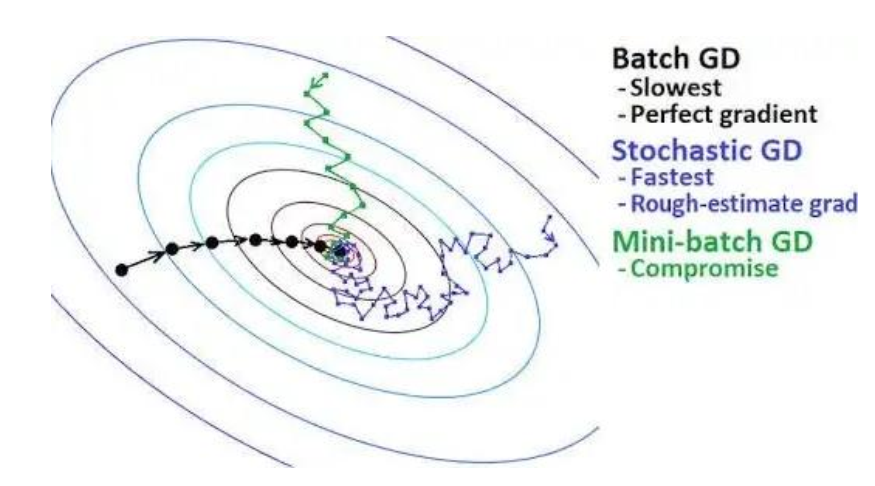
              - 每个单词有两个嵌入vw和uw，训练完毕后，下游任务只需要一个词向量。我们可以
                - 只使用vw
                - vw+uw
                - vw||uw
            - CBOW(Continuous Bag of Words)
              - 从(一袋)上下文词中预测中心词（位置无关，不关心上下文词的顺序）
          - GloVe
          - 评估词向量 
            - 内在的Intrinsic:
              - 对特定子任务的评估
              - 计算速度快
              - 有助于理解这个系统
              - 不清楚是否真的有帮助， 除非与下游相关
              - 词向量类比
                - a+b-c =?d
                  - king+woman-man=?queen
                - $$
                  d = \arg\max_{i} \frac{(\boldsymbol{x}_b - \boldsymbol{x}_a + \boldsymbol{x}_c)^\top \boldsymbol{x}_i}{\|\boldsymbol{x}_b - \boldsymbol{x}_a + \boldsymbol{x}_c\|}
                  $$
                - 通过线性代数操作，来测试词向量是否学到了合理的语义 / 语法关系
                - 无法测试非线性关系                 
            - 外在的Extrinsic:
              - 对下游任务的评价
              - 会花很长时间
              - 结果可能与中间系统，下游系统或者它们之间的相互作用有关   
        - 上下文相关向量表示Contextualized vector representations
          - 静态词嵌入的缺陷
            - 每个词恰好有一个嵌入，但是
              - I deposit the check in the bank.
              - We sit on the river bank.
              - bank在两句的用法显然不同
          - 静态词嵌入对上下文不敏感，需要上下文化的词嵌入，词表示在不同上下文中变化
          - 需要学习一个模型，该模型输出输入文本中词的上下文化嵌入  
            - ELMo，BERT，GPT，…（后续详细讨论）
- 文档表示Document Representation
  - 稀疏向量表示
    - 共现矩阵
      - Term-document matrix
        - 每个单元格：文档中单词 w 的计数
        - 每个文档是一个计数向量 $\in ℕ^𝑉$（即矩阵的一列）
        - 每个单词是一个计数向量在$\in ℕ^D$（即矩阵的一行）
        - 如果两个单词/文档的向量相似，则这两个单词/文档相似
        - 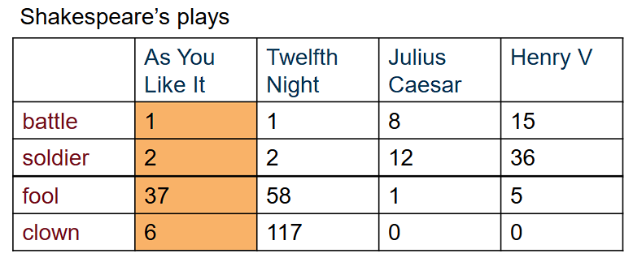
        - Term-document matrix中的行向量不是理想的词向量  
          - 如果文档数量少则效果不好
          - 高频词出现在所有文档中，它们的向量可能无法区分。
        - 原始频率仍然是一个糟糕的表示
          - 过于频繁的词如 the、it 或 they 对文档并没有太多信息。然而，它们的计数常常主导这些向量。
      - TF-IDF
        - 词频
          - $tf_{t,d} = \log_{10}{(count( t , d )+1)}$
          - 还有其他变体
        - 术语 t 的文档频率
          - $df_t$ 是出现 t 的文档数量。
        - 逆文档频率(idf)
          - $$
            \text{idf}_t = \log_{10} \left( \frac{N}{\text{df}_t} \right)
            $$ 
          - N 是集合中文档的总数。
        - 最终的tf-idf 值
          - $$
            w_{t,d} = \text{tf}_{t,d} \times \text{idf}_t
            $$
        - Ex
          - 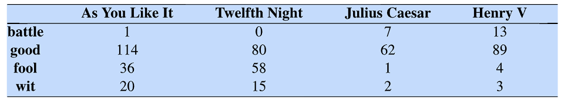
          - 通常对每个文档（列向量）进行 L2 归一化，以便于比较不同长度文档之间的差异。 
          - 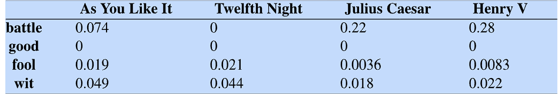
  - 稠密向量表示 
    - 奇异值分解（SVD）
      - 与之前示例类似，只保留前 k 个奇异值
      - 使用缩小后的 $\boldsymbol{U}$ 的每一行作为 k 维单词表示
      - 使用缩小后的 $\boldsymbol{V}^\top$ 的每一列作为 k 维文档表示
      - 结果是对原始矩阵A的最小二乘近似
    - 神经网络
      - 从词嵌入构建文档嵌入
        - 池化：均值，最大值
        - 分割词
        - 在词嵌入序列上应用LSTM或Transformer（后续详细讨论）
        - 也适用于短语/句子嵌入的构建。
    - 面向人文研究的词向量
      - 嵌入反映文化偏见
        - 问“巴黎 : 法国 :: 东京 : x” x = 日本
        - 问“父亲 : 医生 :: 母亲 : x” x = 护士
        - 问“男人 : 计算机程序员 :: 女人 : x” x = 家庭主妇
      - 训练词嵌入在不同年代的历史文本上，观察意义的变化
        - gay
          - 早期：含义偏向欢快愉悦
          - 后期：语义转变，特指同性恋相关含义
        - broadcast
          - 早期：本义为农业播种
          - 逐步演变：延伸为信息传播
          - 现代：专指广播电视节目播出
        - awful
          - 早期：表意令人敬畏，偏庄重褒义
          - 现今：词义贬义化，指代糟糕、可怕

### 文本分类

- 文本分类
  - 输入：
    - 一份文档 𝑑
    - 一组固定的类别 𝐶 = {𝑐 1 , 𝑐 2 , … , 𝑐 𝐾}
  - 输出：
    - 一个预测的类别 𝑐 ∈ 𝐶
  - 场景：
    - 垃圾邮件
    - 情感分析
    - 文章主题  
- 类型
  - 基于规则的方法
    - 需要专家编写规则
    - 正则表达式
  - 机器学习方法
    - 需要带标签的训练数据和计算资源进行训练
    - 生成式分类器Generative classifiers
    - 判别式分类器Discriminative classifiers
- 正则表达式
  - 一种用于指定文本模式的形式语言
    - 分词中使用了字符级正则表达式
    - 可以使用词级正则表达式进行文本分类
  - 一个文档可能匹配多个正则表达式
    - 一个简单的解决方案
      - 为每个正则表达式设置优先级
      - 返回具有最高优先级的匹配正则表达式的类的标签
    - 更复杂的解决方案
      - 逻辑表达式： (M1 ∨ M2) ∧ ¬M3 → L
  - 优势
    - 可解释
    - 易于诊断和操作
    - 不需要（标注的）数据和训练
  - 问题
    - 依赖人类专家编写
    - 覆盖率低，即使对于专家来说也很难覆盖所有情况
    - 无法基于标注数据自动演化
- 监督学习
  - 输入：
    - 一组固定的类别 𝐶 = {𝑐 1 , 𝑐 2 , … , 𝑐 𝐾}
    - 一个训练集 𝑚 手动标记的文档 (𝑑 1 , 𝑐 1) , … , (𝑑 𝑚 , 𝑐 𝑚)
  - 输出：
    - 一个训练完毕的分类器 𝑑 → 𝑐
  - 生成式分类器
    - 假设我们正在区分猫和狗的图像 
    - 生成式分类器为任何图像分配一个概率
    - 对猫图像构建模型，还要为狗图像构建一个模型。
    - 运行两个模型，看看哪个更适合。
    - 算法：
      - \[
        \hat{c} = \arg\max_{c \in C} P(c|d) = \arg\max_{c \in C} \frac{P(d|c)P(c)}{P(d)} = \arg\max_{c \in C} \overbrace{P(d|c)}^{\text{似然函数}} \overbrace{P(c)}^{\text{先验概率}}
        \]
      - $$
        c_{MAP} = \argmax_{c \in C} P(d|c)P(c) = \argmax_{c \in C} P(x_1, x_2, \dots, x_n|c)P(c)
        $$
        其中MAP指Maximum A Posteriori，最大后验估计
      - 先验概率可以直接从标注好的语料库中计算相对频率得到
      - 似然函数参数规模为$O(|X|^n \cdot |C|)$，只能在 |𝑋| 和 𝑛 较小且训练集较大时进行估计
      - 多项式朴素贝叶斯
        - 条件独立性
          - 假设在给定类别 𝑐 的情况下，词是独立的。
          - \[
            P(x_1, x_2, \dots, x_n|c) = P_1(x_1|c)P_2(x_2|c)\cdots P_n(x_n|c)
            \]
            \[
            C_{NB} = \argmax_{c \in C} P(c) \prod_{i \in \text{positions}} P_i(x_i|c)
            \]
             其中NB指Naive Bayes，朴素贝叶斯  
        - 词袋Bag of Words假设
          - 假设位置无关紧要
          - 所有位置共享相同的条件分布
          - \[
            \forall i,j:\ P_i(x|c) = P_j(x|c)
            \]
        - 朴素贝叶斯的概率图模型    
          - 一般形式\[
            P(f_i \mid c; \psi_i)
            \]
          - 词袋\[
            P(x_i \mid c; \psi_i)
            \]
          - 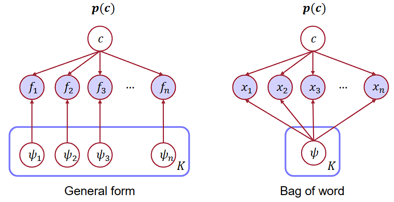 
        - 极大似然估计
          - 简单使用数据中的频率作为估计概率，反推$\psi_i$
          - \[
          \hat{p}(c_j) = \frac{N_{c_j}}{N_{\text{total}}}
          \]
            - 𝑁𝑐𝑗 是类别 𝑐 的文档数量；𝑁𝑡𝑜𝑡𝑎𝑙 是文档的总数量
          - \[
            \hat{P}(w_i \mid c_j) = \frac{\text{count}(w_i, c_j)}{\sum_{w \in V} \text{count}(w, c_j)}
            \]
            - 𝑐𝑜𝑢𝑛𝑡(𝑤, 𝑐)是单词 𝑤 在类别 𝑐 的所有文档中出现的次数
          - 问题：零条件概率导致零后验
            - 使用add-1拉普拉斯平滑
        - 未知词
          - 出现在测试集但不在训练集的词语
          - 从测试文档中删除它们并假装它们不存在，完全不包括它们的任何概率！
          - 为什么我们不构建一个未知词模型？
          - 这没有帮助：知道哪个类别有更多未知词没有用处，我们的目的是求解模型对于训练集中训练的词语的概率
          - Ex
            - 任务目标
              - 对测试句子 `predictable with no fun` 进行情感二分类（正面 / 负面）

            - 数据集与预处理
              - 训练数据
                - 负面（3篇）：just plain boring、entirely predictable and lacks energy、no surprises and very few laughs
                - 正面（2篇）：very powerful、the most fun film of the summer
              - 测试句子预处理
                - 原句：predictable with no fun
                - 移除停用词：with
                - 最终有效词：predictable, no, fun
            - 类别先验概率计算
              - 公式（极大似然估计）
            \[
            \hat{P}(c_j) = \frac{N_{c_j}}{N_{\text{total}}}
            \]
              - 总文档数：\(N_{\text{total}} = 5\)
              - 负面先验概率：\(P(-) = \dfrac{3}{5}\)
              - 正面先验概率：\(P(+) = \dfrac{2}{5}\)

            - 词条件概率计算（add-1平滑）
              - 平滑公式
                \[
                p(w_i|c) = \frac{\text{count}(w_i,c) + 1}{\sum_{w \in V}\text{count}(w,c) + |V|}
                \]
              - 词表大小：\(|V| = 20\)
              - 负面类别（总词数 = 14）
                - \(P(\text{predictable}|-) = \dfrac{1+1}{14+20} = \dfrac{2}{34}\)
                - \(P(\text{no}|-) = \dfrac{1+1}{14+20} = \dfrac{2}{34}\)
                - \(P(\text{fun}|-) = \dfrac{0+1}{14+20} = \dfrac{1}{34}\)
              - 正面类别（总词数 = 9）
                - \(P(\text{predictable}|+) = \dfrac{0+1}{9+20} = \dfrac{1}{29}\)
                - \(P(\text{no}|+) = \dfrac{0+1}{9+20} = \dfrac{1}{29}\)
                - \(P(\text{fun}|+) = \dfrac{1+1}{9+20} = \dfrac{2}{29}\)

            - MAP 最大后验预测
              - 决策公式
            \[
            C_{NB} = \argmax_{c} P(c)\prod P(w_i|c)
            \]
              - 负面得分计算
            \[
            P(-)P(S|-) = \frac{3}{5} \times \frac{2}{34} \times \frac{2}{34} \times \frac{1}{34} = 6.1 \times 10^{-5}
            \]
              - 正面得分计算
            \[
            P(+)P(S|+) = \frac{2}{5} \times \frac{1}{29} \times \frac{1}{29} \times \frac{2}{29} = 3.3 \times 10^{-5}
            \]
              - 最终结论
                - 负面得分大于正面得分
                - 模型预测该句子为负面情感                    
  - 判别式分类器
    - 只是试着区分狗和猫
    - \[
      \hat{c} = \arg\max_{c \in C} \overbrace{P(c|d)}^{\text{后验概率}}
      \]
    - 算法：
      - 使用表示文本的特征向量(即前文的词向量)
      - 逻辑回归Logistic regression
        - 二分类
          - 使用 Sigmoid 函数生成概率
            - 正类概率：$P(y = 1|x) = \sigma(w \cdot x + b) = \dfrac{1}{1 + e^{-(w \cdot x + b)}}$
            - 负类概率：$P(y = 0|x) = 1 - \sigma(w \cdot x + b) = \sigma(-(w \cdot x + b)) = \dfrac{e^{-(w \cdot x + b)}}{1 + e^{-(w \cdot x + b)}}$
            - 核心恒等式：$\sigma(-x) = 1 - \sigma(x)$
          - 将概率转换为分类器
            - 分类决策函数：
              $$f(x) = \begin{cases} 1, & \text{若 } P(y=1|x) > 0.5 \quad (\text{等价于 } w \cdot x + b > 0) \\ 0, & \text{其他情况} \quad (\text{等价于 } w \cdot x + b \le 0) \end{cases}$$
        - 多分类
          - 仍需计算权重向量 w 与输入向量 x 的点积
          - 但现在需要为 K 个类别中的每一类单独定义一个权重向量
          - 类别概率公式
            \[
            p(y = c|x) = \frac{\exp(w_c \cdot x + b_c)}{\sum_{j=1}^k \exp(w_j \cdot x + b_j)}
            \]
          - Softmax 函数
            - 将一个包含 k 个任意值的向量 \(z = [z_1,z_2, ..., z_k]\) 转换为概率分布
            - Softmax 定义式
                \[
                \text{softmax}(z) = \left[ \frac{\exp z_1}{\sum_{j=1}^k \exp z_j}, \frac{\exp z_2}{\sum_{j=1}^k \exp z_j}, ..., \frac{\exp z_k}{\sum_{j=1}^k \exp z_j} \right]
                \]
          - 当类别数 \(K=2\) 时，Softmax 就等价于二分类的 Sigmoid 函数。Softmax 是 Sigmoid 在多分类场景下的推广。
        - 最大化真实标签的条件对数似然
          - 等价于最小化交叉熵损失
          - 通常加入正则项以防止过拟合
          - 损失函数
            \[
            \mathcal{L} = \underbrace{-\frac{1}{N} \sum_{i \in N} \log p_\theta(y_i^* | x_i)}_{\mathcal{L}_{CE}} + \lambda \underbrace{R(\theta)}_{\mathcal{L}_{reg}}
            \]
            - \(\mathcal{L}_{CE}\)：交叉熵损失项
            - \(\mathcal{L}_{reg}\)：正则项，\(\lambda\) 为正则化系数
          - 使用随机梯度下降（SGD）进行优化
      - 支持向量机
      - 决策树
      - 神经网络
- 评估分类结果
  - 数据集
    - 在训练集上训练，在评估集上调整，在测试集上报告
  - 混淆矩阵
    - 2*2
      - 行：模型输出标签（system output labels）
        - system positive：模型预测为正
        - system negative：模型预测为负
      - 列：标准标签（gold standard labels）
        - gold positive：实际为正
        - gold negative：实际为负
      - 矩阵单元
        - true positive (TP)：预测为正、实际为正
        - false positive (FP)：预测为正、实际为负
        - false negative (FN)：预测为负、实际为正
        - true negative (TN)：预测为负、实际为负
    - 指标metrics
      - 精确率（Precision）
        - 公式：\(\text{precision} = \frac{tp}{tp + fp}\)
        - 含义：所有预测为正的样本中，真正为正的比例
        - 关注模型的预测结果，不把负例误判为正例
      - 召回率（Recall）
        - 公式：\(\text{recall} = \frac{tp}{tp + fn}\)
        - 含义：所有实际为正的样本中，被正确预测为正的比例
        - 关注真实数据分布，不把正例漏判为负例
      - 准确率（Accuracy）
        - 公式：\(\text{accuracy} = \frac{tp + tn}{tp + fp + tn + fn}\)
        - 含义：所有样本中，预测正确的比例
      - F值
        - 作用：将精确率P和召回率R合并为单一指标
        - 公式：
          \[
          F_\beta = \frac{(\beta^2 + 1)PR}{\beta^2 P + R}
          \]
        - 常用形式：F1（β=1）
          - 公式：
            \[
            F_1 = \frac{2PR}{P + R}
            \]
          - 含义：对精确率和召回率赋予相同权重的调和平均数
    - n*n
      - 结合n个类别的P/R以获得一个指标
      - 宏平均Macro-averaging：
        - 计算每个类别的指标
        - 然后对类别进行平均
      - 微平均Micro-averaging：
        - 将所有类别的统计数据汇总到一个混淆矩阵中
        - 从该表中计算精确度和召回率。

### 文本聚类

- 文本聚类
  - 输入：
    - 一组文档 𝑑 1 , 𝑑 2 , … , 𝑑 𝑛
  - 输出：
    - 一个聚类归属
      - 𝐶 1 = {𝑑 1 , 𝑑 3 , …}
      - 𝐶 2 = {𝑑 2 , 𝑑 6 , …}
      - 𝐶 3 = {𝑑 4 , …}
- 算法：
  - 用表示文本的特征向量
  - 应用任何聚类算法
    - 硬聚类：合并独立簇得到新簇;每个点只属于一个簇;需要向量之间的距离度量，例如L2
      - K均值聚类
      - 凝聚式层次聚类
    - 软聚类：每个点属于每个簇都有一个概率值 
      - 基于高斯混合模型的期望最大化算法（GMM-EM）
- 高斯混合（MoG）
  - 概率分布
    - $$
      p(\mathbf{x}) = \sum_{k=1}^K \pi_k \mathcal{N}(\mathbf{x}|\boldsymbol{\mu}_k, \boldsymbol{\Sigma}_k)
      $$
      $$
      \forall k: \ \pi_k \ge 0
      $$

      $$
      \sum_{k=1}^K \pi_k = 1
      $$
    - $\mathbf{x}$：观测数据点（向量形式）
    - $K$：高斯分量总数（即聚类的簇数）
    - $\pi_k$：混合系数，即第 $k$ 个分量的权重
    - $\mathcal{N}(\mathbf{x}|\boldsymbol{\mu}_k, \boldsymbol{\Sigma}_k)$：第 $k$ 个高斯分量，服从正态分布
      - $\boldsymbol{\mu}_k$：第 $k$ 个高斯分量的均值向量
      - $\boldsymbol{\Sigma}_k$：第 $k$ 个高斯分量的协方差矩阵
  - 变量
    - $X$：观测数据点
    - $Y$：簇标签
    - $P(Y)$：$K$ 个高斯分量（簇）的分布
      - $P(Y = i) = \pi_i$：第 $i$ 个分量的先验概率（混合系数）
    - $P(X|Y = i)$：条件概率分布，每个分量为高斯分布
      - 均值为 $\mu_i$，协方差矩阵为 $\Sigma_i$
  - 概率图模型
    - 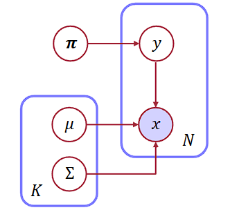  
  - 边缘似然函数Marginal Likelihood
    - $$
      \prod_{j} P(\mathbf{x}_j)
      = \prod_{j} \sum_{i} P(y_j = i, \mathbf{x}_j)
      = \prod_{j} \sum_{i} \pi_i \mathcal{N}(\mathbf{x}_j|\boldsymbol{\mu}_i, \boldsymbol{\Sigma}_i)
      $$
    - 作为无监督学习任务，在聚类中，我们不知道数据点的簇标签 \(Y\)（隐变量）。
    - 因此，我们的目标是最大化边缘似然，而不是完全似然。
    - 问题：存在“乘积在外、求和在内”的形式，无法直接通过求导得到参数的闭式解
    - 期望最大化
      - 选择 K 个随机聚类模型 (高斯分布)
        - 交替进行：
          - 将数据实例按照混合系数与高斯分布给不同的模型分配概率（E step）
          - 根据各个数据点按照混合系数与高斯分布给不同的模型分配的概率，优化每个聚类模型（M step）
        - 当边际似然没有显著变化时停止
      - 通过坐标上升Coordinate Ascent最大化边际似然。
        - 坐标上升是一种迭代优化策略，核心思想是：每次只优化一组参数（一个 “坐标”），其他参数固定不变；循环迭代，直到收敛。
        - E step：固定模型参数 \(\theta\)，计算隐变量 y 的分布（也就是数据点属于每个簇的后验概率）
        - M step：固定隐变量 y 的分布，优化模型参数 \(\theta\) 
        - 通过E step得到的隐变量 y 的分布，可以得到优化各个高斯分量的闭式解(即子问题闭式解)
      - E step
        - 计算每个数据点的标签分布
          $$
          P\left(y_j = i \mid \mathbf{x}_j, \theta^{(t)}\right) \propto \pi_i^{(t)} \mathcal{N}\left(\mathbf{x}_j \mid \boldsymbol{\mu}_i^{(t)}, \boldsymbol{\Sigma}_i^{(t)}\right)
          $$
          - 第 $t$ 次迭代的所有参数：$\{\pi_i^{(t)}, \boldsymbol{\mu}_i^{(t)}, \boldsymbol{\Sigma}_i^{(t)}\}$
          - 仅需计算数据点 $\mathbf{x}_j$ 在高斯分布下的概率密度
      - M step
        - 基于标签分布，计算参数的加权极大似然估计
          $$
          \mu_i^{(t+1)} = \frac{\sum_j P\left(y_j = i \mid \mathbf{x}_j, \theta^{(t)}\right) \mathbf{x}_j}{\sum_{j'} P\left(y_{j'} = i \mid \mathbf{x}_{j'}, \theta^{(t)}\right)}
          $$
          $$
          \Sigma_i^{(t+1)} = \frac{\sum_j P\left(y_j = i \mid \mathbf{x}_j, \theta^{(t)}\right) \left[\mathbf{x}_j - \mu_i^{(t+1)}\right]\left[\mathbf{x}_j - \mu_i^{(t+1)}\right]^T}{\sum_{j'} P\left(y_{j'} = i \mid \mathbf{x}_{j'}, \theta^{(t)}\right)}
          $$
          $$
          \pi_i^{(t+1)} = \frac{\sum_j P\left(y_j = i \mid \mathbf{x}_j, \theta^{(t)}\right)}{m}
          $$
          - $m$ 为训练样本总数
      - Ex
        - 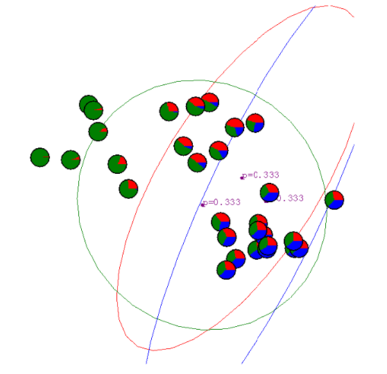
        - 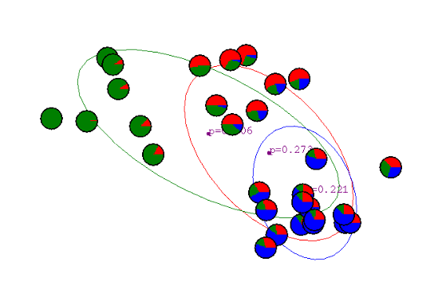 
        - 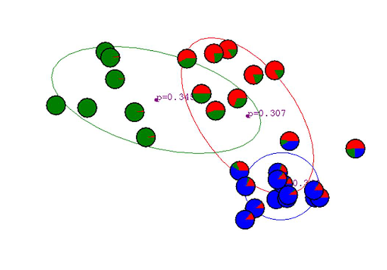
        - 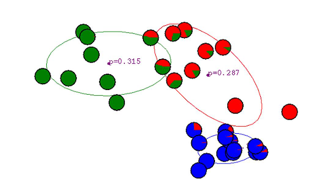
        - 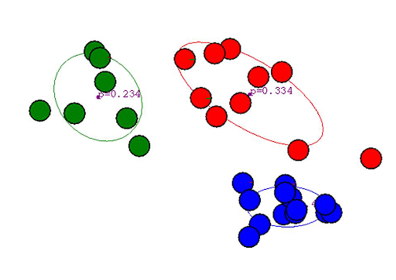
    - 随机梯度下降
  - 生成式模型
    - 高斯混合可以生成文档的特征向量：以概率 \(\pi_i\) 选择第 i 个分量 \(y = i\)，再从高斯分布 \(\mathcal{N}(\mathbf{x}|\mu_i, \Sigma_i)\) 中生成文档的特征向量
    - 
- 无监督朴素贝叶斯
  - 受高斯混合启发，我们可以直接使用 𝐾 个离散分布中的一个生成文档（单词序列）
  - 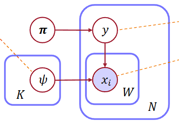 
  - 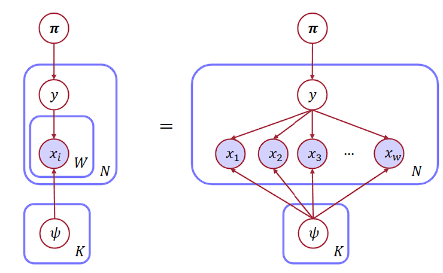
  - 观察概率图模型，可知这就是朴素贝叶斯模型
  - 触类旁通，我们可以运行EM进行朴素贝叶斯的无监督学习，即基于单词而不是特征的文本聚类。
    - E step
      - 计算每个各主题下的文档分布
        $$
        P\left(y_j = i \mid x_{j,1:w}, \theta^{(t)}\right) \propto \pi_i^{(t)} \prod_{k=1}^w P\left(x_{j,k} \mid \psi_i^{(t)}\right)
        $$
        - 其中w指文档$x_{j,1:w}$的长度
    - M step
      - 根据各个文档按照混合系数与所有属于文档的各主题下的词分布分配的主题概率，更新每个各主题下的词分布
      - 基于各主题下的文档分布，计算参数的加权极大似然估计
        - 显然，在此处使用被分配的文档作为估计值，与文本分类任务中使用频率作为估计值的朴素贝叶斯不同。因此，此处为无监督朴素贝叶斯，且应用于文本聚类任务
        - 也因此，与高斯混合处同理，应用于文本聚类任务的朴素贝叶斯无法直接得到闭式解
      - 定义各主题下的词分布：$\psi_i = \{p_{i,1}, p_{i,2}, \dots, p_{i,v}\}$，则
        $$
        p_{i,l}^{(t+1)} = \frac{\sum_j P\left(y_j = i \mid x_{j,1:w}, \theta^{(t)}\right) \sum_k \mathbf{1}(x_{j,k} = l)}{\sum_j P\left(y_j = i \mid x_{j,1:w}, \theta^{(t)}\right) \cdot w_j}
        $$
        $$
        \pi_i^{(t+1)} = \frac{\sum_j P\left(y_j = i \mid x_{j,1:w}, \theta^{(t)}\right)}{m}
        $$
        - 其中 $v$ 是词汇表大小，$m$ 是训练文档总数
- 主题建模Topic modeling
  - 到目前为止，我们假设每个文档有一个单一的聚类标签。但是，一个文档可能涵盖多个主题
  - 我们可以使用概率潜在语义分析（pLSA）
    - 相当于把无监督朴素贝叶斯的y变成主题分布
    - 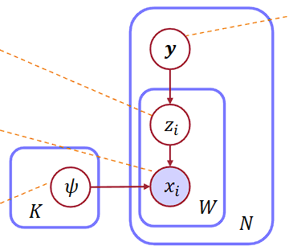
      - y:主题分布
      - z:分配给单词的主题  
    - 同样可通过 EM 算法进行学习
    - pLSA 与 LSA 均可挖掘文本潜在主题，其中LSA依托SVD，适合降维；pLSA依托概率模型，适合软聚类
  - 可进一步在主题与词分布上添加狄利克雷先验Dirichlet priors，即潜在狄利克雷分配（LDA）
    - 狄利克雷先验
      - 当我们把狄利克雷分布当作多项分布参数的先验分布时，它就叫狄利克雷先验 
    - 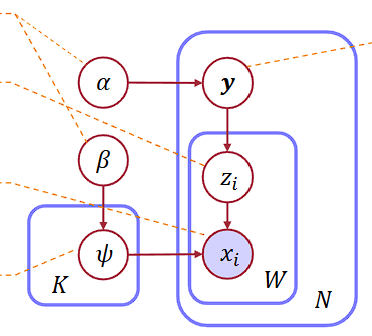 
      - $\alpha$：文档的主题分布的狄利克雷先验参数
      - $\beta$：各主题下的词分布的狄利克雷先验参数
      - $\alpha$ 与 $\beta$ 取值偏小时，可以促使主题分布与词分布呈现稀疏特性
      - 一篇文档仅包含少数几个主题
      - 单个主题中，只有部分词语出现频次较高
    - 模型学习方式：变分推断，马尔可夫链蒙特卡洛采样MCMC
- 期望最大化算法EM
  - 应用 
    - 可以用来学习任何具有隐变量（或数据维度缺失，样本缺失）的模型
    - 基于当前参数值计算隐藏变量的分布
    - 计算新的参数值以最大化基于隐藏变量分布的期望对数似然
    - 当没有变化时停止
    - 可以达到局部最优，但不一定是全局最优
  - 原理
    - EM 算法在 $F(\theta, Q)$ 上做坐标上升
    - 核心公式（Jensen 不等式保证下界成立）：
      $$
      \ell(\theta: \mathcal{D}) \ge F(\theta, Q) = \sum_{j=1}^m \sum_{\mathbf{z}} Q(\mathbf{z} \mid \mathbf{x}_j) \log \frac{P(\mathbf{z}, \mathbf{x}_j \mid \theta)}{Q(\mathbf{z} \mid \mathbf{x}_j)}
      $$
    - E步：固定参数 $\theta$，优化隐变量分布 $Q$
    - M步：固定隐变量分布 $Q$，优化参数 $\theta$
    - E步和M步都不会降低 $F(\theta, Q)$ 的值，EM收敛
- 评估聚类
  - Purity
    - 预测聚类包含真值聚类的程度
    - $$
      \text{Purity} = \frac{1}{N} \sum_{m \in M} \max_{d \in D} |m \cap d|
      $$
      - $N$：数据点总数
      - $M$：预测得到的聚类集合
      - $D$：真实标注的聚类集合
      - $|m \cap d|$：预测聚类 $m$ 与真实聚类 $d$ 的交集大小
    - Ex
      - $$
        \begin{align*}
        \text{Purity} &= \frac{1}{N} \sum_{m \in M} \max_{d \in D} |m \cap d| \\
        &= \frac{1}{9} \left( \max\{4,1\} + \max\{2,2\} \right) \\
        &= \frac{1}{9} \left( 4 + 2 \right) \\
        &\approx 0.6667
        \end{align*}
        $$
        混淆矩阵：
        |           | Pred. 1 | Pred. 2 |
        |-----------|---------|---------|
        | Gold. 1   | 4       | 2       |
        | Gold. 2   | 1       | 2       |
        
  - Inverse Purity
    - 与 Purity公式相似，交换M和D即可           
  - Rand index
  - MUC
  - B-CUBED 
      
        
            
              
             
                                                                  
                                                                                  
                                                                    