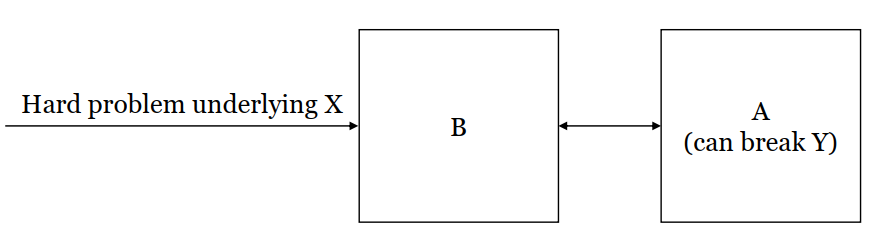

## 密码学

### 密码学入门

- 信息安全
  - 机密性：敏感信息不会被泄露给未经授权的个人、实体或过程的特性
  - 完整性：敏感数据未被未经授权且未被检测到的方式修改或删除的特性。
  - 可用性：授权用户、合法设备在需要时，能够正常、及时地访问和使用系统、数据、服务。
  - 可认证性：建立对用户或信息系统身份的信任的过程
  - 不可否认性：确保信息的发送者获得交付证明，接收者获得发送者身份的证明，双方都不能在事后否认已处理该信息
- 密码学
  - 研究用于保护数字信息、系统和分布式计算免受敌对攻击的数学技术
  - 研究与信息安全各个方面相关的数学技术，如机密性、数据完整性、实体认证和数据源认证。
  - 该学科体现了提供信息安全的原则、手段和方法，包括机密性、数据完整性、不可否认性和可认证性
  - Kerckhoffs’ principle：密码方法不必保密，并且它必须能够在落入敌人手中的情况下不造成不便
    - 安全性应仅仅依赖于密钥的保密性（香农：敌人知道系统）
    - 加密设计（算法）可以公开
    - 公开 ⇒ 找出弱点 ⇒ 做出改进 ⇒ 最终得到一个真正强大的设计
    - 国家安全中的许多设计仍未公开
  - 𝐏𝐫𝐢𝐯𝐊𝐄
    - 𝐆𝐞𝐧, 𝐄𝐧𝐜, 𝐃𝐞𝐜: 密钥生成，加密，解密
      - Gen 和 Enc 可能是概率性的
        - 使用随机数
        - 输出是一个随机变量
      - 𝑘: 私钥; 𝑚, 𝑐: 明文（消息）、密文
      - 𝒦 : 密钥空间; ℳ, 𝒞: 明文空间，密文空间
      - 𝐏𝐫𝐢𝐯𝐊𝐄 = (𝐆𝐞𝐧, 𝐄𝐧𝐜, 𝐃𝐞𝐜) + ℳ
        - 正确性
          - 𝐃𝐞𝐜 (𝑘, 𝐄𝐧𝐜 (𝑘, 𝑚)) = 𝑚
        - 安全性
          - 对手不应能够从 𝑐 学习到 𝑚
          - Alice 和 Bob 需要隐藏部分信息
          - 对攻击者保密密钥 $k$ 优于对攻击者保密解密算法 $\mathbf{Dec}$
            - $|k| \ll |\mathbf{Dec}|$，保密密钥 $k$ 容易得多。
            - 秘密泄露时，更换密钥 $k$ 要容易得多。
            - 在多用户场景，使用同一套算法、搭配多组密钥的实现方式要容易得多。  
- 大纲
  - 古典密码学
  - 现代密码学（1980年代后） 
    - 私钥加密：共享一个私钥以保证安全
      - 私钥加密
      - 消息认证码
      - 哈希函数
      - 实用构建
    - 公钥加密：不要分享任何私钥
      - 密钥交换
      - 公钥加密
      - 数字签名
    - 前沿课题
      - 安全计算，数字水印，差分隐私...

### 古典密码学

- 移位密码（凯撒密码的推广，约2000年前）
  - 方案 
    - $\mathcal{M} = \{\mathrm{a},\mathrm{b},...,\mathrm{z}\}^*$; $\mathcal{C} = \{\mathrm{A},\mathrm{B},...,\mathrm{Z}\}^*$; $\mathcal{K} = \{0,1,...,25\}$
    - $\{\mathrm{a},\mathrm{b},...,\mathrm{z}\} \leftrightarrow \{0,1,...,25\} \leftrightarrow \{\mathrm{A},\mathrm{B},...,\mathrm{Z}\}$: 双射
    - Gen: 选择 $k \leftarrow \{0,1,...,25\}$ 并输出 $k$。
    - $\mathrm{Enc}(k,m_1m_2...m_n)$: $c_i = (m_i + k) \bmod 26$; 输出 $c_1c_2...c_n$。
    - $\mathrm{Dec}(k,c_1c_2...c_n)$: $m_i = (c_i - k)\bmod 26$; 输出 $m_1m_2...m_n$。 
    - Ex： $\mathrm{Enc}(7, attack) = HAAHJR；\mathrm{Dec}(7, HAAHJR) = attack$
  - 暴力破解攻击：尝试所有可能的密钥，根据破解得到的原文有无意义，找到最有可能用于加密的那一个（又称穷举搜索）
  - 足够密钥空间原则：任何安全的加密方案必须具有足够大的密钥空间，以使穷举搜索攻击不可行。
    - |𝒦| 应该足够大
  - 暴力破解攻击的缺陷 
    - 密钥空间足够大的情况下，暴力破解攻击无法进行
    - 计算机很难判断给定的明文是否有意义，神经网络可以判断语义，但耗费时间
  - 改进的自动化攻击（启发式算法）
    - 需要足够长的密文
    - $p_i$: 在普通英文文本中，第 $i$ 个字母的频率，$i = 0,1, \dots, 25$
    $$
    \sum_{i=0}^{25} p_i^2 \approx 0.065
    $$

    - $q_i$: 密文中第 $i$ 个字母的频率

    - 如果密钥等于 $k$，那么对于所有 $i = 0,1, \dots, 25$，$p_i \approx q_{i+k}$，并且
    $$
    \sum_{i=0}^{25} p_i q_{i+k} \approx 0.065
    $$
    - 输出最接近0.065的$I_j = \sum_{i=0}^{25} p_i q_{i+j} \ (0 \le j \le 25)$  
- 替换密码
  - 方案
    - $\mathcal{M} = \{\mathrm{a},\mathrm{b},...,\mathrm{z}\}^*$; $\mathcal{C} = \{\mathrm{A},\mathrm{B},...,\mathrm{Z}\}^*$; $\mathcal{K}$ 为所有双射的集合 $\sigma: \{\mathrm{a},\mathrm{b},...,\mathrm{z}\} \to \{\mathrm{A},\mathrm{B},...,\mathrm{Z}\}$
    - Gen: 选择 $\sigma \leftarrow \mathcal{K}$ 并输出 $\sigma$。
    - $\mathrm{Enc}(\sigma, m_1m_2...m_n)$: $c_i = \sigma(m_i)$; 输出 $c_1c_2...c_n$。
    - $\mathrm{Dec}(\sigma, c_1c_2...c_n)$: $m_i = \sigma^{-1}(c_i)$; 输出 $m_1m_2...m_n$。
    - Ex
      - Gen: 随机选择一个密钥 $\sigma$
      - $\sigma$

        | 明文 |a|b|c|d|e|f|g|h|i|j|k|l|m|n|o|p|q|r|s|t|u|v|w|x|y|z|
        |:---- |:-:|:-:|:-:|:-:|:-:|:-:|:-:|:-:|:-:|:-:|:-:|:-:|:-:|:-:|:-:|:-:|:-:|:-:|:-:|:-:|:-:|:-:|:-:|:-:|:-:|:-:|
        | 密文 |X|E|U|A|D|N|B|K|V|M|R|O|C|Q|F|S|Y|H|W|G|L|Z|I|J|P|T|

      - $\mathrm{Enc}(\sigma, \text{tellhimaboutme}) = \text{GDOOKVCXEFLGCD}$
      - $\mathrm{Dec}(\sigma, \text{GDOOKVCXEFLGCD}) = \text{tellhimaboutme}$
  - |𝒦| = 26! ≈ $2^{88}$ : 对暴力破解攻击来说，密钥空间很大
  - 字母频率分析
    - 在替换密码中，每个字母都映射到一个固定字母，𝑚和𝜎(𝑚)的频率相等
    - 在正常的英文文本中，单个字母的频率是已知的
    - 分析频率，根据最常见的字母，双字母组合，三字母组合进行攻击
- Vigenère Cipher
  - 方案：
    - $\mathcal{K} = \mathcal{M} = \{\text{a,b,...,z}\}^*$，$\mathcal{C} = \{\text{A,B,...,Z}\}^*$
    - $\{\text{a,b,...,z}\} \leftrightarrow \{0,1,...,25\} \leftrightarrow \{\text{A,B,...,Z}\}$：双射
    - Gen：从字母表中随机选择密钥 $k$，记为 $k = k_1k_2\cdots k_t$（密钥长度为 $t$）。
    - Enc$(k, m_1m_2\cdots m_n)$：
      - 将明文按密钥长度分块：$m = m_1\cdots m_t \parallel m_{t+1}\cdots m_{2t} \parallel \cdots \parallel m_{(d-1)t+1}\cdots m_n$
      - 第 $i$ 位密文 $c_i$：将明文字母 $m_i$ 按密钥对应位 $k_I$ 的值向前移位
      - 输出密文：$c = c_1c_2\cdots c_n$
    - 索引规则：
    $$
    I =
    \begin{cases}
    i \bmod t & \text{当 } t \nmid i \\
    t & \text{当 } t \mid i
    \end{cases}
    $$
    - Dec$(k, c_1c_2\cdots c_n)$：反向执行加密过程（按密钥对应位向后移位）
  - 足够密钥空间：理论为无限
  - 明文中的相同（小写）字母可以映射为密文中的不同（大写）字母
  - 仍然不安全，可以被频率分析
  - Kasiski’s Method
    - 寻找密钥长度 𝑡  
      - 相同的片段可能在明文中多次出现
      - 如果两个相同的有一定长度的明文段被加密为相同的密文段，则它们的距离极大可能是密钥长度 𝑡 的倍数
      - 在密文中搜索长度至少为三的相同片段对；
      - 记录任意两个片段起始位置之间的距离；
      - 输出这些距离的最大公约数
    - 如果密钥长度 𝑡 已知，只需通过考虑以下 𝑡 个序列来破解 𝑡 个移位密码
  - Index of Coincidence
    - 正常英文文本：设 $p_0, p_1, \dots, p_{25}$ 为 a、b、…、z 出现的频率，对应一段普通的英文文本。则：
      $$
      \sum_{i=0}^{25} p_i^2 \approx 0.065
      $$
    - 随机英文文本：设 $q_0, q_1, \dots, q_{25}$ 为字母 A、B、…、Z 在随机英文文本中出现的频率。$q_i \approx 1/26$ 对所有 $i = 0,1, \dots, 25$ 成立，则：
      $$
      \sum_{i=0}^{25} q_i^2 \approx 0.038
      $$ 
    - 对于 $\tau = 1,2,\dots$：将密文 $c_1c_2\cdots$ 分割为
      $$
          \begin{aligned}
          \boldsymbol{c}_1 &= c_1c_{1+\tau}c_{1+2\tau}\cdots \\
          \boldsymbol{c}_2 &= c_2c_{2+\tau}c_{2+2\tau}\cdots \\
          &\vdots \\
          \boldsymbol{c}_\tau &= c_\tau c_{2\tau}c_{3\tau}\cdots
          \end{aligned}
      $$
    - 如果 $\tau = t$，那么每个 $\boldsymbol{c}_1,\boldsymbol{c}_2,\dots,\boldsymbol{c}_\tau$ 都使用相同的字母加密， 在所有 $\boldsymbol{c}_1,\boldsymbol{c}_2,\dots,\boldsymbol{c}_\tau$ 中$\sum_{i=0}^{25} q_i^2 \approx 0.065$
    - 如果 $\tau \neq t$，那么每个 $\boldsymbol{c}_1,\boldsymbol{c}_2,\dots,\boldsymbol{c}_\tau$ 都使用不同的字母加密，在所有的 $\boldsymbol{c}_1,\boldsymbol{c}_2,\dots,\boldsymbol{c}_\tau$ 中$\sum_{i=0}^{25} q_i^2 \approx 0.038$ 。
    - 输出在所有 $\boldsymbol{c}_1,\boldsymbol{c}_2,\dots,\boldsymbol{c}_\tau$中，$\sum_{i=0}^{25} q_i^2 $最接近0.065的$\tau$作为t
    - 如果密钥长度 𝑡 已知，只需通过考虑以下 𝑡 个序列来破解 𝑡 个移位密码
- 从古典密码学到现代密码学
  - 所有古典密码都被破解了
    - 对手只学会一个密文（𝑐）
    - 对手可以恢复消息（𝑚）和密钥（𝑘）
  - 古典密码学是一门艺术，而不是一门科学
    - 没有安全的正式定义
    - 没有安全性证明
  - 现代密码学原理
    - 安全的正式定义
    - 精确假设
    - 安全性证明

### 现代密码学

- 安全的正式定义
  - 安全保证：该方案旨在防止对手做什么？成功的攻击是什么？ 
    - 对手不可能恢复私钥 𝑘
      - 不安全！对于𝐄𝐧𝐜 (𝑘, 𝑚) = 𝑚 ，虽然对手不可能恢复私钥 𝑘，但是整个明文都被泄露
    - 对手不可能从 𝑐 中恢复整个 𝑚
      - 不安全！泄露部分内容也可能是敏感的，如财务数据、医疗数据。
    - 对手不可能从 𝑐 中恢复 𝑚 的任何字符
      - 不安全！该方案也可能会泄露 𝑚 包含的特征、范围或判定结果，如出价>$10^6$或≤ $10^6$。
    - 对手不应该能够从 𝑐 获得任何关于 𝑚 的额外信息
      - 这是一个良好的安全保证。
  - 威胁模型：假定对手能够执行的操作，定义对手的力量
    - 唯密文攻击 (COA)：
      - 对手观察一个密文（或多个密文），确定有关明文（或多个明文）的信息。
      - 移位密码、替换密码和维吉尼亚密码在唯密文攻击下都被破解了。
    - 已知明文攻击（KPA）：
      - 对手获取使用某个密钥生成的一个或多个明文和密文对，试图确定使用相同密钥生成的其他密文的底层明文的信息。
      - 所有古典密码在已知明文攻击下都很容易被破解。
    - 选择明文攻击（CPA）：
      - 对手获得其选择的明文的明文/密文对，试图确定使用相同密钥生成的其他密文的底层明文的信息。
    - 选择密文攻击（CCA）：
      - 对手可以获取其选择的明文对应的明文/密文对，以及其选择的密文对应的密文/明文对，试图确定使用相同密钥生成的其他密文的底层明文的信息。
  - 定义：对于特定场景下的密码方案，若具备相应能力的攻击者无法实现既定破解目标，则称该方案是安全的。
- 精确假设
  - 假设：未经证明但推测为真的命题
    - 整数分解问题很难。从 𝑁 = 𝑝𝑞 学习 𝑝, 𝑞 很难。
      - RSA 公钥加密；Paillier 加密；⋯
    - 离散对数问题很难。
      - ElGamal 加密；BGN 加密
    - 现代密码学的构造基于假设
    - 事实上，由于 P =? NP 未证明，无法严格证明任何一个 NP 问题不存在多项式解法，因此只能作为假设
  - 为什么要精确假设：
    - 便于分析，建立安全可信度
    - 便于对比不同方案的安全强度
    - 明确方案的安全前提与风险边界
- 安全性证明
  - 证明是相对于安全性定义和精确假设的。如果设计的加密方案可以被对手破解，那么其基础假设就是错误的。
  - 安全定理：假设 X 为真（例如，某个问题是困难的），方案 Y 根据给定定义是安全的
  - 安全性证明：给定一个按照定义破坏方案 Y 的对手 A，利用 A 我们可以构造某个东西（一个算法 B）来证明 X 是假的（解决与 X 相关的问题）
  -  
- 完美保密
  - 令**密钥分布 $K$, 明文分布 $M$ 是独立的随机变量** 
  - 对于任意明文分布 $M$、任意明文 $m \in \mathcal{M}$，以及任意密文 $c \in \mathcal{C}$（ $\Pr[C = c] > 0$），方案 $\Pi = (\mathsf{Gen}, \mathsf{Enc}, \mathsf{Dec})$ 满足：
    $$
    \Pr[M = m \mid C = c] = \Pr[M = m]
    $$
    - 该安全定义要求明文 $M$ 与密文 $C$ 相互独立。
    - 通常默认所有出现的密文 $c$ 均满足 $\Pr[C = c] > 0$。
  - 安全保证：敌手无法从密文 $c$ 中获得关于明文 $m$ 的任何额外信息，即：
    $$
    \Pr[M = m \mid C = c] = \Pr[M = m]
    $$
  - 威胁模型：
    - 敌手拥有无限计算能力（无算力限制）
    - 敌手仅观察单个密文
      - 如果敌手可观察多个密文，由于当敌手能够观察到同一个密钥加密的多个密文 \(c_1, c_2, \dots, c_n\) 时，其对明文 \(m\) 的后验概率变为：
  \[
  \Pr\left[M = m \mid C = c_1, C = c_2, \dots, C = c_n\right]
  \]
  此时，即使每个单个密文都满足完美保密的条件（即对任意 \(i\)，\(\Pr[M=m \mid C=c_i] = \Pr[M=m]\)），**多个密文的联合条件概率也不再等于先验概率 \(\Pr[M=m]\)**。
  - 方案 $\Pi = (\mathsf{Gen},\mathsf{Enc},\mathsf{Dec})$ 完美保密,当且仅当 $\forall m, m' \in \mathcal{M},\ \forall c \in \mathcal{C},\ \Pr[\mathsf{Enc}(K,m) = c] = \Pr[\mathsf{Enc}(K,m') = c]$ 
    - 对任意 $m \in \mathcal{M}$, $\Pr[\mathsf{Enc}(K,m) = c] = \Pr[C = c|M = m]$ 
      - $\Pr[C = c|M = m] = \Pr[\mathsf{Enc}(K,M) = c|M = m] = \Pr[\mathsf{Enc}(K,m) = c]$
    - ⇐
      - 对 $\forall m \in \mathcal{M},\ c \in \mathcal{C}$，由贝叶斯公式：
      $$
      \Pr[M = m \mid C = c] = \frac{\Pr[C = c \mid M = m]\Pr[M = m]}{\Pr[C = c]}
      $$
      - 先推导 $\Pr[C = c \mid M = m] = \Pr[C = c]$：
      $$
      \begin{align*}
      \Pr[C = c] &= \sum_{m' \in \mathcal{M}} \Pr[C = c \mid M = m']\Pr[M = m'] \\
      &= \sum_{m' \in \mathcal{M}} \Pr[C = c \mid M = m]\Pr[M = m'] \\
      &= \Pr[C = c \mid M = m]
      \end{align*}
      $$
      - 代入贝叶斯公式可得：
      $$
      \Pr[M = m \mid C = c] = \Pr[M = m]
      $$
      满足完美保密定义。
    - ⇒
      - 由完美保密定义变形：
      $$
      \Pr[\mathsf{Enc}(K,m)=c] = \Pr[C = c \mid M = m] = \frac{\Pr[M=m \mid C=c]\Pr[C=c]}{\Pr[M=m]} = \Pr[C = c]
      $$
      - 同理对任意 $m'$ 有：
      $$
      \Pr[\mathsf{Enc}(K,m')=c] = \Pr[C = c]
      $$
      - 因此得到：
      $$
      \Pr[\mathsf{Enc}(K,m) = c] = \Pr[\mathsf{Enc}(K,m') = c]
      $$
- One-Time Pad（OTP）一次一密
  - 方案：𝒦 = {0,1}ⁿ, ℳ = {0,1}ⁿ, 𝒞 = {0,1}ⁿ
    - Gen: 从 {0,1}ⁿ 中随机选择 k 并输出 k
    - Enc(k, m): 输出 c = k ⊕ m
    - Dec(k, c): 输出 k ⊕ c
      - 等同于模2加法
      - (k₁⋯kₙ) ⊕ (m₁⋯mₙ) = (k₁ ⊕ m₁)⋯(kₙ ⊕ mₙ)
  - 曾用于白宫与克里姆林宫之间的“红机”热线
  - One-Time Pad是完美保密的
    - 对于任意明文 $m$，有 $\Pr[C = c|M = m] = \Pr[K \oplus m = c] = \Pr[K = m \oplus c] = 2^{-n}$
    - 对于任意明文 $m'$，有 $\Pr[C = c|M = m'] = \Pr[K \oplus m' = c] = \Pr[K = m' \oplus c] = 2^{-n}$
    - 因此$\Pr[C = c|M = m] = \Pr[C = c|M = m']$
  - One-Time Pad 的缺陷
    - 密钥长度过长：密钥长度与明文长度相同，即 $|k| = |m|$
      - Kerckhoffs’ principle：密钥必须能够在不借助书面记录的情况下传递和记忆，且通信双方必须能够随时更改或修改它
    - 一次性安全：同一密钥不能重复使用
      - 若 $c = k \oplus m$，$c' = k \oplus m'$，则可推导出 $m \oplus m' = c \oplus c'$
      - 苏联曾因重复使用One-Time Pad密钥而导致信息泄露             
                          