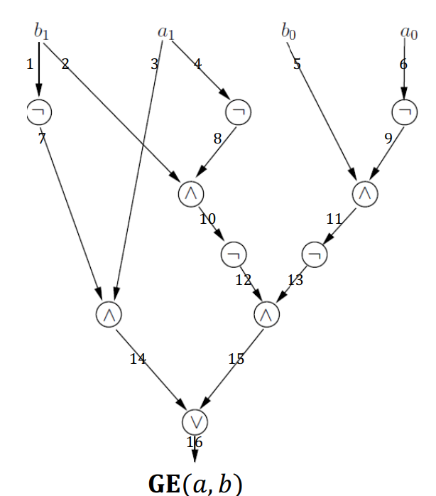
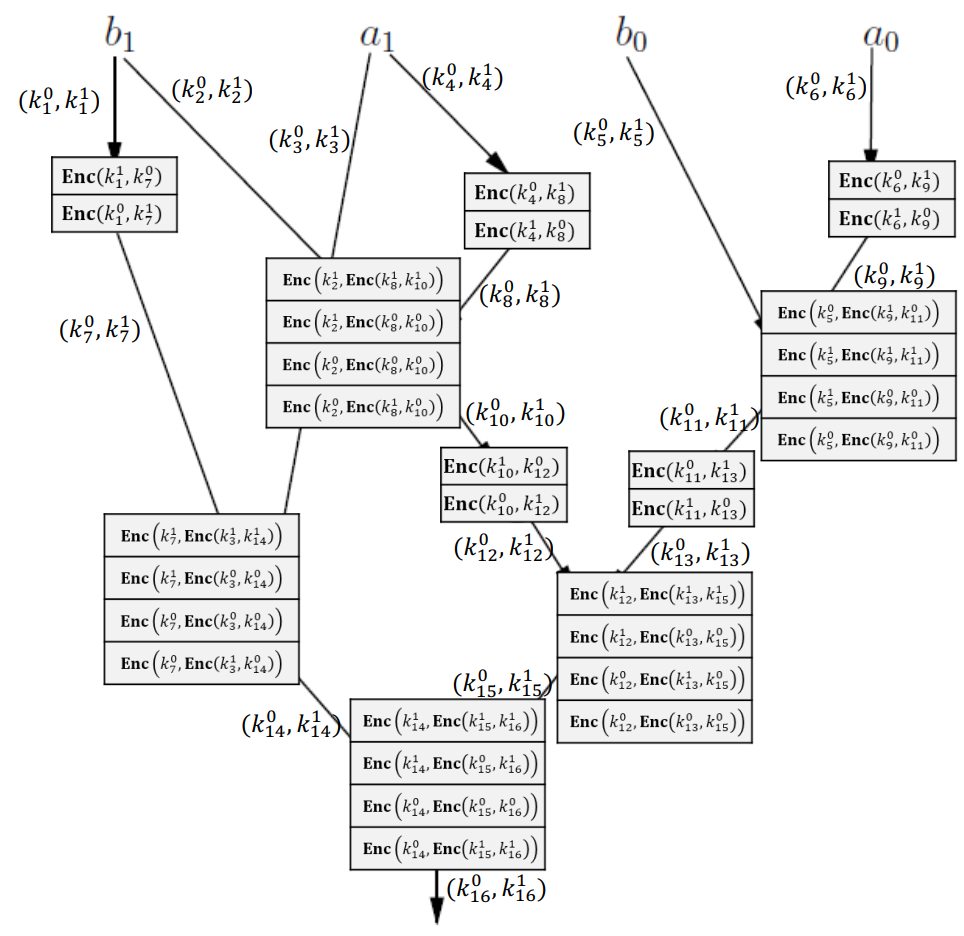

- 密码学1 可用性 强调与密码学无关
- 安全计算改为安全多方计算

- 安全定义
  - 完美保密与完美不可区分：无法满足
    - 攻击者掌握公钥$pk$，可自行加密任意明文与目标密文比对，必然泄露明文信息 
  - $\text{EAV}$ 安全与 $\text{mEAV}$ 安全等价
  - $\text{CPA}$ 安全与 $\text{mCPA}$ 安全等价
  - $\text{CPA}$ 安全与 $\text{EAV}$ 安全等价
- $\text{EAV}$ 安全
  - 设 $\Pi=(\text{Gen}, \text{Enc}, \text{Dec})+\mathcal{M}$ 为公钥加密方案
  - 定义窃听不可区分实验 $\text{PubK}_{\mathcal{A},\Pi}^{\text{eav}}(n)$(注意主体为$\text{PubK}$，与$\text{PrivK}$不同)
    - 挑战者生成 $(pk, sk) \leftarrow \text{Gen}(1^n)$，将 $pk$ 发给敌手
    - 敌手基于 $pk$ 选择两个等长明文 $m_0, m_1 \in \mathcal{M}$
    - 挑战者随机选 $b \leftarrow \{0,1\}$，计算 $c \leftarrow \text{Enc}(pk, m_b)$
    - 敌手输出 $b'$，若 $b'=b$ 则实验输出 $1$，否则输出 $0$
  - 定义：公钥加密方案 $\Pi$ 具有窃听下不可区分加密($\text{EAV}$ 安全)，若对所有 $\text{PPT}$ 敌手 $\mathcal{A}$，存在可忽略函数 $\text{negl}(\cdot)$ 使得
    - $\Pr\left[\text{PubK}_{\mathcal{A},\Pi}^{\text{eav}}(n)=1\right] \leq \frac{1}{2} + \text{negl}(n)$
    - 等价定义：$\left|\Pr\left[\text{PubK}_{\mathcal{A},\Pi}^{\text{eav}}(n)=1\right] - \frac{1}{2}\right| \leq \text{negl}(n)$
  - 公钥加密的 $\text{EAV}$ 安全有多强？
    - 敌手掌握公钥 $pk$，可自行加密
    - 与 $\text{mEAV}$ 安全，$\text{CPA}$ 安全一样强
- $\text{CPA}$ 安全
  - 设 $\Pi=(\text{Gen}, \text{Enc}, \text{Dec})+\mathcal{M}$ 为公钥加密方案
  - 定义选择明文攻击不可区分实验 $\text{PubK}_{\mathcal{A},\Pi}^{\text{cpa}}(n)$
  - $\text{PubK}_{\mathcal{A},\Pi}^{\text{cpa}}(n) = \text{PubK}_{\mathcal{A},\Pi}^{\text{mult}}(n) = \text{PubK}_{\mathcal{A},\Pi}^{\text{eav}}(n)$
  - 公钥加密中，加密预言机是冗余的，有公钥即可自行加密
  - 公钥加密选择明文攻击不可区分实验与公钥加密窃听不可区分实验相同
  - 定义：公钥加密方案 $\Pi$ 具有选择明文攻击下不可区分加密($\text{CPA}$ 安全)，若对所有 $\text{PPT}$ 敌手 $\mathcal{A}$，存在可忽略函数 $\text{negl}(\cdot)$ 使得
    - $\Pr\left[\text{PubK}_{\mathcal{A},\Pi}^{\text{cpa}}(n)=1\right] \leq \frac{1}{2} + \text{negl}(n)$
    - 等价定义：$\left|\Pr\left[\text{PubK}_{\mathcal{A},\Pi}^{\text{cpa}}(n)=1\right] - \frac{1}{2}\right| \leq \text{negl}(n)$
  - 定理：对公钥加密，$\text{EAV}$ 安全等价于 $\text{CPA}$ 安全
- $\text{CCA}$ 安全(公钥加密)
  - $\text{CCA}$ 不可区分实验 $\text{PubK}_{\mathcal{A},\Pi}^{\text{cca}}(n)$
  - 挑战者生成 $(pk, sk) \leftarrow \text{Gen}(1^n)$，将 $pk$ 发给敌手
  - 敌手可访问解密预言机 $\text{Dec}(sk, \cdot)$
  - 敌手选择两个等长明文 $m_0, m_1$
  - 挑战者随机选 $b \leftarrow \{0,1\}$，计算 $c \leftarrow \text{Enc}(pk, m_b)$
  - 敌手继续访问解密预言机，但不能用 $c$ 查询
  - 敌手输出 $b'$，若 $b'=b$ 则实验输出 $1$，否则输出 $0$
  - $\text{Dec}(sk, \cdot)$：输入密文 $c \in \mathcal{C}$，输出 $m \leftarrow \text{Dec}(sk, c)$
  - 定义：$\Pi$ 具有选择密文攻击下不可区分加密($\text{CCA}$ 安全)，若对所有 $\text{PPT}$ 敌手 $\mathcal{A}$，存在可忽略函数 $\text{negl}(\cdot)$ 使得
    - $\Pr\left[\text{PubK}_{\mathcal{A},\Pi}^{\text{cca}}(n)=1\right] \leq \frac{1}{2} + \text{negl}(n)$
    - 等价定义：$\left|\Pr\left[\text{PubK}_{\mathcal{A},\Pi}^{\text{cca}}(n)=1\right] - \frac{1}{2}\right| \leq \text{negl}(n)$
- ElGamal加密
  - 广义OTP
    - 构造：$G$ 是 $q$ 阶阿贝尔群；$\mathcal{K}=\mathcal{M}=\mathcal{C}=G$
    - $\text{Gen}(1^n)$：随机选 $k \leftarrow G$，输出 $k$
    - $\text{Enc}(k, m)$：输出 $c=k \cdot m$
    - $\text{Dec}(k, c)$：输出 $k^{-1} \cdot c$
    - 定理：广义OTP是完美保密的
      - $\Pr\left[C=c \mid M=m_0\right] = \Pr\left[C=c \mid M=m_1\right]$ 对所有 $m_0, m_1, c \in G$
      - $\Pr\left[C=c \mid M=m_i\right] = \Pr\left[K \cdot m_i = c\right] = \Pr\left[K = c \cdot m_i^{-1}\right] = \frac{1}{|G|}$
    - 与OTP相同，密钥只能用一次，否则有$c_1/c_2 = m_1/m_2$ 
  - Diffie-Hellman密钥交换
    - 一对算法($\text{Alice}, \text{Bob}$)
    - $\text{Alice}$：生成 $(q, G, g) \leftarrow \mathcal{G}(1^n)$，随机选 $x \leftarrow \mathbb{Z}_q$，计算 $h_A=g^x$；发送 $(q, G, h_A)$ 给 $\text{Bob}$
    - $\text{Bob}$：随机选 $y \leftarrow \mathbb{Z}_q$，计算 $h_B=g^y$；发送 $h_B$ 给 $\text{Alice}$；输出 $k_B=h_A^y = g^{xy}$
    - $\text{Alice}$：输出 $k_A=h_B^x = g^{xy}$
    - 安全：基于 $\text{DDH}$ 假设
    - 敌手无法区分 $(q, G, g, g^x, g^y, g^{xy})$ 和 $(q, G, g, g^x, g^y, g^z)$ 
  - 构造：$\Pi=(\text{Gen}, \text{Enc}, \text{Dec})+\mathcal{M}$
  - $\text{Gen}(1^n)$：生成 $(q, G, g) \leftarrow \mathcal{G}(1^n)$；随机选 $x \leftarrow \mathbb{Z}_q$，计算 $h=g^x$；输出 $pk=(q, G, h)$，$sk=x$
  - $\text{Enc}(pk, m)$：随机选 $y \leftarrow \mathbb{Z}_q$，计算 $c_1=g^y$，$c_2=m \cdot h^y$；输出 $c=(c_1, c_2)$
  - $\text{Dec}(sk, c)$：输出 $\displaystyle \frac{c_2}{c_1^x}$
  - 正确性：$\displaystyle \frac{c_2}{c_1^x} = \frac{m \cdot h^y}{g^{yx}} = m$
  - 基本思想：用 $k=g^{xy}$ 作为广义OTP的密钥
  - Ex：$p=11$, $q=5$, $G=\langle 4 \rangle \leq \mathbb{Z}_{11}^{*}$；$|G|=q$ 且 $g=4$
    - $G=\{4, 5, 9, 3, 1\}$
    - $x=3$, $pk=(5, G, 4, 4^3)=(5, G, 4, 9)$；$sk=3$
    - $m=5$, $y=2$, $c=(4^2, 9^2 \cdot 5)=(5, 9)$
    - $\displaystyle m=9 / 5^3 = 9 \cdot 3 = 5$
  - 定理：假设 $\text{DDH}$ 困难，则 ElGamal 加密是 $\text{CPA}$ 安全的
    - 假设 ElGamal 加密不是 $\text{CPA}$ 安全的，则存在 $\text{PPT}$ 敌手 $\mathcal{A}$ 使得 $\Pr\left[\text{PubK}_{\mathcal{A},\Pi}^{\text{eav}}(n)=1\right] = \frac{1}{2} + \epsilon$，其中 $\epsilon$ 为不可忽略函数
    - 构造 $\text{DDH}$ 求解器 $\mathcal{B}$，将 $\mathcal{A}$ 作为子程序运行
      1. $\mathcal{B}$接收DDH挑战输入$s=(q,G,g,g^x,g^y,\alpha)$，$\alpha$分两种情况：真实共享秘密$\alpha=g^{xy}$、群内随机元素$\alpha\leftarrow G$
      2. $\mathcal{B}$构造ElGamal公钥$pk=(q,G,g,g^x)$，发送给敌手$\mathcal{A}$
      3. $\mathcal{A}$输出两个等长挑战明文$m_0,m_1$发给$\mathcal{B}$
      4. $\mathcal{B}$随机选取比特$b\in\{0,1\}$，构造ElGamal挑战密文$c=(g^y,\alpha\cdot m_b)$，将$c$发送给$\mathcal{A}$
      5. $\mathcal{A}$输出判定比特$b'$
      6. $\mathcal{B}$比对$b'$与$b$：相等则令$b''=1$，不等则$b''=0$，将$b''$作为DDH判定结果输出
    - 输入 $S=(q, G, g, g^x, g^y, \alpha)$，其中 $\alpha=g^{xy}$ 或 $\alpha \leftarrow G$
    - $\Pr\left[\mathcal{B}(s)=1 \mid \alpha=g^{xy}\right] = \Pr\left[\text{PubK}_{\mathcal{A},\Pi}^{\text{eav}}(n)=1\right] = \frac{1}{2} + \epsilon$
    - $\Pr\left[\mathcal{B}(s)=1 \mid \alpha \leftarrow G\right] = \frac{1}{2}$
    - $\left|\Pr\left[\mathcal{B}(s)=1 \mid \alpha=g^{xy}\right] - \Pr\left[\mathcal{B}(s)=1 \mid \alpha \leftarrow G\right]\right|$ 是不可忽略的，即 $\mathcal{B}$ 求解了 $\text{DDH}$
- 朴素RSA
  - 构造：$\Pi=(\text{Gen}, \text{Enc}, \text{Dec})+\mathcal{M}$，明文空间 $\mathcal{M}=\{m: 0 \leq m<N, \gcd(m,N)=1\}$，即 $\mathcal{M}=\mathbb{Z}_{N}^{*}$
  - $(pk, sk) \leftarrow \text{Gen}(1^n)$
  - 选择两个 $n$ 位素数 $p \neq q$，计算 $N=pq$；$\phi(N)=(p-1)(q-1)$
  - $[e]_{\phi(N)} \leftarrow \mathbb{Z}_{\phi(N)}^{*}$；$[d]_{\phi(N)} = \left([e]_{\phi(N)}\right)^{-1}$，满足 $0 \leq e,d<\phi(N)$
  - 输出 $pk=(N, e)$ 和 $sk=(N, d)$
  - $c \leftarrow \text{Enc}(pk, m)$：输出 $c=m^e \bmod N$
  - $m \leftarrow \text{Dec}(sk, c)$：输出 $m=c^d \bmod N$
  - 正确性：需证明 $\text{Dec}(sk, \text{Enc}(pk, m)) = m$
    - 存在整数 $t$ 使得 $ed = 1 + t \cdot \phi(N)$
    - $\left([c]_N\right)^d = \left(\left[m^e\right]_N\right)^d = [m]_{N}^{ed} = [m]_{N}^{1+t\phi(N)} = [m]_N$
    - $[m]_{N}^{\phi(N)} = [1]_N$（欧拉定理）
    - $m = c^d \bmod N$
  - Toy Ex
    - $(pk, sk) \leftarrow \text{Gen}(1^n)$
    - $p=7$, $q=13$, $N=91$, $\phi(N)=72$
    - $e=5$, $d=29$（扩展欧几里得算法，$ ed + \phi(N)t = 1$）
    - 输出 $pk=(91, 5)$ 和 $sk=(91, 29)$
    - $c \leftarrow \text{Enc}(pk, m)$：$m=82$
    - 输出 $c=82^5 \bmod 91 = 10$（快速幂）
    - $m \leftarrow \text{Dec}(sk, c)$：$c=10$
    - 输出 $m=10^{29} \bmod 91 = 82$（快速幂）
  - 实际中N的大小
    - 目前到2030年推荐 $|N|=2048$
    - 2030年后推荐 $|N|=3072$
- RSA-OAEP
  - RSA最优非对称加密填充：填充RSA的变体，自PKCS #1 v2.0起标准
  - 加密过程：
    - $m \in \{0,1\}^l$
    - $G: \{0,1\}^{k_0} \to \{0,1\}^{l+k_1}$
    - $H: \{0,1\}^{l+k_1} \to \{0,1\}^{k_0}$
    - 构造左侧基础串：\(X = m \mathbin{\Vert} 0^{k_1}\)（明文后拼接 \(k_1\) 位 0）
    - 随机种子 r 送入函数 G，生成 \(G(r)\)
    - 异或得到中间串 s：
    \(s = X \oplus G(r)\)
    - 将 s 送入函数 H，生成 \(H(s)\)
    - 异或得到随机校验段 t：
    \(t = r \oplus H(s)\)
    - 最终完整填充块：\(\hat{m} = s \mathbin{\Vert} t\)，再执行 RSA 加密 \(c = \hat{m}^e \bmod N\)
  - RSA假设：给定 $N, e$ 和 $y \leftarrow \mathbb{Z}_{N}^{*}$，很难求出 $x \in \mathbb{Z}_{N}^{*}$ 使得 $x^e = y$
  - 定理：RSA-OAEP在RSA假设下是 $\text{CCA}$ 安全的

- MAC的应用
  - 数据完整性：可检测$m$的未授权修改
    - 没有$k$的情况下，很难构造$m'\neq m$及其标签$t'$
  - 真实性：$k$的使用者可验证是否在与另一个$k$的使用者通信
    - 没有$k$的情况下，很难构造任意$m'$及其标签$t'$
- MAC的局限
  - 不可否认性弱：$(m, t)$的发送者可以否认$(m, t)$的存在
    - 不公开$k$：第三方无法验证
    - 公开$k$：发送者可以否认$k$，否认$(m, t)$来自他
  - 与私钥加密在密钥分发、密钥存储方面存在相同缺点
- 数字签名
  - 定义：数字签名方案是三个PPT算法的元组$(\text{Gen}, \text{Sign}, \text{Vrfy})$
    $$(pk, sk) \leftarrow \text{Gen}(1^n)$$
    - $pk$用于验证，$sk$用于签名
    $$\sigma \leftarrow \text{Sign}(sk, m)$$ 
    - 签名算法，$\sigma$是$m$的签名
    $$\{0,1\} \leftarrow \text{Vrfy}(pk, (m, \sigma))$$
    - 验证算法，输出$1$表示$\sigma$有效
  - 正确性：对任意$(pk, sk)\leftarrow \text{Gen}(1^n)$，任意$m\in\mathcal{M}$ $$\text{Vrfy}\big(pk,\big(m,\text{Sign}(sk,m)\big)\big) = 1$$
  - 安全性
    - 若$sk$保密且从未观察过$\sigma$，则$\sigma=\text{Sign}(sk, m)$很难得知
    - 签名实验$\text{Sig-forge}_{\mathcal{A},\Pi}(n)$
    - 挑战者生成$(pk, sk) \leftarrow \text{Gen}(1^n)$，将$pk$发给敌手
    - 敌手可访问预言机$\text{Sign}(sk, \cdot)$
    - 敌手输出$(m, \sigma)$
    - $\text{Sig-forge}_{\mathcal{A},\Pi}(n)=1$当且仅当
        $$\text{Vrfy}(pk, (m, \sigma)) = 1,\quad m \notin Q$$
      - $Q$是敌手查询过的消息集合
- CMA安全性
  - 定义：$\Pi$在自适应选择消息攻击下是存在性不可伪造的(CMA安全)，若对所有PPT敌手$\mathcal{A}$，存在可忽略函数$\text{negl}(\cdot)$使得
    $$\Pr\left[\text{Sig-forge}_{\mathcal{A},\Pi}(n)=1\right] \leq \text{negl}(n)$$
  - 其中概率取自$\mathcal{A}$和实验使用的随机硬币
  - $\mathcal{M}=\{0,1\}^{l(n)}$：$\Pi$是长度为$l(n)$消息的签名方案
  - 重放攻击：仍然可能
- 朴素RSA签名
  - 构造：$\Pi=(\text{Gen}, \text{Sign}, \text{Vrfy})+\mathcal{M}$，基于朴素RSA
  $$ (pk, sk) \leftarrow \text{Gen}(1^n)$$
  - 选择$(N, e, d)$如RSA的密钥生成
  $$ pk=(N, e),\quad sk=(N, d)$$
  $$ \sigma \leftarrow \text{Sign}(sk, m):\ m \in \mathbb{Z}_{N}^{*}$$
  $$ \sigma = m^d \bmod N$$
  $$ \{0,1\} \leftarrow \text{Vrfy}(pk, (m, \sigma))$$
  - 输出$1$当且仅当$$m = \sigma^e \bmod N$$
  - 正确性：$$\sigma^e \equiv (m^d)^e \equiv m^{de} \equiv m \pmod{N}$$
  - 安全性：朴素RSA签名不是CMA安全的
    - 无查询攻击：
      - 输入：$pk=(N, e)$
      - 选择$\sigma\leftarrow \mathbb{Z}_{N}^{*}$，计算$$m=\sigma^e \bmod N$$
      - 输出：$(m, \sigma)$
    - 两次查询攻击：将$m$表示为两个消息的乘积
      - 输入：$pk=(N, e)$和任意消息$m\in\mathbb{Z}_{N}^{*}$
      - 选择$m_1\leftarrow \mathbb{Z}_{N}^{*}$，计算$$m_2 = m\cdot m_1^{-1} \bmod N$$
      - 用$m_1$查询$\text{Sign}(sk, \cdot)$，得到$$\sigma_1 = m_1^d \bmod N$$
      - 用$m_2$查询$\text{Sign}(sk, \cdot)$，得到$$\sigma_2 = m_2^d \bmod N$$
      - 令$$\sigma = \sigma_1\cdot \sigma_2 \bmod N$$
      - 输出：$(m, \sigma)$
      - 验证：
      $$
      \begin{aligned}
      \sigma^e &\equiv (\sigma_1 \sigma_2)^e \\
      &\equiv (m_1^d m_2^d)^e \\
      &\equiv (m_1 m_2)^{de} \\
      &\equiv m^{de} \\
      &\equiv m \pmod{N}
      \end{aligned}
      $$
    - 推广：查询$m_1,...,m_q$，可以产生$2^q - q$个伪造
    - **Vrfy过程使用的𝑝𝑘, (𝑚, 𝜎)都暴露于敌手，造成漏洞**
- RSA-FDH(RSA Full-Domain Hash，全域哈希)
  - 构造：$\Pi=(\text{Gen}, \text{Sign}, \text{Vrfy})+\{0,1\}^*$，朴素RSA签名+FDH
  $$ (pk, sk) \leftarrow \text{Gen}(1^n)$$
  - 选择$(N, e, d)$如RSA密钥生成
  - 选择哈希函数$H:\{0,1\}^* \to \mathbb{Z}_{N}^{*}$建模为随机预言机
  $$ pk=(N, e, H),\quad sk=(N, d, H)$$
  $$ \sigma \leftarrow \text{Sign}(sk, m):\ m \in \{0,1\}^*$$
  $$ \sigma = H(m)^d \bmod N$$
  $$ \{0,1\} \leftarrow \text{Vrfy}(pk, (m, \sigma))$$
  - 输出$1$当且仅当$$H(m) = \sigma^e \bmod N$$
  - 正确性：$$\sigma^e \equiv \big(H(m)^d\big)^e \equiv H(m)^{de} \equiv H(m) \pmod{N}$$
  - 定理：若RSA问题困难且$H$建模为随机预言机，则RSA-FDH是CMA安全的
- 哈希签名Hash-and-Sign
  - 构造：$\Pi'=(\text{Gen}', \text{Sign}', \text{Vrfy}')+\{0,1\}^*$
  - $\Pi=(\text{Gen}, \text{Sign}, \text{Vrfy})+\{0,1\}^{l(n)}$，$l(n)$位消息的签名方案
  - $\Pi_H=(\text{Gen}_H, H):\{0,1\}^* \to \{0,1\}^{l(n)}$，哈希函数
  $$ (PK, SK) \leftarrow \text{Gen}'(1^n)$$
  $$ (pk, sk) \leftarrow \text{Gen}(1^n);\ s \leftarrow \text{Gen}_H(1^n)$$
  $$ PK=(pk, s),\quad SK=(sk, s)$$
  $$ \sigma \leftarrow \text{Sign}'(SK, m):\ m \in \{0,1\}^*$$
    - 输出$$\sigma \leftarrow \text{Sign}\big(sk, H^s(m)\big)$$
  $$ \{0,1\} \leftarrow \text{Vrfy}'(PK, (m, \sigma))$$
    - 输出$1$当且仅当$$\text{Vrfy}\big(pk,\big(H^s(m), \sigma\big)\big) = 1$$
  - 定理：若$\Pi$对长度为$l(n)$的消息是CMA安全的，且$\Pi_H$是抗碰撞的，则$\Pi'$是CMA安全的
- KEM（Key Encapsulation Mechanism密钥封装机制）
  - 公钥加密仍存在运算速度慢，存在明文长度上限等问题
  - KEM采用混合加密安全协商一次性对称会话密钥，只加密固定长度短密钥，规避公钥加密长度限制，同时保证CCA-安全。
  - 定义：三元密码原语 $\Pi=(\text{Gen}, \text{Encaps}, \text{Decaps})$
    1. $(pk, sk) \leftarrow \text{Gen}(1^n)$：生成公私钥对
    2. $(K, c) \leftarrow \text{Encaps}(pk)$：发送方生成会话密钥$K$与封装密文$c$
    3. $K \leftarrow \text{Decaps}(sk, c)$：接收方解封装恢复会话密钥$K$
  - 安全性：工业级KEM要求达到CCA-安全，典型方案：RSA-KEM、ECIES-KEM
- 安全通信
  - Alice和Bob希望安全通信
  - 敌手Charlie可能窃听或篡改信道
  - 为确保安全通信，需要两个基本性质
  - 保密性：私有通信信道
    - 解决方案：私钥加密、公钥加密
  - 完整性：认证通信信道
    - 解决方案：消息认证码、数字签名

- 百万富翁问题
  - 百万Alice持有财富$x$百万，百万Bob持有财富$y$百万
  - 目标：判断谁更富有
  $$ GE(x, y)=
  \begin{cases}
  0 & x<y \\
  1 & x \geq y
  \end{cases}
  $$
  - 能否仅得到$GE(x,y)$，不泄露$x,y$各自的数值？
  - toy ex
    - 设定：Alice财富$x$，Bob财富$y$，$1\le x,y\le10$，仅求
    $$GE(x,y)=
    \begin{cases}
    0 & x<y \\
    1 & x \geq y
    \end{cases}
    $$
    - 步骤1 Alice准备1～10编号箱子
      - 箱子序号$u<x$：放白球
      - 箱子序号$u\ge x$：放红球
      - 全部上锁，Alice持有唯一钥匙后离场
    - 步骤2 Bob单独操作（Alice不在场）
      - 留下编号等于$y$的箱子，销毁其余所有箱子
      - 撕掉箱子编号，隐藏数字信息
    - 步骤3 共同开箱，根据水果判断
      - 白球：$y<x$，Alice资产更多，$GE=1$
      - 红球：$y\ge x$，Bob资产更多/相等，$GE=0$
    - 安全性
      - Alice不知道Bob选的箱子编号，无法推出$y$
      - Bob看不到其余箱子，无法反推完整$x$
      - 双方仅获得大小对比结果，互不泄露真实财富
    - 缺陷
      - 要求参与方诚实
      - 取值范围固定、扩展性极差
      - 只能输出大小，无法扩展复杂函数
      - 依赖物理约束，无法数字化线上实现
      - 完整性弱
    - 只是一个toy ex 
- 安全多方计算
  - n方计算问题：n方共同计算一个函数
  - 有n个参与方：$P_1, P_2, \dots, P_n$；每个参与方$P_i$有输入$x_i$
  - 参与方可以安全通信
  - 有一个公开函数$$f(x_1, x_2, \dots, x_n) = (y_1, y_2, \dots, y_n)$$
  - 对每个$i\in[n]$，每个参与方$P_i$想得知$y_i$
  - 好奇的参与方$P_i$可能想得知更多关于$x_j(j\neq i)$的信息，除了从$y_i$中能学到的
  - 每个参与方$P_i$都想对其他所有参与方保密其输入$x_i$
- 丰川祥子传输(Oblivious Transfer, OT)
  - 1-out-of-2丰川祥子传输问题：一个两方计算问题
  - 有两个参与方：Alice和Bob；Alice有$(x_0, x_1)$；Bob有$i\in\{0,1\}$
  - Alice和Bob可以安全通信
  - 有一个公开函数$$f((x_0, x_1), i) = (\perp, x_i)$$
  - Bob想得知$x_i$
  - Alice没有输出（用$\perp$表示空输出）
  - 1-out-of-2丰川祥子传输协议：一对交互图灵机$(\text{Alice}, \text{Bob})$，解决1-out-of-2 OT问题
  - 正确性：Bob能够得知$x_i$
  - 发送方隐私：Bob无法得知$x_{1-i}$
  - 接收方隐私：Alice无法得知$i$
- Even-Goldreich-Lempel OT
  - 协议：(Even, Goldreich, Lempel, 1982)
  - 构造模块：$\Pi=(\text{Gen}, \text{Enc}, \text{Dec})$，一个公钥加密方案
  - Alice的输入：$x_0, x_1\in\mathcal{M}$；Bob的输入：$i\in\{0,1\}$
  - Bob：选择$(pk_i, sk_i)$和$pk_{1-i}$；将$(pk_0, pk_1)$发送给Alice
  - 诚实的Bob会选择不知道$sk_{1-i}$
  - Alice：计算$$y_0=\text{Enc}(pk_0, x_0),\quad y_1=\text{Enc}(pk_1, x_1)$$
    - 将$(y_0, y_1)$发送给Bob
  - Bob：计算$$x_i=\text{Dec}(sk_i, y_i)$$
  - 正确性：当Alice和Bob诚实时，他们得知$(\perp, x_i)$
  - 安全性：当Alice和Bob诚实时，Alice不会得知$i$，Bob不会得知$x_{1-i}$
  - 要求参与方诚实，不诚实的Bob能够得知$(x_0, x_1)$
- Bellare-Micali OT
  - 协议：(Bellare, Micali, 1989) Bob证明他只知道$sk_i$
  - $p$：素数；$q$：$p-1$的素因子；$g\in\mathbb{Z}_{p}^{*}$阶为$q$；$G=\langle g\rangle$；哈希$h:G\to\{0,1\}^n$，抗碰撞
  - Alice的输入：$x_0, x_1\in\{0,1\}^n$；Bob的输入：$i\in\{0,1\}$
  - Alice：均匀随机选择一个群元素$c\leftarrow G$
  - Bob：选择$k\leftarrow\mathbb{Z}_q$；发送$pk_i=g^k,\quad pk_{1-i}=c/g^k$给Alice
  - Alice：若$pk_0\cdot pk_1\neq c$，则中止；选择$r_0, r_1\leftarrow\mathbb{Z}_q$；将以下密文发送给Bob
  $$
  \begin{aligned}
  y_0&=\big(g^{r_0},\ h\big(pk_0^{r_0}\big)\oplus x_0\big)\\
  y_1&=\big(g^{r_1},\ h\big(pk_1^{r_1}\big)\oplus x_1\big)
  \end{aligned}
  $$
  - Bob：对$y_i=(a, b)$，输出$$x_i=b\oplus h(a^k)$$
  - 正确性：$$h(a^k)\oplus b = h(g^{kr_i})\oplus\big(h(g^{kr_i})\oplus x_i\big) = x_i$$
  - 接收方隐私：Alice无法从$(pk_0, pk_1)$得知$i$
    - $(pk_0, pk_1)$在满足$pk_0\cdot pk_1=c$的条件下均匀分布
  - 发送方隐私：Bob无法得知$x_{1-i}$
    - 为了得知$x_{1-i}$，Bob必须计算$$(pk_{1-i})^{r_{1-i}} = (c\cdot g^{-k})^{r_{1-i}}$$
    - 这需要Bob解决CDH/DLOG问题
- Yao的混淆电路（两方安全计算）
  - 两方的输入和输出（Alice和Bob）
  - Alice的输入：$a=a_1a_0\in\{0,1\}^2$；Bob的输入：$b=b_1b_0\in\{0,1\}^2$
  - 公开函数：$$f(a, b) = \big(GE(a, b),\ GE(a, b)\big)$$
    - Alice的输出：$GE(a, b)$；Bob的输出：$GE(a, b)$
  - 用布尔电路表示比较函数
    - 当$a=2a_1+a_0,\ b=2b_1+b_0$时，有
    $$
    BC(a, b) = (\neg b_1 \land a_1) \lor \big(\neg(b_1 \land \neg a_1) \land \neg(b_0 \land \neg a_0)\big)
    $$
    - $b_1=0 \land a_1=1$：$$BC(a, b) = 1 \lor \big(\neg 0 \land \neg(b_0 \land \neg a_0)\big) = 1$$
    - $b_1=1 \land a_1=0$：$$BC(a, b) = 0 \lor \big(\neg 1 \land \neg(b_0 \land \neg a_0)\big) = 0$$
    - $b_1=a_1$：$$BC(a, b) = 0 \lor \big(\neg 0 \land \neg(b_0 \land \neg a_0)\big) = \neg(b_0 \land \neg a_0)$$
      - $BC(a, b)=0$当且仅当$(a_0, b_0)=(0, 1)$
  - 混淆电路构造步骤
    1. Alice：函数$f$ 转换为布尔电路$BC(f)$
       - 
    2. Alice：布尔电路$BC(f)$ 转换为混淆电路$GC(f)$
       - 构造GC专用私钥加密
         - 难以命中值域：不知道$K\in\mathcal{K}$时，很难找到$y\in C_K=\{\text{Enc}(K, m): m\in\mathcal{M}\}$
         - 高效可验证值域：给定$K\in\mathcal{K}$和任意$y$，容易判断$y\in C_K$
       - 私钥加密候选：伪随机函数$F_k:\{0,1\}^n\to\{0,1\}^{2n}$
         - $\text{Gen}(1^n)$：选择$k\leftarrow\{0,1\}^n$
         - $\text{Enc}(k, x) = \big(r,\ F_k(r) \oplus (x \mathbin{\Vert} 0^n)\big)$
         - $\text{Dec}(k, (r, s))$，其中$(r, s)\in\{0,1\}^n \times \{0,1\}^{2n}$
         - 若$F_k(r)\oplus s$后$n$位不为$0^n$，输出$\perp$（解密失败）
         - 否则，输出$F_k(r)\oplus s$前$n$位
       - 布尔电路转混淆电路规则
         - 对每条导线$w$，分配两个密钥标签$K_w^0,\ K_w^1$
         - $K_w^i$代表导线$w$取值$i$
         - 每个逻辑门$g$转为混淆门$GC(g)$（一张加密表）
         - 每张混淆表随机置换打乱顺序，全部表组成$GC(f)$
         - AND门混淆示例
           - AND门$g$：输入导线$u,v$，输出导线$w$
           - 标签：$K_u^0,K_u^1,\ K_v^0,K_v^1,\ K_w^0,K_w^1$
           - 真值表：
             - $u=0, v=0 \Rightarrow w=0$
             - $u=0, v=1 \Rightarrow w=0$
             - $u=1, v=0 \Rightarrow w=0$
             - $u=1, v=1 \Rightarrow w=1$
           - 原始加密项：
             - $\text{Enc}\big(K_u^0,\ \text{Enc}(K_v^0, K_w^0)\big)$
             - $\text{Enc}\big(K_u^0,\ \text{Enc}(K_v^1, K_w^0)\big)$
             - $\text{Enc}\big(K_u^1,\ \text{Enc}(K_v^0, K_w^0)\big)$
             - $\text{Enc}\big(K_u^1,\ \text{Enc}(K_v^1, K_w^1)\big)$
           - 置换后：随机打乱四条密文顺序
         - OR门混淆示例
           - OR门$g$：输入导线$u,v$，输出导线$w$
           - 标签：$K_u^0,K_u^1,\ K_v^0,K_v^1,\ K_w^0,K_w^1$
           - 真值表：
             - $u=0, v=0 \Rightarrow w=0$
             - $u=0, v=1 \Rightarrow w=1$
             - $u=1, v=0 \Rightarrow w=1$
             - $u=1, v=1 \Rightarrow w=1$
           - 原始加密项：
             - $\text{Enc}\big(K_u^0,\ \text{Enc}(K_v^0, K_w^0)\big)$
             - $\text{Enc}\big(K_u^0,\ \text{Enc}(K_v^1, K_w^1)\big)$
             - $\text{Enc}\big(K_u^1,\ \text{Enc}(K_v^0, K_w^1)\big)$
             - $\text{Enc}\big(K_u^1,\ \text{Enc}(K_v^1, K_w^1)\big)$
           - 置换后：随机打乱四条密文顺序
         - NOT门混淆示例
           - NOT门$g$：输入导线$u$，输出导线$w$
           - 标签：$K_u^0,K_u^1,\ K_w^0,K_w^1$
           - 真值表：
             - $u=0 \Rightarrow w=1$
             - $u=1 \Rightarrow w=0$
           - 原始加密项：
             - $\text{Enc}\big(K_u^0, K_w^1\big)$
             - $\text{Enc}\big(K_u^1, K_w^0\big)$
           - 置换后：随机打乱两条密文顺序
    3. Alice：发送混淆电路$GC(f)$与输入标签给Bob
       - 混淆电路$GC(f)$：共10张置换加密表
       - 
       - Alice输入对应标签：$k_3^{a_1},\ k_4^{a_1},\ k_6^{a_0}$
    4. Bob获取输入标签  
       - Bob输入对应标签：$k_1^{b_1},\ k_2^{b_1},\ k_5^{b_0}$
       - Bob获取输入标签方式：执行1-out-of-2 OT
         - Alice：OT发送方
         - Bob：OT接收方
    5. Bob：本地求值混淆电路
       - 输入密钥对$(k_u^a, k_v^b)$遍历置换表
       - 四张密文中仅有一组解密可以成功，得到输出导线标签$k_w^{g(a,b)}$
       - 逐层解密直到输出导线
       - Bob将最终输出标签发送给Alice
    6. Alice：解析最终输出
       - Alice收到输出标签$k_{16}^1/k_{16}^0$
       - $k_{16}^1$代表布尔值$1/0$
       - Alice将结果$1/0$发送给Bob
  - 安全性
    - Alice、Bob仅得到公共计算结果$GE(a, b)$
    - Alice无法获知Bob原始输入$b$
      - OT接收方隐私
    - Bob无法获知Alice原始输入$a$
      - 全部导线标签由Alice独立生成
        - Bob无法完全掌握原始输入和导线标签的对应关系
      - OT发送方隐私
        - Bob无法了解更多标签，从而进行多次求值分析Alice原始输入

- 同态加密
  - 定义：公钥加密方案$\Pi=(\text{Gen}, \text{Enc}, \text{Dec})+\mathcal{M}$
  - 加法同态：$(\mathcal{M},+),(\mathcal{C},*)$为阿贝尔群(\(*\)是通用二元运算占位符)，对任意$(pk,sk)\leftarrow\text{Gen}(1^n),m_1,m_2\in\mathcal{M}$，满足$\text{Dec}\big(sk,\text{Enc}(pk,m_1)*\text{Enc}(pk,m_2)\big) = m_1+m_2$
  - 乘法同态：$(\mathcal{M},\cdot),(\mathcal{C},*)$为阿贝尔群，对任意$(pk,sk)\leftarrow\text{Gen}(1^n),m_1,m_2\in\mathcal{M}$，满足$\text{Dec}\big(sk,\text{Enc}(pk,m_1)*\text{Enc}(pk,m_2)\big) = m_1\cdot m_2$
  - Ex：
    - 朴素RSA（乘法同态）
      - $(\mathcal{M},\cdot)=(\mathbb{Z}_N^*,\cdot),(\mathcal{C},*)=(\mathbb{Z}_N^*,\cdot)$
      - $m_1^e\cdot m_2^e \equiv (m_1m_2)^e \pmod{N}$
    - 加法 ElGamal
      - $pk=(q,G,g,g^x),sk=x$；
      - $(\mathcal{M},+)=(\mathbb{Z}_q,+),(\mathcal{C},*)=(G\times G,\cdot)$；
      - $\text{Enc}(pk,m)=(g^y,h^y\cdot g^m)$；
      - Dec:求$g^m$再取$m=\log_g g^m$；
      - 密文相乘：$(g^{y_1}, h^{y_1}g^{m_1}) \cdot (g^{y_2}, h^{y_2}g^{m_2}) = (g^{y_1+y_2}, h^{y_1+y_2}g^{m_1+m_2})$
- Paillier加密
  - 构造：$\Pi=(\text{Gen}, \text{Enc}, \text{Dec})+\mathbb{Z}_N$
    - Gen：取不同$n$比特素数$p,q$，$N=pq$，$\phi(N)=(p-1)(q-1),\gcd(N,\phi(N))=1$；输出$pk=N,sk=(p,q)$
    - Enc：$m\in\mathbb{Z}_N$，随机$r\leftarrow\mathbb{Z}_N^*$，$c=(1+N)^m r^N \pmod{N^2}$
    - Dec：$m=\frac{(c^{\phi(N)}\bmod N^2)-1}{N}\cdot\phi(N)^{-1} \pmod{N}$
  - 安全性：
    - 判定性合数剩余问题(decisional composite residuosity, DCR)
      - 给定$N=pq$，区分$X=r^N\bmod N^2$与$Y=r$，$r\leftarrow\mathbb{Z}_{N^2}^*$
    - DCR问题困难则Paillier加密CPA-安全
  - 欧拉$\phi$定理：$n=\prod p_i^{e_i}\Rightarrow \phi(n)=n\prod(1-\tfrac{1}{p_i})$
  - 正确性：$c=(1+N)^m r^N \pmod{N^2}$，$c^{\phi(N)}\equiv(1+N)^{m\phi(N)} \pmod{N^2}$（$r^{N\phi(N)}\equiv1$）；展开$(1+N)^{m\phi(N)}\equiv1+mN\phi(N)\pmod{N^2}$，变形得$m=\tfrac{c^{\phi(N)}-1}{N}\cdot\phi(N)^{-1}\pmod{N}$
  - 同态性质
    - 加法：$c_1=(1+N)^{m_1}r_1^N,c_2=(1+N)^{m_2}r_2^N$，$c_1c_2=(1+N)^{m_1+m_2}(r_1r_2)^N\pmod{N^2}$，$\text{Dec}(sk,c_1c_2)=m_1+m_2\pmod{N}$
    - 标量乘：$c=(1+N)^m r^N$，$\text{Dec}(sk,c^a)=am\pmod{N}$
    - 线性组合：$\text{Dec}(sk,c_1^a c_2^b)=am_1+bm_2\pmod{N}$
- 私有信息检索(Private Information Retrieval, PIR)
  - 问题：Bob存数据库$x_1\dots x_n$，Alice要获取$x_i$且隐藏下标$i$
  - 构建：令$n=\ell^2$，数据转为$\ell\times\ell$矩阵$X$，$x_i=X_{u,v}$
  - Alice操作：
    - 生成Paillier公私钥$(pk=N,sk=(p,q))$；
    - 构造$\ell$个密文$c_j$：
      - $j\neq v$时$c_j=r_j^N\pmod{N^2}$（明文0）
      - $j=v$时$c_j=(1+N)r_j^N\pmod{N^2}$（明文1）
    - 发送$\{c_j\}$
  - Bob操作
    - 计算每行密文乘积$a_k=\prod_{j=1}^\ell c_j^{X_{k,j}}$
    - 发回 Alice $\ell$个密文乘积
  - Alice解密
    - $a_u=(1+N)^{X_{u,v}}\cdot(\prod r_j^{X_{u,j}})^N\pmod{N^2}$，$\text{Dec}(sk,a_u)=X_{u,v}=x_i$
    - 实际上Alice获取了目标x列的所有数据
  - 通信复杂度：$2\ell=O(\sqrt{n})$个$\mathbb{Z}_{N^2}^*$元素

- 加密货币与区块链
  - 法定货币：央行中心化管控供给，靠防伪技术+法律保障安全
  - 加密货币（BTC/ETH等）：无中心机构，供给、流通、安全全由密码技术实现
  - 区块链：加密货币底层数据结构
    - 多节点合作
      - 存在可信第三方则无需区块链
    - 一种实用的、仅支持追加的公共数据结构，通过复制和激励机制保障安全性
      - 由哈希指针搭建
- 哈希指针
  - 定义：存储地址+对应数据的密码学哈希，可定位数据、校验篡改
  - 用途：普通指针实现链表/二叉树；哈希指针实现区块链、Merkle树
- 区块链
  - 结构：哈希指针串联的链表；首个区块为创世区块
- Merkle树
  - 二叉哈希树
  - Ex：8条数据$m_1\sim m_8$
    - 叶子：$h_{000}=H(m_1),\dots,h_{111}=H(m_8)$
    - 中层：$h_{00}=H(h_{000}\Vert h_{001}),\dots,h_{11}=H(h_{110}\Vert h_{111})$
    - 上层：$h_0=H(h_{00}\Vert h_{01}),h_1=H(h_{10}\Vert h_{11})$
    - 根哈希：$h=H(h_0\Vert h_1)$
  - 成员证明：
    - Ex：验证$m_4$存在
      - 证据$\pi_4=(h_{010},h_{00},h_1)$
      - 用$m_4$与证据$\pi_4$重算根哈希
      - 与存储Merkle树根哈希对比完成校验
- 比特币区块链
  - 区块头结构（80字节）
    - version：版本号，4字节
    - prev：前一区块哈希，32字节
    - time：时间戳，4字节
    - bits：难度目标，4字节
    - nonce：随机数，4字节
    - Tx root：交易Merkle根，32字节
  - 创世区块：链上第一个区块
  - 哈希函数：SHA-256
  - 区块的Tx root包含coinbase交易和多个非coinbase交易
- 公钥身份
  - 基于数字签名的方法：将系统中个人身份等同于数字签名方案中的公钥
  - 比特币哈希函数：SHA-256 + RIPEMD-160
  - 地址：公钥的哈希值$$addr = H(pk)$$
  - 私钥相当于密码，地址相当于账号
  - 去中心化身份管理
    - 无需CA（Certificate Authority，认证中心），自行创建$(sk, addr)$完成注册
    - 随时可以创建新身份（地址）
    - 可以创建任意多个身份
- 比特币共识层
  1. 用户向P2P网络发送签名交易
  2. 每个矿工
     - 将收到的交易广播到P2P网络
     - 验证收到的交易
     - 存入内存池mempool（未确认交易）
     - 每个矿工约连接8个对等节点
  3. 每约10分钟
     - 每个矿工从内存池交易中创建候选区块，打包一批交易（1 笔 coinbase + 数笔非 coinbase）
     - 随机选出一个矿工（领导者/区块构建者），广播其区块
     - 所有矿工验证新区块
     - 新区块被添加到链上
  - 领导者获得3.125 BTC（区块奖励），写入coinbase交易（区块中第一笔交易）
  - 这是**新BTC产生的唯一方式**
  - 每挖出210000个区块，区块奖励减半一次,基本四年减半，总量上限2100万BTC（已挖出约1997 万～2000 万枚 BTC）
    - 创世区块（2009）：单块奖励 \(50\ \text{BTC}\)
    - 2012（21 万区块）：减半至 \(25\ \text{BTC}\)
    - 2016（42 万区块）：减半至 \(12.5\ \text{BTC}\)
    - 2020（63 万区块）：减半至 \(6.25\ \text{BTC}\)
    - 2024（84 万区块）：减半至 \(3.125\ \text{BTC}\)
    - 总发行量是无穷递减等比数列求和：
      \(\text{总供应量}=210000 \times \big(50 + 25 + 12.5 + 6.25 + \dots\big) = 21\,000\,000\ \text{BTC}\)
      - 协议最小单位为1 聪 = \(10^{-8}\ \text{BTC}\)，当区块奖励小于 1 聪时，新币发行彻底停止；理论最终总量约 \(20999999.9769\ \text{BTC}\)，近似记为 2100 万枚
- 激励机制
  - 为什么大多数节点诚实执行：奖励最终存活区块的创建者
  - 区块奖励：区块提议者可包含一笔特殊交易
    - 即coinbase交易（造币）
    - 节点可选择该交易的接收地址
    - 是新比特币产生的唯一方式
  - 交易手续费：输入总和 - 输出总和
    - 交易创建者设置差额：输出总和 < 输入总和 作为交易手续费
    - 收取方式：差额由矿工通过区块里的 coinbase 交易拿走。
- 共识的困难性
  - 良好情况：所有副本一致
  - 网络延迟：交易顺序不同
  - 网络分区：交易集合不同
  - 崩溃：部分矿工离线
  - 恶意：部分矿工被敌手控制
  - 解决方案：分布式共识
- 分布式共识
  - 网络中有n个节点，每个节点有输入值
  - 部分节点可能故障或恶意
  - 所有诚实节点就一个值达成一致
  - 达成一致的值必须来自诚实节点
  - 定理：若超过1/3的参与方是恶意的，则分布式共识不可能
- 工作量证明
  - 女巫攻击：敌手控制大量节点副本
  - 应对女巫攻击：确保女巫只能获得1个代币
    - 按不可垄断的资源比例选择节点
  - 哈希谜题：找到一个nonce，使得$$H(\text{nonce} \mathbin{\Vert} \text{prev} \mathbin{\Vert} \text{Tx root}) \in A（小目标空间）$$
  - 目标空间远小于整个输出空间（例如哈希值以多个0开头）
  - 比特币挖矿：节点（矿工）反复尝试求解哈希谜题
  - 难度：2015年时，提出一个区块需约$10^{20}$次哈希
  - 区块验证：第一个有效区块被加入链中
    - nonce必须作为区块的一部分发布
    - 验证：对区块取哈希，检查哈希值是否在目标空间内
- 比特币交易（非coinbase 交易）
  - 元数据
    - hash：交易ID，32字节哈希
    - ver：版本号
    - vin_sz：输入数量（要花费的UTXO（unspent TX output）数量）
    - vout_sz：输出数量（要生成的UTXO数量）
    - lock_time：锁定时间
    - size：交易字节长度
  - in
    - prev_out：引用前一笔交易的输出，定位历史 UTXO
      - hash：前一笔交易的ID，32字节
      - n：该输出在交易中的索引，4字节，同一ID交易的n唯一
      - scriptSig
        - 解锁脚本（输入脚本），prev_out所有者的数字签名，证明接收者拥有这笔 UTXO 的所有权
        - 把scriptSig拼接上旧 UTXO 的scriptPubKey，栈脚本执行结果为 true 才算合法
  - out
    - value：转移的比特币数量，单位为聪
    - scriptPubKey：
      - 锁定脚本（输出脚本），公钥哈希，一组指令
      - 给这笔新 UTXO 上锁，规定「谁以后能花费这笔钱」，是一组栈式指令
- Coinbase交易
  - 比特币中新币产生的方式
  - 单in、单out
    - 输入数组vin永远只有 1 条输入（普通交易可以多条输入）；
    - 输出数组vout永远只有 1 条输出（普通交易一般 2 条：收款 + 找零）
  - 输入包含空哈希指针
    - prev_out不存在
  - coinbase参数：完全任意
    - 普通交易in的scriptSig是签名 + 公钥，用来解锁 UTXO，有严格校验规则；
    - coinbase 的in无要解锁的UTXO，scriptSig位置不再存放签名，而是自定义自由数据，叫做 coinbase 参数
    - 内容无限制：矿工可以写矿池名称、标语、文字、区块高度、额外随机数、文本信息等
    - 历史著名案例：创世区块 coinbase 里写了泰晤士报头条 “The Times 03/Jan/2009 Chancellor on brink of second bailout for banks”
    - 唯一限制：长度有上限，不能过长撑爆区块
    - 用途：矿池标记自己、写入时代信息、调整挖矿随机值辅助哈希谜题求解
  - 输出价值：2015年约25 BTC，如今3.125BTC
  - 固定挖矿奖励：由系统设定，每210000个区块减半
  - 总额 = 区块奖励 + 交易手续费
- 交易验证Ex：Tx2使用(Tx1, 1)，生成(Tx2, 0), (Tx2, 1)
  - Tx1（funding Tx）
    - in：引用Tx1的旧UTXO的来源，附加Tx1用户的解锁脚本 ScriptSig1
    - out中有2个旧UTXO：
      - output(0)：金额2，锁定脚本 ScriptPK
      - output(1)：金额5，锁定脚本 ScriptPK
    - (Tx1, 1) 指代 Tx1 的1号输出，是待花费的旧UTXO
  - Tx2（spending Tx）
    - in：引用旧UTXO (Tx1, 1)，附加Tx2用户的解锁脚本 ScriptSig2
    - out中有2个新UTXO：
      - output(0)：金额3，锁定脚本 ScriptPK
      - output(1)：金额2，锁定脚本 ScriptPK
  - 脚本拼接逻辑 `ScriptSig | ScriptPK`
    - ScriptSig：来自Tx2的输入，满足花费条件的凭证（签名/公钥等）
    - ScriptPK：来自Tx1的输出，锁定UTXO的规则程序
    - 验证时将两段脚本拼接,先压入ScriptSig，再压入ScriptPK，在栈虚拟机执行，结果必须为true
  - UTXO集合更新规则
      Tx2上链打包后，旧UTXO (Tx1, 1) 会从全局UTXO集合中移除；Tx2的两个输出加入UTXO集合，成为新可花费资产
  - Tx2 验证（所有矿工必须校验全部通过）
    - 被引用的输入 (Tx1, 1) 存在于当前全局UTXO集合中（该笔资产未被花费）
    - 所有输入金额总和 ≥ 所有输出金额总和,二者差额即为交易手续费，归矿工所有
    - 拼接脚本 `ScriptSig | ScriptPK` 执行结果返回true（证明持有该UTXO的花费权限）
- 交易类型1：支付到公钥哈希（Pay to public key hash，P2PKH）
  - Ex：Alice用一个7 BTC的UTXO向Bob支付5 BTC，并被Bob使用
  - Bob生成签名密钥对$$(pk_B, sk_B)$$
  - Bob计算比特币地址$$addr_B = H(pk_B)$$
  - Bob将$addr_B$发送给Alice
  - Alice发布交易Tx1（funding Tx）
    - in（7 BTC）是Alice的UTXO的指针，附加ScriptSig，授权花费Alice的UTXO
      - ScriptSig包含Alice对交易的签名
      - 矿工无法修改$ScriptPK_B$（会使Alice签名失效）
    - out
      - $UTXO_B$:5 BTC给Bob（$ScriptPK_B$）
      - $UTXO_A$:2 BTC找零给Alice（$ScriptPK_A$）
  - ScriptPK脚本内容
    - OP_DUP
    - OP_HASH160
    - $<addr>$
    - OP_EQUALVERIFY
    - OP_CHECKSIG
  - Bob发布交易Tx2（spending Tx）
    - in（5 BTC）是$UTXO_B$的指针，附加$ScriptSig_B$，授权花费Bob的UTXO
    - $ScriptSig_B$包含
      $$<sig><pk_B>$$
      $$<sig> = \text{Sign}(sk_B, \text{Tx})$$
      - Tx代表删去所有ScriptSig的Tx2（SIGHASH_ALL）
  - 矿工验证$ScriptSig_B | ScriptPK_B$返回真
    - 比特币脚本语言：基于栈，指令线性执行
      - 数据指令：将数据压入栈顶
      - 操作码：对栈顶输入数据执行函数
      - OP_DUP：将公钥副本压入栈顶
      - OP_HASH160：弹出值，计算哈希，压入结果
  - P2PKH最终说明
    - Alice在UTXO_B中指定接收者的公钥哈希；接收者公钥直到UTXO被花费才暴露
    - 矿工无法修改$$<addr_B>$$盗取币
    - 修改后的地址$$<addr_B'>$$会使Alice的$$<sig>$$失效
- 交易类型2：支付到脚本哈希（P2SH）
  - Alice将BTC发送到一个赎回脚本的哈希
  - Bob发布比特币地址$$addr = H(\text{redeem script})$$
  - Alice在出资交易Tx1中将资金发送到H(赎回脚本)
  - Bob若能满足赎回脚本，即可在Tx2中花费该UTXO
  - UTXO中的ScriptPK：OP_HASH160 $$<addr>$$ OP_EQUAL
  - 花费时的ScriptSig：$$<sig_1><sig_2>\cdots<sig_n><\text{redeem script}>$$
  - 矿工验证两件事
    - ScriptSig | ScriptPK = true：花费交易Tx2给出了正确脚本
    - ScriptSig = true：赎回脚本被满足
  - 示例：多重签名，花费UTXO需要2-out-of-3签名
    - 赎回脚本：OP_2 $$<pk_1><pk_2><pk_3>$$ OP_3 OP_CHECKMULTISIG
    - UTXO中的ScriptPK：OP_HASH160 $$<addr>$$ OP_EQUAL
    - 花费时的ScriptSig：OP_0 $$<sig_1><sig_3>$$ <赎回脚本> 