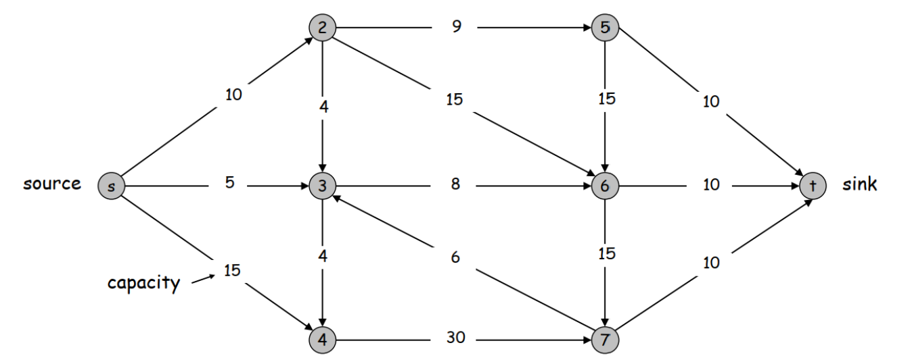
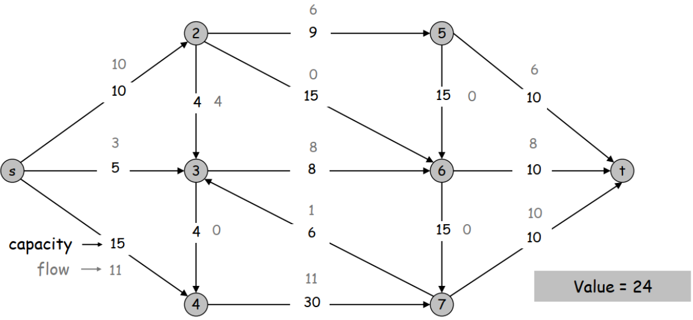
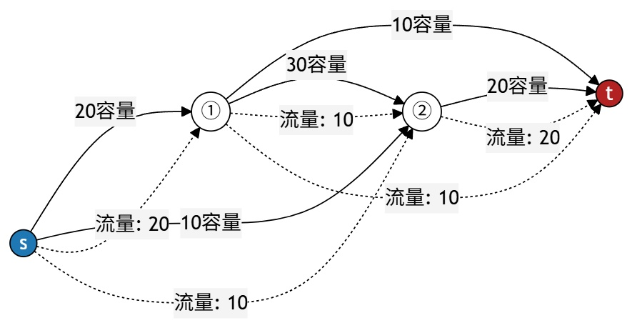
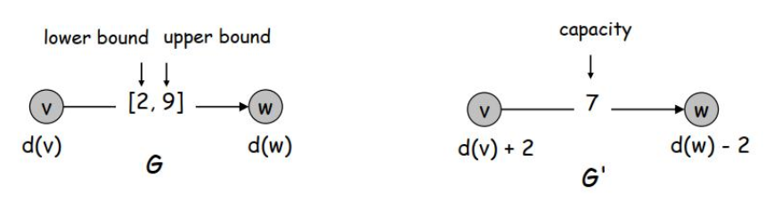
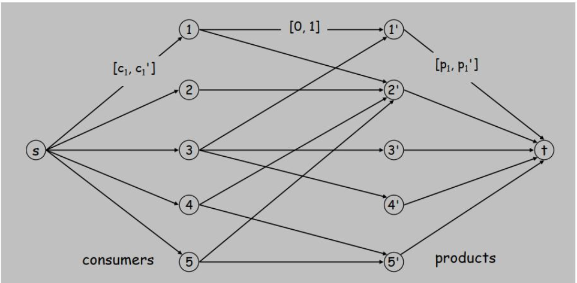
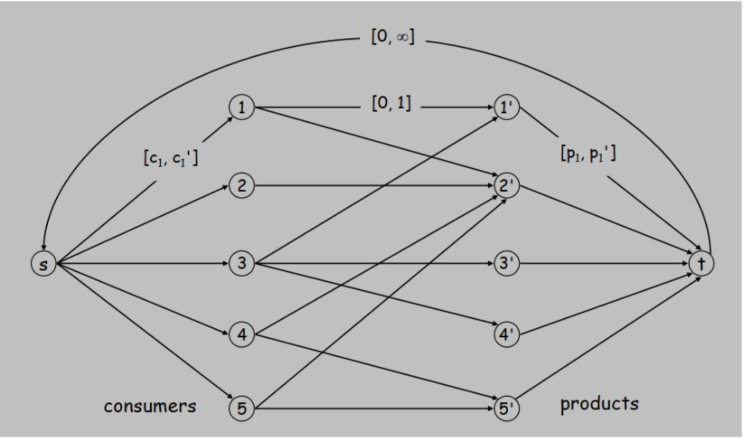

## 算法
### 定义
- 有限的，良定义的，计算机可解释的，有效的程序，接受输入，产生输出，用于解决一类问题或进行计算。
### 原则
- 最坏情况分析：对所有输入的时间界，适用于通用程序
- 平均情况分析与benchmark：需要domain knowledge（领域知识）
- High-level idea：忽略低阶项与常数项
- 渐近分析：关注大规模输入，追求快算法（最坏情况时间增长慢于输入规模增长）
### 计算可解性
- 多项式时间：
  - 理想标度性：当输入规模翻番时，算法运行时间的增长幅度应限制于某个常数因子C。即：存在常数 c > 0 和 d > 0，使得对于任意大小为 N 的输入，其运行时间被限制在 $cN^d$ 之内。
  - 理想标度性的成立等价于多项式时间。
  - 若算法的运行时间为多项式，则该算法是有效的。
  ps:某些多项式时间算法具有较高的常数项和/或指数项，在实际应用中毫无用处。但一般而言，多项式时间算法具有较低的对应项，并且反映了问题的某些特征。 
- 最坏情况运行时间：算法在给定输入规模 N 上的最大可能运行时间界。通常能反映实际应用中的效率。
  ps:某些指数时间（或更差）的算法被广泛使用，因为其最坏情况实例较为罕见（例如单纯形法和Unix grep命令）。
- 平均情况运行时间：获取算法在随机输入上的运行时间上限，作为输入规模的函数。
    - 需要为输入实例选择分布
    - 为特定分布调优的算法在其他输入上可能表现不佳
    - 可能更多揭示分布选择问题，而非算法本身
- 渐近复杂度：
  - 上界：若存在常数 c > 0 和 n0 >= 0，使得对于所有 n ≥ n0，均有 T(n) ≤ c・ f(n)，则 T(n) 为 O(f(n))。
  - 下界：若存在常数 c > 0 和 n0 >= 0，使得对于所有 n ≥ n0，有 T(n) ≥ c・ f(n)，则 T(n) 为 Ω(f(n))。
  - 紧界：若 T(n) 同时满足 O(f(n)) 和 Ω(f(n))，则 T(n) 为 Θ(f(n))。
    ps：存在常数 c₁, c₂, n₀，使得对于所有 n ≥ n₀，有 c₁f(n) ≤ T(n) ≤ c₂f(n)。
  - 对于任意一对（正）函数 f(n)、g(n)，有 max{f, g} = Θ(f(n) + g(n))
  - 性质：非对称性，传递性，可加性
  - 对数时间，线性时间，nlogn，平方时间，立方时间，指数时间，阶乘时间
  ps：Stirling’s approximation for factorials:
$n! ∼ \sqrt{2πn} (\frac{n}{e})^{n} .$
### 贪心法
- 思路
  - 选取合理规则
  - 根据规则，在每个步骤中做出局部最优选择,得到最优解
- 技巧
  - 贪心算法始终领先。证明贪心算法每走一步后，其解至少不逊于其他任何算法的解
  - 交换论证（exchange method）。将最优解逐步转化为贪心算法找到的解，且不损害其质量
- 应用
  - Interval Schedule
    - 算法：依次选取结束最早的/开始最晚的 
    - 证明：将最优解的一个job与结束最早的/开始最晚的job交换，不会减少job数量；类推可得贪心法是最优解 
  - Scheduling to Minimize Lateness
    - 定义：单个资源每次处理一个作业，作业 j 需要 tj 个单位的处理时间，截止时间为 dj，若 j 在时间 sj 开始，则结束于时间 fj = sj + tj，延迟：lj = max{ 0, fj – dj }，目标：调度所有作业以最小化最大延迟 L = max lj 
    - 算法：升序排序deadline 
    - 证明：存在无空闲时间的最优解；定义deadline大小与排序顺序相反的工作对为逆序对。在无空闲时间的最优解中，若有逆序对，则存在连续的逆序对；将无空闲时间的最优解的一个连续逆序进行交换，交换后的两lateness均小于交换前的deadline较小的lateness，则交换过程减少逆序数且不会增加max lateness；则存在逆序为0的最优解，即贪心法。
  - Minimum Spanning Tree
    - Prim’s Algorithm
      - 算法：初始化 S = {任意一个节点}，将最小成本边 e = (u, v) 添加到 T 中，其中 u ∈ S 且 v ∈ V – S，将 v 添加到 S 中，重复上述步骤直至 S = V。
      - 证明：
        - 割引理。在所有边的权值各不相同时，设S为任意节点子集，e为仅有一个端点位于S中的最小成本边。则每个最小生成树都必须包含e。ps:存在相同权值时，最小生成树不唯一。
        - 假设割引理不成立，那么最小生成树必须包含非e的边。将该边替换为e，总成本将下降，矛盾。
        - 割引理成立，每个最小生成树都必须包含e，则所有e组成的Prim树即为最小生成树。 
    - Kruskal’s Algorithm
      - 算法：从空树 T 开始，按权值升序考虑边，若将 e 加入 T 会形成环，则舍弃 e。否则，根据割引理将 e = (u, v) 插入 T。
      - 证明：
        - T是树
          - 显然无环路。
          - 无环路，$\lvert V \rvert-1$条边，T为连通图。
        - T是MST
          - 据割引理，每个最小生成树都必须包含e，则所有e组成的Kruskal树即为最小生成树。   
  - Clustering of maximum spacing
    - 定义：给定一组标记为p1, …, pn的n个对象集合U，将其划分为若干簇s，使得不同簇中的对象彼此相距较远。
      - 基本问题：将点划分为簇，使得不同簇中的点彼此远离。
      - k-聚类。将对象划分为k个非空组
      - 距离函数。需满足若干自然属性
         - 若pi = pj，则d(pi, pj) = 0（不可区分元素的恒等性）
         - d(pi, pj) ≥ 0（非负性）
         - d(pi, pj) = d(pj, pi)（对称性）
      - 间距。不同簇的两点间的最小距离
      - 最大间距聚类。给定整数k，寻找最大间距的k-聚类方案  
    - 算法：Single-link k-clustering algorithm：
      - 创建n个簇，每个对象归属一个簇
      - 寻找最近的对象对，确保每个对象分属不同簇；在它们之间添加一条边并合并两个簇
      - 重复n-k次直至形成恰好k个簇 
    - 证明：假设最大间距聚类中最近的对象对不在簇内，那么将对应的两簇融合，再任意分裂，其间距大于等于最大间距聚类的间距，矛盾。ps：该算法正是Kruskal算法（但当连通分量数达到k时终止），等效于得到最小生成树后删除其k-1条最贵边 
  - Optimal Caching
    - 定义：
      - Cache：具有存储k个项容量的cache
      - 包含m个项请求的序列：d1, d2, …, dm
      - Cache 命中：请求项已存在于缓存中
      - Cache 未命中：请求项未存在于缓存中；需将请求项加载至缓存，若缓存已满则需清除现有项
      - 目标：制定能最小化清除次数的清除策略 
    - Offline
      - FF（Farthest-in-future）（OPT）：清除缓存中那些在未来最远才被请求的项目。
        - 证明：
          - 简化调度方案是指仅在满足以下条件时将项目d插入缓存的调度方案，该步骤中请求了项目d，而项目d尚未存在于缓存中。
          - 可将非简化调度方案S转换为简化方案S’，且不会产生额外的清除操作：假设系统在没有请求 d 的时间 t 将数据项 d 放入缓存，设 c 为系统在放入 d 时清除的项。若 d 在下次请求 d 之前在时间 t' 被清除，则将d重新替换为c；若 d 被清除前在 t’ 时刻被请求，保留c直到t’再替换为d。
          - 设S为一个精简调度方案，其在前j个请求中与$S_{FF}$产生相同调度结果。则存在精简调度方案S'，其在前j+1个请求中与$S_{FF}$产生相同调度结果，且引发的清除次数不超过S。
            - 考虑第(j+1)个请求d
            - 由于S与$S_{FF}$此前保持一致，它们在请求d前拥有相同的缓存内容
            - 情况1：（d已存在于缓存中）S' = S
            - 情况2：（d不存在于缓存中，且S与$S_{FF}$清除相同元素）S' = S
            - 情况3：（d不在缓存中；$S_{FF}$清除e；S清除f ≠ e）
              - 通过清除e而非f从S构造S'
              - 此时S'与$S_{FF}$在前j+1次请求中保持一致
              - 从第j+2次请求起，使S'与S完全相同，但当涉及e或f时无法做到
              - 设 j’ 为 S 与 S’ 在 j+1 之后首次采取不同行动的时间点，g 为时间 j’ 请求的项目。
              - 情况 3a：g = e。由FF策略，不可能发生，因为必须先请求 f 才能请求 e。
              - 情况 3b：g ≠ e, f。S清除e，S'清除f，则S和S'拥有相同的缓存。
              - 情况 3c：g = f。元素f不可能存在于S的缓存中，因此设e’为S清除的元素。若 e’ = e，则 S’ 从缓存中访问 f；此时 S 与 S’ 缓存内容相同。若 e’ ≠ e，则 S’ 清除 e’ 并加载 e 至缓存；此时 S 与 S’ 缓存内容相同。S’ 虽不再是简化调度，但可转化为简化调度，且保证：
                a) 步骤 j + 1 之前与 $S_{FF}$ 完全一致
                b) 清除次数不超过 S
          - 由归纳法，可得$S_{FF}$为最优解
    - Online
      - Caching是计算机科学中最基础的online问题之一  
      - LRU：清除最近最少被访问的页面（k-competitive）
        - 设缓存大小为k，当LRU清除项目k次，则至少出现k+1个不同的项目，则FF至少清除1次 
      - FIFO：清除引入最早的页面（bad）
        - 考虑Belady异常 
      - LIFO：清除引入最晚的页面（bad）
        - 考虑 k = 2,序列 1，2，3，2，3，2，3··· 
### 分治法
- 思路
  - 划分不重叠的子问题
  - 递归解决子问题
  - 归并子问题，得到全局解
  ps:常见做法为二分问题，在线性时间内合并为整体解。
  ps:时间复杂度经常表现为Θ(nlogn)
- 技巧
  - 划分问题
  - 写出递归式，构造递归树
  - 归纳证明/计算得到时间复杂度
- 应用
  - Mergesort
  - Closest Pair of Points
    - 最近点对：给定平面上n个点，找出它们之间欧几里得距离最小的点对。 
    - 朴素算法Θ（n^2）
    - 算法：
      - divide：绘制垂直线 L，使两侧点数大致各占 1/2n
      - conquer：递归查找每侧最近点对
      - combine：找出两侧各含一点的最近点对  
      - 返回三对中的最佳方案
      - combine朴素考虑Θ(n²)，改良：
        - 令δ=min{left，right}，只需考虑L两侧δ距离的点
        - 两侧间对应点按照y坐标排序
        - 断言：若 |i – j| >= 12，则点si与点sj之间的距离至少为δ
          - 在L左右各划出6个1/2δ×1/2δ的矩形，δ=min{left，right}，则任意两个点均不位于某个1/2δ×1/2δ的矩形区域内
          - 相距至少2行的两个点间距≥2(1/2δ)
          - 若|i – j| >= 12，则12个1/2δ×1/2δ的矩形都被占据，所关注点与其第12个邻居在垂直距离上必然相距至少2行，间距大于等于2(1/2δ)
          - 因此只需计算各点与11个邻居距离，得到combine结果
        - 若每次combine均进行y坐标排序，O（n(logn)^2）；重复使用y坐标排序结果，O（nlogn）
  - Integer Multiplication
    - 朴素算法Θ（n^2）
    - Karatsuba Multiplication 
      - 令 x = $10^{n/2}$a + b 且 y = $10^{n/2}$c + d，其中 a、b、c、d 均为 n/2 位数。
      - x・ y = ($10^{n/2}$a + b)・ ($10^{n/2}$c + d) = $10^{n}$ac + $10^{n/2}$(ad + bc) + bd
      - 步骤1：递归计算 ac
      - 步骤2：递归计算 bd
      - 步骤3：递归计算 (a+b)(c+d) = ac+ad+bc+bd
      - Gaoss技巧：步骤3 – 步骤1 – 步骤2 = ad + bc
      - O（n^log{2}3）= O（n^l.585）
  - Matrix Multiplication
    - 朴素算法Θ（n^3） 
    - Fast matrix multiplication (Strassen, 1969)
      - O（n^log{2}7）= O（n^2.81）  
    $$
    \begin{bmatrix}
    C_{11} & C_{12} \\
    C_{21} & C_{22}
    \end{bmatrix}
    =
    \begin{bmatrix}
    A_{11} & A_{12} \\
    A_{21} & A_{22}
    \end{bmatrix}
    \times
    \begin{bmatrix}
    B_{11} & B_{12} \\
    B_{21} & B_{22}
    \end{bmatrix}
    $$

    $$
    \begin{aligned}
    C_{11} &= P_5 + P_4 - P_2 + P_6 \\
    C_{12} &= P_1 + P_2 \\
    C_{21} &= P_3 + P_4 \\
    C_{22} &= P_5 + P_1 - P_3 - P_7 \\
    P_1 &= A_{11} \times (B_{12} - B_{22}) \\
    P_2 &= (A_{11} + A_{12}) \times B_{22} \\
    P_3 &= (A_{21} + A_{22}) \times B_{11} \\
    P_4 &= A_{22} \times (B_{21} - B_{11}) \\
    P_5 &= (A_{11} + A_{22}) \times (B_{11} + B_{22}) \\
    P_6 &= (A_{12} - A_{22}) \times (B_{21} + B_{22}) \\
    P_7 &= (A_{11} - A_{21}) \times (B_{11} + B_{12})
    \end{aligned}
    $$  
    - 常见误解：“Strassen算法仅是理论上的奇观。”
        - 苹果计算机高级计算团队报告称，当n≈2,500时，G4 Velocity引擎可实现8倍加速
        - 其适用场景范围仍存在争议
    - 十进制战争
      - 问：能否仅用7次标量乘法完成两个2×2矩阵的乘法？
        答：可以！[Strassen, 1969]（O（n^log{2}7））
        问：能否仅用6次标量乘法完成两个2×2矩阵的乘法？
        答：不可能。[Hopcroft and Kerr, 1971]
        （O（n^log{2}6））
        问： 仅用21次标量乘法完成两个3×3矩阵的乘法？
        答：不可能。（O（n^log{3}21））
        问： 仅用143,640次标量乘法完成两个70×70矩阵的乘法？
        答：可以 （O（n^log{70}143640））
      - 已知最佳。O(n^2.3728639) [Francois Gall, 2014]
      - 猜想。O(2+𝛆) 适用于任意𝛆 > 0
      - 限制。对Strassen算法的理论改进在实际应用中效果递减
  - Convolution and FFT
    - 多项式的系数表示与点集表示
      - 系数表示
          $$
          A(x) = a_0 + a_1x + a_2x^2 + \cdots + a_{n-1}x^{n-1}
          $$

          $$
          B(x) = b_0 + b_1x + b_2x^2 + \cdots + b_{n-1}x^{n-1}
          $$ 
        - 乘法暴力求解的时间复杂度为O（n^2），求值的时间复杂度为O（n）（Horner's Method）
      - 点集表示
          $$
          A(x):\ (x_0, y_0),\ \dots,\ (x_{n-1}, y_{n-1})
          $$

          $$
          B(x):\ (x_0, z_0),\ \dots,\ (x_{n-1}, z_{n-1})
          $$ 
        - 乘法的时间复杂度为O（n），求值的时间复杂度为O（n^2）（Lagrange’s formula） 
    - 转化多项式的系数表示与点集表示
      - 系数表示->点集表示：
        - 朴素：O（n^2） （Vandermonde矩阵乘法/n次Horner's Method）
        $$
        \begin{bmatrix}
        y_0 \\
        y_1 \\
        y_2 \\
        \vdots \\
        y_{n-1}
        \end{bmatrix}
        =
        \begin{bmatrix}
        1 & x_0 & x_0^2 & \cdots & x_0^{n-1} \\
        1 & x_1 & x_1^2 & \cdots & x_1^{n-1} \\
        1 & x_2 & x_2^2 & \cdots & x_2^{n-1} \\
        \vdots & \vdots & \vdots & \ddots & \vdots \\
        1 & x_{n-1} & x_{n-1}^2 & \cdots & x_{n-1}^{n-1}
        \end{bmatrix}
        \begin{bmatrix}
        a_0 \\
        a_1 \\
        a_2 \\
        \vdots \\
        a_{n-1}
        \end{bmatrix}
        $$
        - 考虑分治
          $$
          \begin{align*}
          A(x) &= a_0 + a_1x + a_2x^2 + a_3x^3 + a_4x^4 + a_5x^5 + a_6x^6 + a_7x^7. \\
          A_{\text{even}}(x) &= a_0 + a_2x + a_4x^2 + a_6x^3. \\
          A_{\text{odd}}(x) &= a_1 + a_3x + a_5x^2 + a_7x^3. \\
          A(x) &= A_{\text{even}}(x^2) + x \cdot A_{\text{odd}}(x^2). \\
          A(-x) &= A_{\text{even}}(x^2) - x \cdot A_{\text{odd}}(x^2).
          \end{align*}
          $$
        - 点可以任意选取。为实现递归，我们希望点有如下性质：
          - 点的幂不改变其大小，且点不止一个
          - 点可以通过同样的方法构造，使两子式的点构成的集合相同，且每个点都可以开正负平方根对应母式的两个点
        - 容易想到构造点的个数应与n呈线性关系，并且点按照幂指数为周期回到1。因此，选取n次单位元作为点的构造方式 
        - 使用n个单位元构成点集， O（nlogn）
        $$
        \begin{bmatrix}
        y_0 \\
        y_1 \\
        y_2 \\
        \vdots \\
        y_{n-1}
        \end{bmatrix}
        =
        \begin{bmatrix}
        1 & \omega_n^0 & \omega_n^0 & \cdots & \omega_n^0 \\
        1 & \omega_n^1 & \omega_n^2 & \cdots & \omega_n^{n-1} \\
        1 & \omega_n^2 & \omega_n^4 & \cdots & \omega_n^{2(n-1)} \\
        \vdots & \vdots & \vdots & \ddots & \vdots \\
        1 & \omega_n^{n-1} & \omega_n^{2(n-1)} & \cdots & \omega_n^{(n-1)^2}
        \end{bmatrix}
        \begin{bmatrix}
        a_0 \\
        a_1 \\
        a_2 \\
        \vdots \\
        a_{n-1}
        \end{bmatrix}
        $$
        $$
        \begin{aligned}
        A(\omega^k) &= A_{\text{even}}(v^k) + \omega^k A_{\text{odd}}(v^k), \quad 0 \le k < n/2 \\
        A(\omega^{k+n/2}) &= A_{\text{even}}(v^k) - \omega^k A_{\text{odd}}(v^k), \quad 0 \le k < n/2 \\
        \omega^{k+n/2} &= -\omega^k \\
        v^k &= (\omega^k)^2 = (\omega^{k+n/2})^2
        \end{aligned}
        $$
      - 点集表示->系数表示：
        - 朴素：O（n^3）（高斯消元法）
        $$
        \begin{bmatrix}
        y_0 \\
        y_1 \\
        y_2 \\
        \vdots \\
        y_{n-1}
        \end{bmatrix}
        =
        \begin{bmatrix}
        1 & x_0 & x_0^2 & \cdots & x_0^{n-1} \\
        1 & x_1 & x_1^2 & \cdots & x_1^{n-1} \\
        1 & x_2 & x_2^2 & \cdots & x_2^{n-1} \\
        \vdots & \vdots & \vdots & \ddots & \vdots \\
        1 & x_{n-1} & x_{n-1}^2 & \cdots & x_{n-1}^{n-1}
        \end{bmatrix}
        \begin{bmatrix}
        a_0 \\
        a_1 \\
        a_2 \\
        \vdots \\
        a_{n-1}
        \end{bmatrix}
        $$
        - 同上 O（nlogn）
        $$
        \begin{bmatrix}
        a_0 \\
        a_1 \\
        a_2 \\
        a_3 \\
        \vdots \\
        a_{n-1}
        \end{bmatrix}
        =
        \begin{bmatrix}
        1 & 1 & 1 & 1 & \cdots & 1 \\
        1 & \omega^1 & \omega^2 & \omega^3 & \cdots & \omega^{n-1} \\
        1 & \omega^2 & \omega^4 & \omega^6 & \cdots & \omega^{2(n-1)} \\
        1 & \omega^3 & \omega^6 & \omega^9 & \cdots & \omega^{3(n-1)} \\
        \vdots & \vdots & \vdots & \vdots & \ddots & \vdots \\
        1 & \omega^{n-1} & \omega^{2(n-1)} & \omega^{3(n-1)} & \cdots & \omega^{(n-1)(n-1)}
        \end{bmatrix}^{-1}
        \begin{bmatrix}
        y_0 \\
        y_1 \\
        y_2 \\
        y_3 \\
        \vdots \\
        y_{n-1}
        \end{bmatrix}
        $$
        $$
        \begin{bmatrix}
        a_0 \\
        a_1 \\
        a_2 \\
        a_3 \\
        \vdots \\
        a_{n-1}
        \end{bmatrix}
        =
        \frac{1}{n}
        \begin{bmatrix}
        1 & 1 & 1 & 1 & \cdots & 1 \\
        1 & \omega^{-1} & \omega^{-2} & \omega^{-3} & \cdots & \omega^{-(n-1)} \\
        1 & \omega^{-2} & \omega^{-4} & \omega^{-6} & \cdots & \omega^{-2(n-1)} \\
        1 & \omega^{-3} & \omega^{-6} & \omega^{-9} & \cdots & \omega^{-3(n-1)} \\
        \vdots & \vdots & \vdots & \vdots & \ddots & \vdots \\
        1 & \omega^{-(n-1)} & \omega^{-2(n-1)} & \omega^{-3(n-1)} & \cdots & \omega^{-(n-1)(n-1)}
        \end{bmatrix}
        \begin{bmatrix}
        y_0 \\
        y_1 \\
        y_2 \\
        y_3 \\
        \vdots \\
        y_{n-1}
        \end{bmatrix}
        $$
    - 多项式乘法：系数表示->点集表示->多项式乘法->系数表示 O（nlogn）
    - 不难发现，点集表示->系数表示过程形似DFT
      $$
      X(k) = \sum_{n=0}^{N-1} x(n) \cdot \omega_N^{kn}, \quad k = 0, 1, \dots, N-1
      $$
      $$
      \omega_N = e^{-i\frac{2\pi}{N}} = \cos\left(\frac{2\pi}{N}\right) - i\sin\left(\frac{2\pi}{N}\right)
      $$
      同样系数表示->点集表示形似IDFT
### 动态规划
- 思路
  - 将问题分解为一系列相互重叠，**相互包含**的子问题
  - 构建出将大问题逐步下降为更小的子问题的解决方案。
- 技巧
  - top-down：构建递归树，可跳过不必要的子问题
  - bottom-up：从底层子问题开始，存储子问题结果，节省递归开销  
- 应用
  - Weighted Interval Scheduling
    - 定义：有权重的Interval Scheduling
    - 算法：
      - 按完成时间升序排序任务：f1 ≤ f2 ≤ … ≤ fn
      - 定义 p(j) = 使任务 i 与任务 j 兼容的最大索引（i < j）
      - OPT(j) = 由作业请求 1, 2, …, j 组成的最优解的值
      - 情况 1：OPT 选择作业 j
        - 不可使用不相容作业 {p(j) + 1, p(j) + 2, …, j-1}
        - 必须包含由剩余兼容作业 1, 2, …, p(j) 组成的子结构的最优解
      - 情况 2：OPT 未选择作业 j
        - 必须包含由剩余兼容作业 1, 2, …, j-1 组成的子结构的最优解
        $$
        OPT(j) = 
        \begin{cases}
        0 & \text{if } j = 0 \\
        \max\left\{ v_j + OPT(p(j)),\ OPT(j-1) \right\} & \text{otherwise}
        \end{cases}
        $$
      - O（nlogn+n）= O（nlogn）  
  - 0-1 Knapsack Algorithm
    - 算法：
      $$
      OPT(i, w) =
      \begin{cases}
      0 & \text{if } i = 0 \\
      OPT(i-1, w) & \text{if } w_i > w \\
      \max\left\{ OPT(i-1, w),\ v_i + OPT(i-1, w - w_i) \right\} & \text{otherwise}
      \end{cases}
      $$  
    - 运行时间：Θ(nW) “伪多项式”。
    - 背包问题的决策版本属于NPC问题
    - 背包近似算法。存在一种多项式时间算法，可生成可行解，其值与最优解的偏差在0.01%以内。(见下文**近似算法**对应部分)
  - RNA Secondary Structure
    - 定义：
      - RNA。字符串 B = b1b2…bn，取自字母表 { A, C, G, U }。
      - 二级结构。RNA为单链结构，因此倾向于回折形成自身碱基配对。该结构对于理解分子行为至关重要。二级结构为一组满足下列条件的配对集合 S = { (bi, bj)}：
        - [沃森-克里克规则]。S 具有配对性，且 S 中每对均为沃森-克里克互补配对：A-U、U-A、C-G 或 G-C
        - [无急转弯]。每对序列两端至少相隔4个中间碱基。若(bi, bj) ∊ S，则 i < j – 4
        - [无交叉]。若(bi, bj)与(bk, bl)均为S中序列对，则不存在i < k < j < l
      - 自由能。通常假设RNA分子将形成具有最佳总自由能的二级结构，约等于碱基对数量最大的二级结构。
      - 目标。给定RNA分子B = b1b2…bn，寻找碱基对数量最大的二级结构。
    - 算法：
      - 三个变量：位置j（1<=j<=n），长度k（5<=k<=n），分割字符$b_t$（i<=t< j）
      - $OPT(i, j)$ = 子字符串 bibi+1…bj 的二级结构中碱基对数目最大值
      - 若 i >= j – 4
      - 根据无急转弯条件，$OPT(i, j) = 0$
      - 若 i < j – 4：取两种情况中的最大值
      - 情况 1. 碱基 $b_j$ 未参与配对
      - $OPT(i, j – 1)$
      - 情况 2. 碱基 $b_j$ 与某 i <= t < j – 4 处的 bt 配对，无交叉条件解耦子问题
      $1 + max_t \{ OPT(i, t-1) + OPT(t+1, j-1)\}$ （对所有满足 i≤t< j−4 且 bt​ 与 bj​ 为沃森 - 克里克互补碱基的 t，取最大值。）
      - O(n^3)    
  - Sequence Alignment
    - 定义：
      - 编辑距离。[Levenshtein 1966, Needleman-Wunsch 1970]
        - 空隙惩罚 𝛅；错配惩罚 $𝛂_{pq}$
        - 成本 = 空隙惩罚与错配惩罚之和
        - 编辑距离 = 最小成本
      - 目标：给定两个字符串X = x1x2…xm和Y = y1y2…yn，求出最小成本的对齐方式。
      - 对齐M是一组有序对(xi, yj)，满足每个元素最多出现在一对中，且不存在交叉。（若i < i'且j > j'，则有序对(xi, yj)与(xi', yj')发生交叉。）  
        $$
        \text{cost}(M) = \underbrace{\sum_{\substack{(x_i, y_j) \in M}} \alpha_{x_i y_j}}_{\text{mismatch}} + \underbrace{\sum_{\substack{i: x_i \text{ unmatched} \\ j: y_j \text{ unmatched}}} \delta}_{\text{gap}}
        $$
    - 算法：
      - OPT(i, j) = 字符串 x1x2…xi 与 y1y2…yj 对齐的最小成本
      - 情况 1：OPT 匹配 xi – yj
      - 支付 xi – yj 的不匹配成本 + 两个字符串 x1x2…xi-1 和 y1y2…yj-1 对齐的最小成本
      - 情况2a：OPT使xi未匹配
          - xi的支付差额 + x1x2…xi-1与y1y2…yj-1的最小对齐成本
      - 情况2b：OPT使yj未匹配
          - yj的支付差额 + x1x2…xi与y1y2…yj-1的最小对齐成本  
      - 时间，空间复杂度Θ(mn)
      - 空间复杂度太高
      - 简单的想法：只从OPT(i-1, ⋅)计算OPT(i, ⋅)，OPT(⋅,j-1)计算OPT(⋅,j)，覆盖旧数据，保留一行一列，空间复杂度为O(m + n)，时间复杂度为O(mn)
        - 无法通过简单方法恢复对齐M本身
      - [Hirschberg 1975] Optimal alignment in O(m + n) space and O(mn) time
        - 令 f(i, j) 表示从 (0, 0) 到 (i, j) 的最短道路
        - 可在 O(mn) 时间和 O(m + n) 空间内计算任意 j 的 f(⋅，j)（只保留一条道路）
        - 设 g(i, j) 为从 (i, j) 到 (m, n) 的最短道路
        - 可在 O(mn) 时间和 O(m + n) 空间内计算任意 j 的 g(⋅, j)
        - 通过(i, j)的最短道路成本为 f(i, j) + g(i, j)
        - 设 q 为 f(q, n/2) + g(q, n/2) 取最小值的索引
        - 则从 (0, 0) 到 (m, n) 的最短道路通过 (q, n/2)
        - divide：使用动态规划找到使 f(q, n/2) + g(q, n/2) 最小化的索引 q（在 (xq, yn/2) 处进行对齐）
        - conquer：递归计算每个片段的最佳对齐方案
        - combine：拼接道路
        - 显然空间复杂度O(m + n)
        - 设 T(m, n) = 算法在长度为 m 和 n 的字符串上的最大运行时间，则T(m, n) = O(mn)
          - 证明（对 n 归纳）：
          - 计算 f(⋅, n/2) 和 g(⋅, n/2) 并查找索引 q 耗时 O(mn)
          - 两次递归调用耗时 T(q, n/2) + T(m – q, n/2)
          - 选取常数 c 使：
          $$
          \begin{align*}
          T(m, 2) &\le c m \\
          T(2, n) &\le c n \\
          T(m, n) &\le c m n + T(q, n/2) + T(m - q, n/2)
          \end{align*}
          $$
          
          - 归纳奠基：m = 2 或 n = 2
          - 归纳假设：T(m', n') ≤ 2cm'n'(m' < m 且 n' < n)
            $$
            \begin{align*}
            T(m,n) &\le T(q,n/2) + T(m-q,n/2) + cmn \\
                  &\le 2c\frac{qn}{2} + 2c\frac{(m-q)n}{2} + cmn \\
                  &= cqn + cmn - cqn + cmn \\
                  &= 2cmn
            \end{align*}
            $$
          - 结论：T(m, n) ≤ 2cmn  
  - Shortest Paths
    - Dijkstra’s algorithm
      - 单源最短道路算法。
      - 贪心法，时间$O(V^2)$，空间$O(V^2)$
      - 算法：
        - 初始化：源点 s 到自身距离为 0，到其他节点距离为无穷大；标记所有节点为未访问。
        - 迭代选择：
          - 从未访问节点中选距离源点最近的节点 u，标记为已访问。
          - 以 u 为跳板，更新 u 的所有邻接节点 v 的距离：
            `dist[v] = min(dist[v], dist[u] + 边(u,v)的权重)`
        - 终止：所有节点访问完毕，得到源点到所有节点的最短距离。 
      - 若存在负权边则可能失效。
      - 适用于稠密图
      - **普遍最优性**
    - 若从节点s到节点t的某条道路包含负成本环，则不存在s-t最短道路；否则，存在一条简单的最短道路。 
    - Floyd
      - 多源最短道路算法。
      - DP法，时间$O(V^3)$，空间$O(V^2)$
      - 三变量：源点i，终点j，途径点k
      - 算法：
        - 构建距离矩阵 `dist`：
          - 若 `i = j`（节点到自身），`dist[i][j] = 0`；
          - 若节点 `i` 到 `j` 有直接边，`dist[i][j] = 直接边的权重`；
          - 若节点 `i` 到 `j` 无直接边，`dist[i][j] = 无穷大（∞）`。
        - 迭代更新
          - 遍历每一个节点 `k` 作为中转的中间节点；
          - 遍历所有节点对 `(i, j)`（`i` 为起点，`j` 为终点）；
          - 对每对节点执行松弛操作：`dist[i][j] = min(dist[i][j], dist[i][k] + dist[k][j])`。
        - 终止条件
          - 所有中间节点 `k` 遍历完毕，此时 `dist` 矩阵中 `dist[i][j]` 即为节点 `i` 到 `j` 的最短道路长度。  
      - 可处理负权边
    - Bellman-Ford  
      - 朴素Bellman-Ford
        - 单源最短道路算法。
        - DP法，时间$Θ(VE)$，空间$Θ(V^2)$
        - 二变量：途径边（v，w），道路边数i
        - 算法：  
          - 定义：OPT(i, v) = 使用最多 i 条边构成的最短 v-t 道路 P 的长度
          - 情况 1：P 使用最多 i-1 条边
          - OPT(i, v) = OPT(i-1, v)
          - 情况 2：道路 P 可能使用 i 条边
          - 若首条边为 (v, w)，则 OPT 先使用 (v, w)，再选择最多使用 i-1 条边的最佳 w-t 道路
            $$
            OPT(i,v) = 
            \begin{cases}
            \infty & \text{if } i = 0, v \neq t \\
            0 & \text{if } v = t \\
            \min\left\{ OPT(i-1,v), \min_{(v,w)\in E}\{ OPT(i-1,w) + c_{vw} \} \right\} & \text{otherwise}
            \end{cases}
            $$
        - 可处理负权边，检测负权回路
        - 适用于稀疏图 
      - 空间复杂度改进
        -  只存储一行OPT(i, v)，OPT(i, v)覆盖OPT(i-1, v)
        -  空间复杂度$Θ(V)$
      - Shortest Path Faster Algorithm（SPFA）
        - 算法：
        ```pseudo 
          Push-Based-Shortest-Path(G, s, t) {
            foreach node v ∈ V
                M[v] ← ∞
            M[t] ← 0

            for i = 1 to n-1 {
                foreach node w ∈ V
                    if (M[w] has been updated in previous iteration)
                        foreach node v such that (v, w) ∈ E
                            if (M[v] > M[w] + c_vw)
                                M[v] ← M[w] + c_vw
                If no M[w] value changed in iteration i, stop.
            }

            return M[s]
        }
        ```  
        - 额外空间复杂度：O(V)
        - 时间复杂度：最坏情况为 O(VE)，但实际运行速度一般更快，表现为O(KE)，K为常数
        - 对于M[w]松弛的判断可以使用队列，即BFS版SPFA；也可以使用递归栈，DFS版SPFA，在一般复杂程度的图上检测负权环有明显效果。但DFS版不适用于最短道路，递归栈的深度受限，且由于无法去重，重复松弛次数随图的复杂程度呈指数增长。BFS版SPFA更普适。
        - 容易构造非负权边稠密图，使SPFA慢于Dijkstra   
    - Distance Vector Protocol
      - 通信网络
        - 节点 ≈ 路由器
        - 边 ≈ 直接通信链路
        - 边成本 ≈ 链路延迟
      - Dijkstra’s algorithm。需要网络全局信息
      - Bellman-Ford。仅使用邻近节点的局部知识
      - 同步性。不期望路由器同步运行。每个foreach循环的执行顺序不重要。即使更新是异步的，算法仍能收敛。
      - 典型应用：RIP, Xerox XNS RIP, Novell’s IPX RIP, Cisco’s IGRP, DEC’s DNA Phase IV, AppleTalk’s RTMP
      - 边的权值在算法运行期间可能发生变化（或边被删除）
      - Path Vector Protocols：
        - 每个路由器存储完整道路
        - 避免“无限计数”问题及相关困难
        - 路由器需要更多存储空间
        - 边界网关协议（BGP）、开放最短道路优先（OSPF）
    - 检测负权回路
      - 货币兑换。已知n种货币及其两两间的汇率，是否存在套利机会？最快算法具有极高价值。
      - 若对所有 v 均有 OPT(n, v) = OPT(n-1, v)，则不存在通向 t 的负周期道路。
        - 证明（反证法）
        - OPT(n, v) = OPT(n-1, v) → 对于 i ≥ n，有 OPT(i, v) = OPT(n-1, v)
        - 但负周路的出现意味着随着 i 增大，OPT(i, v) 始终递减 
      - 若存在某个节点 v 使得 OPT(n, v) < OPT(n-1, v)，则从 v 到 t 的（任意）最短道路中包含一个环 W。此外，环 W 的成本为负值。
        - 证明（反证法）
        - 由于 OPT(n, v) < OPT(n-1, v)，可知最短 v-t 道路 P 恰有 n 条边
        - 根据抽屉原理，P 必须包含有向环 W
        - 删除 W 后得到一条边数 < n 的 v-t 道路 → 故 W 具有负成本
      - BF算法循环第n次，即可判断负回路 
### 网络流
- 最大流与Ford-Fulkerson 算法
  - 网络流
    - 用于描述物质通过边流动的抽象模型
    - G = (V, E) = 有向图
    - 两个特殊节点：s = 源节点，t = 汇节点
    - c(e) = 边 e 的非负容量
      
    - 容量（capacity）
      对于每一条边 e ∈ E，满足：
       0 ≤ f(e) ≤ c(e)

    - 流量守恒（flow conservation）
      对于每一个节点 v ∈ V - {s, t}（即除源点 s 和汇点 t 外的所有节点），流入 v 的所有边流量之和 = 流出 v 的所有边流量之和

    - 流量（The value of a flow）
      流 f 的流量值定义为：
      v(f) = 从源点 s 流出的所有边流量之和
      
  - 最大流：
    - 寻找最大流
    - 贪心法只能取得局部最优值
    - 残余图
      - 原始边：e = (u, v) ∊ E
        - 流 f(e)，容量 c(e)
      - 残余边
        - 使**已发送流可被“撤销”**
        - e = (u, v) 且 eR = (v, u)
      - 残余容量
        $$
        c_f(e) = 
        \begin{cases}
        c(e) - f(e) & \text{if } e \in E \\
        f(e) & \text{if } e^R \in E
        \end{cases}
        $$
      - 残余图：Gf = (V, Ef)
      - 具有正残余容量的残余边
      - Ef = {e: f(e) < c(e)} ∪ {eR: f(e) > 0}
  - Ford-Fulkerson 算法
    - 初始化所有边 e ∊ E 的 f(e) = 0
    - 在残余图 Gf 中寻找一条增广道路 P
    - 沿道路 P 增大流量
    - 重复直至无法增流
     -1.jpg>) 
     .jpg>)
     $f(e)=0 \ P:s-1-2-t$
     .jpg>)
     .jpg>)
     $f(e)=20 \ P:s-2-1-t$
     
     .jpg>)
     $f(e)=30$
    - 例子显示Ford-Fulkerson 算法的优越性：在贪心法受阻时，Ford-Fulkerson 算法通过增广流撤销已发送流继续增大流量
    - 需要证明Ford-Fulkerson 算法是否得到最大流
- 最大流与最小割
  - 割
    - s-t割是集合V的划分(A, B)，其中s ∊ A且t ∊ B
    - 割(A, B)的容量为：流出 A 的所有边流量之和
  - 流量引理。设f为任意流，(A, B)为任意s-t割，则f等于流出 A 的所有边流量之和-流入 A 的所有边流量之和
    - 证明
      设 \(v(f)\) 表示流 \(f\) 的值。根据流值的定义：
      \[
      v(f) = \sum_{e \text{ 从源点 } s \text{ 出发}} f(e)
      \]

      根据流量守恒定律：对于所有非源点、非汇点的节点 \(v \ (v \neq s, t)\)，流入该节点的流量等于流出该节点的流量，即净流量为 0：
      \[
      \sum_{e \text{ 从节点 } v \text{ 出发}} f(e) - \sum_{e \text{ 进入节点 } v} f(e) = 0
      \]

      设 \(A\) 是流网络中满足 \(s \in A\) 且 \(t \notin A\) 的节点集合（包含源点但不包含汇点）。我们可以将流值 \(v(f)\) 重写为对集合 \(A\) 中所有节点的净流量之和：
      \[
      v(f) = \sum_{v \in A} \left( \sum_{e \text{ 从节点 } v \text{ 出发}} f(e) - \sum_{e \text{ 进入节点 } v} f(e) \right)
      \]
      该等式成立的原因是：除源点 \(s\) 外，集合 \(A\) 中其他节点的净流量均为 0（流量守恒），因此求和后仅保留源点 \(s\) 的净流量项，即流值 \(v(f)\)。

      将上述双重求和展开后，集合 \(A\) 内部节点之间的流量会相互抵消（例如节点 \(u \in A\) 流向节点 \(v \in A\) 的流量，会在 \(u\) 的“流出项”和 \(v\) 的“流入项”中各出现一次，求和时抵消），最终仅剩下跨越集合 \(A\) 边界的流量：
      \[
      v(f) = \sum_{e \text{ 从集合 } A \text{ 出发}} f(e) - \sum_{e \text{ 进入集合 } A} f(e)
      \] 
  - 最大流最小割定理。[Ford-Fulkerson 1956] 最大流的值等于最小割的值。
    - 弱对偶性。设 f 为任意流，(A, B) 为任意割，则该流的值至多等于该割的容量。
      - 证明
        $$
        v(f) = \sum_{e \text{ out of } A} f(e) - \sum_{e \text{ in to } A} f(e) \\
            \leq \sum_{e \text{ out of } A} f(e) 
            \leq \sum_{e \text{ out of } A} c(e) 
            = \text{cap}(A,B).
        $$
    - 增广道路定理。流 f 是最大流当且仅当不存在增广道路。     
    - 证明。通过证明以下三个条件对任意流 f 成立，同时推导出增广道路定理与最大流最小割定理：
      (i) 存在割 (A, B) 使得 v(f) = cap(A, B)
      (ii) f 为最大流
      (iii) 不存在与f相关的增广道路
      - (i) ⟹ (ii) 弱对偶引理的推论
      - (ii) ⟹ (iii) 通过反证法证明：若存在增广道路，则可通过沿增广道路改进f
      -  (iii) ⟹ (i)
         - 设 f 为无增广道路流
         - 设 A 为残余图中从 s 可达的顶点集
         - 由 A 的定义，s ∊ A；由 f 的定义，t ∉ A；(A, B)为割
         - A到B的边一定有f(e)=c(e),否则B中有s在残余图中可达的点
         - B到A的边一定有f(e)=0,否则B中也有s在残余图中可达的点
            $$
            v(f) = \sum_{e \text{ out of } A} f(e) - \sum_{e \text{ in to } A} f(e) \\
                = \sum_{e \text{ out of } A} f(e) 
                = \sum_{e \text{ out of } A} c(e) 
                = \text{cap}(A,B).
            $$
    - 增广道路定理得证，Ford-Fulkerson算法得到最大流
    - 最大流最小割定理得证，最大流的值等于最小割的值
- 选择好的增广道路
  - Ford-Fulkerson算法时间复杂度
    - 假设：
      - 所有容量均为1到C之间的整数。
    - 整数不变性定理。若所有容量均为整数，则存在最大流f使得每个流量值f(e)均为整数。
      证：算法可终止，定理由最大流最小割定理得出。
    - 定理。算法在最多v(f*) <= nC次迭代内终止。
      证：每次增量操作使值增加至少1。
    - 推论：Ford-Fulkerson算法的运行时间O(mnC)
  - 选择增广道路时，某些选择会导致指数级算法，巧妙选择可实现多项式时间算法。（若容量为无理数，算法可能无法终止）
  - 选择增广道路应保证：
    - 能高效找到增广道路
    - 迭代次数少
  - 选择增广道路时需满足：[Edmonds-Karp 1972, Dinitz 1970]
    - 最大瓶颈容量
    - 最少边数
    - 足够大的瓶颈容量
  - 令∆-残余图Gf(∆)为残余图的子图，该子图由容量≥∆的边构成。
  - Edmonds-Karp算法：
    ```pseudo
    Scaling-Max-Flow(G, s, t, c) {
        foreach e ∈ E
            f(e) ← 0
        Δ ← largest power of 2 ≤ C

        while (Δ ≥ 1) {
            G_f(Δ) ← Δ-residual graph
            while (there exists augmenting path P in G_f(Δ)) {
                f ← augment(f, c, P)
                update G_f(Δ)
            }
            Δ ← Δ / 2
        }
        return f
    }
    ```
    - 若算法终止，则f为最大流
      - 根据整数不变性，当Δ=1时→Gf(Δ)=Gf
      - 当Δ=1阶段终止时，不存在增广道路
    - 引理 1. 外层 while 循环重复次数为 $1+ \lfloor \log_2C \rfloor $：
      - 证明：初始时 C/2 < ∆ <= C。每次迭代 ∆ 减小 1/2。
    - 引理 2. 设 f 为 ∆ 放缩阶段结束时的流量。则最大流v(f^*)至多为 v(f) + m∆（∆指该阶段使用的值）
      - 证明（与最大流最小割定理证明几乎相同）
        - 选取A为Gf(∆)中从s可达的节点集合
        - 由A的定义，s ∊ A
        - 由f的定义，t ∉ A
        - A到B的边一定有f(e)>=c(e)-∆,否则B中有s在Gf(∆)中可达的点
        - B到A的边一定有f(e)<=∆,否则B中也有s在Gf(∆)中可达的点
            $$
            v(f) = \sum_{e \text{ out of } A} f(e) - \sum_{e \text{ in to } A} f(e) \\
                \geq \sum_{e \text{ out of } A} (c(e)-\Delta) - \sum_{e \text{ in to } A} \Delta \\
                = \sum_{e \text{ out of } A} c(e) - \sum_{e \text{ out of } A} \Delta - \sum_{e \text{ in to } A} \Delta \\
                \geq \text{cap}(A,B) - m\Delta \\
                \geq v(f^*) - m\Delta
            $$  
    - 引理 3. 每次放缩阶段最多进行 2m 次增流操作。
      - 设 f 为**前次**放缩阶段结束时的流量
      - 由引理 2，  V(f*) <= v(f) + m(2∆)
      - 每个Δ阶段的增量操作至少使v(f)增加Δ
    - 定理：最大流放缩算法可在O(mlogC)次增广操作内找到最大流，且可实现为O(m^2logC)时间复杂度运行
- 最大流应用
  - 二分图匹配
    - 输入：无向二分图 G = (L∪ R, E)
    - 若每个节点在 M 中最多出现于一条边，则 M ⊆ E 称为匹配
    - 最大匹配：寻找一个最大基数的匹配
    - 最大流规划
      - 创建有向图 G’ = (L∪ R∪ {s, t}, E’)
      - 将所有从 L 到 R 的边设为有向，并赋予无限（或单位）容量
      - 添加源节点 s，并从 s 到 L 中每个节点添加单位容量边
      - 添加汇节点 t，并从 R 中每个节点到 t 添加单位容量边
      - 图G中最大基数匹配的大小等于图G’中最大流的值。
        - => 令图G中最大基数匹配为k，则图G’存在值为k的流，则图G中最大基数匹配的大小小于等于图G’中最大流的值
        - <= 令图G’中最大流的值为k，根据整数不变性定理， k 为整数且可假设 f 为 0-1
          - 设 M = 从 L 到 R 的边集，且 f(e) = 1
          - L 和 R 中每个节点最多参与 M 中一条边
          - |M| = k：考虑割集 (L∪ s, R∪ t)
          - 图G存在基数为k的匹配
          - 则图G’中最大流的值小于等于图G中最大基数匹配的大小
      - 若每个节点在匹配M中恰好出现一条边，则对应的M ⊆ E为完美匹配。 
      - 设S是节点的一个子集，设N(S)是与节点集S中的节点相邻的节点集合。
      - 婚姻定理。[Frobenius 1917, Hall 1935] 设 G = (L∪ R, E) 为一个二分图，且|L| = |R|。则 G 具有完美匹配当且仅当对于所有子集 S ⊆ L，有 |N(S)| >= |S|。
        - => S中的每个节点都必须与N(S)中的不同节点进行匹配。
        - <= 假设图G不存在完美匹配
          - 转化为最大流问题，令(A, B)为图G'中的最小割
          - 定义 LA = L∩A, LB = L∩B, RA = R∩A, RB = R∩B
          - Cap(A, B) = v(f*) = |M| < |L|（“<”表示不存在完美匹配）
          - N(LA) ⊆ RA （事实上，N(LA) = RA，因为根据最大流最小割定理，RA中的每一点到t的边均载流，且LB到RA的边均不载流，若N(LA) < RA，则存在RA中的一点不满足流量守恒，矛盾）
          - 因最小割不可包含无限边，故 LA 与 RB 间无边
            - Cap(A, B) = |LB| + |RA|
            - |N(LA)| ≤ |RA|
              = cap(A, B) - |LB|
              < |L| - |LB|
              = |LA|
            - 这与条件矛盾
          - 若L,R间为单位容量，也可证明：
            - i. 同样可证空集为N(LA) - RA的子集。可将N(LA) - RA部分加入A，回到上述证明。新的(A', B')仍为图G'中的最小割，因为(A', B')相比(A, B)增加N(LA) - RA部分到t的边，减去LA到N(LA) - RA部分的边，并且数量相等，否则N(LA) - RA部分不满足流量守恒
            - ii. 也可直接证明：|L| - Cap(A, B) =|LB|+|LA|-（|LB| + |RA| + |N(LA)| - |RA|） = |LA| - |N(LA)| > 0，矛盾
  - 不相交道路
    - 给定有向图 G = (V, E) 及两个节点 s 和 t，求 s-t 道路的最大不相交数
    - 定义：若两条道路不存在共同边，则称其不相交
    - 最大流规划
      - 为每条边分配单位容量
      - s-t 道路的最大不相交数等于最大流值
        - => 设 s-t 道路的最大不相交数为k,若边 e 参与某条道路 Pi，则令 f(e) = 1；否则令 f(e) = 0。由于道路互不相交，f 即为值为 k 的流
        - <= 设最大流为k，根据整数不变性定理， k 为整数且可假设 f(e) 为 0-1
          - 考虑边 (s, u)，满足 f(s, u) = 1
          - 根据流量守恒，存在边 (u, v) 满足 f(u, v) = 1
          - 持续操作直至到达终点 t，每次选择新边
          - 由此得到一条 s-t 道路
          - 沿道路将流量归零，得到值为 k-1 的流量
          - 重复此过程 k 次，最终获得 k 条的边不相交道路（不一定是简单道路，可消除环路成为简单道路）
  - 最大流问题的扩展
    - 环流需求问题
      - 定义： 
        - 有向图 G = (V, E)
        - 边容量 c(e)，e ∊ E
        - 节点供给与需求 d(v)，v ∊ V（若d(v) > 0则为需求节点；若d(v) < 0则供给节点；若d(v) = 0则为转运节点）
        - 定义：循环是满足下列条件的函数：
        - 对每个 e ∊ E：0 <= f(e) <= c(e) (容量限制)
        - 对任意 v ∊ V：满足流量守恒（conservation）
          $$
          \sum_{e \text{ in to } v} f(e) - \sum_{e \text{ out of } v} f(e) = d(v)
          $$
        - 环流问题：给定 (V, E, c, d)，是否存在解
      - 最大流规划：
        - 必要条件：供给总量 = 需求总量
          $$
          \sum_{v: d(v) > 0} d(v) = \sum_{v: d(v) < 0} -d(v) =: D
          $$
          - 将所有v的守恒性相加即可得到 
        - 添加源节点 s 和汇节点 t
        - 对每个满足 d(v) < 0 的节点 v，添加容量为 –d(v) 的边 (s, v)
        - 对每个满足 d(v) > 0 的节点 v，添加容量为 d(v) 的边 (v, t)
        - 图 G 有环流当且仅当图 G’ 具有值为 D 的最大流
          - => 图 G 具有环流，则图 G’ 有值为 D 的流，且没有增广道路，图 G’ 有值为 D 的最大流
          - <= 若图 G’ 具有值为 D 的最大流，则图 G 满足容量限制与流量守恒，图 G 有环流
        - 整数不变性定理。若所有容量与需求均为整数，且存在一个流，则存在一个取值为整数的流。
          - 证明：由最大流规划与最大流的整数不变性定理可得。
        - 给定(V, E, c, d)，若存在节点划分(A, B)满足下列条件，则不存在环流
          $$
          \sum_{v \in B} d_v > \text{cap}(A, B)
          $$
          - 等价于给定(V, E, c, d)，若存在节点划分(A, B)满足下列条件，则图 G’ 不具有值为 D 的最大流
            $$
            \sum_{v \in B} d_v > \text{cap}(A, B)
            $$
          - => 在图 G’ 中，令A' = A + s , B' = B + t, 则对于图 G’ 的割（A'，B'），有
          $$
          v(f^*)-D \le cap（A'，B'）- D \\
          = (cap(A , B)+cap(s,B)+cap(A,t))- (cap(A,t) + cap(B,t)) \\
          = cap(A,B)-(cap(B,t)-cap(s,B))=cap(A,B)-\sum_{v \in B} d_v < 0
          $$
          图 G’ 不具有值为 D 的最大流
          - <= 若图 G’ 不具有值为 D 的最大流，令$（A^{'*}，B^{'*}）$为最小割，$A^{'*} = A^* + s, B^{'*} = B^* + t,$则
          $$
          cap(A^*,B^*)-\sum_{v \in B^*} d_v 
          = cap(A^*,B^*)-(cap(B^*,t)-cap(s,B^*)) \\
          = (cap(A^* , B^*)+cap(s,B^*)+cap(A^*,t))- (cap(A^*,t) + cap(B^*,t)) \\
          =cap(A^{'*},B^{'*})-D \\
          = v(f^*)-D < 0 \\
          $$
    - 带下界的环流需求问题
      - 在环流需求问题之上，为每条边添加下界l(e)，要求每条边的流量满足下界
      - 用d(v)建模l(e)
        - 沿边 e 发送 l(e) 个单位流量
        - 更新两端点的d(v)
          
        - 当且仅当G'的环流存在，G的环流存在。若G中所有需求、容量和下界均为整数，则G有整数值的环流。
        - 证明
          - 当且仅当f’(e) = f(e) - l(e)是G'中的环流，f(e)是G中的环流。
          - 参考网络流整数性定理
    - 调查问卷设计
      - 定义： 
        - 设计调查问卷，向n1名消费者询问关于n2种产品的信息
        - 仅当消费者i拥有产品j时，才可就该产品对其进行调查
        - 向消费者i提出ci至c’i之间数量的相关问题
        - 向pj至p’j之间数量的消费者询问产品j相关问题
        - 目标：设计一份符合上述要求的调查问卷（如可行）
      - 算法：
        - 网络流建模
          - 若顾客拥有产品i，则包含边(i, j)
          - 目标：寻找满足边上下界的流。如何实现？
            
        - 带下界的环流需求建模
          - 图中所有需求、容量和下界均为整数，存在有整数值的环流。
          - 转化为环流需求问题，再转化为最大流问题即可判断 
                
    - 图像分割

                          