## 算法2

### NP 与计算不可解性

- 问题分类
  - 根据是否具有多项式时间算法，分类问题。（实际上，多项式时间算法能够处理规模巨大的问题）

    | Yes                      |Solution              | Probably no     |
    | --------------------------- | --------------------------- |--------------- |
    | Shortest path               |DP| Longest path    |
    | Bipartite Matching                    |Max Flow| 3D-matching     |
    | Min cut                     |Max Flow| Max cut         |
    | 2-SAT                       |强连通分量| 3-SAT           |
    | Planar 4-color              |四色定理| Planar 3-color  |
    | Bipartite vertex cover      |等价于Bipartite Matching| Vertex cover    |
    | Primality testing (2002)    |AKS| Factoring       |

    - 被证明需要指数时间的问题：（EXPTIME-complete）
      - k步停机问题：给定一个大小为 log k 的程序，它是否最多在 k 步内终止？
      - 在 n×n 格的跳棋，国象等广义博弈游戏中，给定一个棋盘局面，黑方能否保证获胜？
    - 大量基础问题始终无法被分类
    - 有必要证明这些基础问题在“计算上等价”，且是同一个极其困难问题的不同表现形式。
- 多项式归约
  - 若问题 X 的任意实例均可通过以下方式求解，则问题 X 可多项式归约为问题 Y：
    - 执行多项式数量的标准计算步骤
    - 向能求解问题 Y 的预言机发出多项式数量的调用
    - 由于记录发送到预言机的实例需要花费时间， y 的实例必须是多项式大小的
  - 记作 $$X ≤_{p} Y$$
  - 性质：
    - 设计算法。若 X ≤p y 且 y 可在多项式时间内求解，则 X 也可在多项式时间内求解；
    - 证明不可解性。若 X ≤p y 且 X 无法在多项式时间内求解，则 y 无法在多项式时间内求解；
    - 证明等价性。若 X ≤p y 且 y ≤p X，则记作 X ≡p y。此时，X 能否在多项式时间内求解，当且仅当 y 能否在多项式时间内求解
  - 归约策略：
    - 基于简单等价关系的归约
      - 顶点覆盖 ≡p 独立集
        - 顶点覆盖：给定一个图 G = (V, E) 和一个整数 k，是否存在一个顶点子集 S ⊆ V，使得 |S| ≤ k，且对于每条边，其至少有一个端点属于 S
        - 独立集：给定一个图 G = (V, E) 和一个整数 k，是否存在一个顶点子集 S ⊆ V，使得|S| ≥ k，且对于每条边，其两端点中至多有一个属于 S
        - 证明：
          - 对于顶点覆盖，若找到 S，则 E 的 每条边至少有1个顶点属于 S，则对于V - S，E 的 每条边至多有1个顶点属于 V - S，V - S是 V的独立集；反之同理。两问题等价
    - 从特例归约到一般情况
      - 顶点覆盖 ≤p 集合覆盖
        - 集合覆盖。给定一个元素集 U、U 的子集集合 S1, S2, …, Sm 以及一个整数 k，是否存在一族 个数≤ k 的上述集合，其并集等于 U？
          - 应用： 有 m 个可用软件，设 U 为系统应具备的 n 种能力，第 i 个软件提供能力集 Si ⊆ U，能否使用最少的软件数量实现全部 n 种能力
        - 证明：
          - 令 U = E, Si = {e:vi ∈ e}，1 ≤ i ≤ |V|,则若能找到集合覆盖，意味着k个顶点覆盖了E，即可找到顶点覆盖S={vi：i满足Si属于集合覆盖}
    - 利用小工具编码进行归约
      - 3-SAT ≤p 独立集
        - SAT
          - literal：布尔变量或其否定形式 $x_i$ or $\overline{x_i}$
          - clause：literal的析取式 \[
C_j = x_1 \lor \overline{x_2} \lor x_3
\]
          - 合取范式：命题公式 𝝫，它是clause的合取式 \[
\Phi = C_1 \land C_2 \land C_3 \land C_4
\]
          - 给定合取范式 𝝫，是否存在一个使其成立的真值赋值？
          - 3-SAT：每个clause恰好包含 3 个literal的 SAT 问题
            - Ex: \[
                \left(\overline{x_1} \lor x_2 \lor x_3\right)
                \land
                \left(x_1 \lor \overline{x_2} \lor x_3\right)
                \land
                \left(\overline{x_1} \lor x_2 \lor x_4\right)
                \]

                Yes: $x_1 = \text{true},\ x_2 = \text{true},\ x_3 = \text{false},\ x_4 = \text{false}.$
        - 编码：
          - G 包含每个clause的 3 个顶点，每个literal对应一个顶点;
          - 将clause中的 3 个literal以三角形的方式连接起来;
          - 将literal与其否定形式连接
          - 若赋值为真/假，则选取/不选取对应顶点
           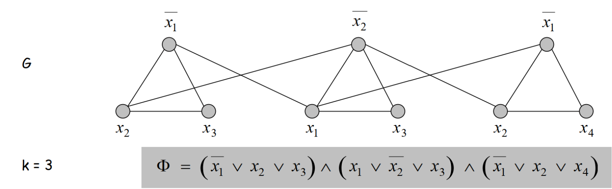
        - G 包含一个大小为 k = |𝝫| 的独立集当且仅当 𝝫 是可满足的
          - =>
            - 设 S 是一个大小为 k 的独立集；
            - S 必须在每个三角形中恰好包含一个顶点；
            - 将这些literal赋真 ，并将其他变量以一致的方式赋值；
            - 真值赋值是一致的，且所有clause均被满足；
          - <=
            - 给定一个满足条件的赋值，从每个三角形中选取一个真literal，这便是一个大小为 k 的独立集。
        - 事实上，证明了3-SAT ≤p 1 in 3-SAT ≤p独立集(这说明**归约的构造过程可以增强X的命题强度**)
  - 传递性：若 x ≤p y 且 y ≤p z，则 x ≤p z
    - 3-SAT ≤p Independent-set ≡p Vertex-cover ≤p Set-cover
  - 自我归约
    - 决定性问题。Ex：是否存在大小≤k的顶点覆盖？
    - 优化问题。Ex：求最小基数的顶点覆盖
    - 优化问题 ≡p 决定性问题
      - 适用于NP-Complete问题
      - 提示我们从存在性问题入手  
- NP
  - 决定性问题
    - X 是一个字符串集合
    - Instance：字符串 s
    - 算法 A 解决问题 X：A(s) = yes 当且仅当 s ∈ X
  - P的定义:若对于任意字符串 s，A(s) 最多在 p(|s|) 步内终止，则算法 A 在多项式时间内运行，X是P问题，其中 p(∙) 是一个多项式。
    - Ex:
      - 质数集：X = {2, 3, 5, 7, 11, 13, 17, 23, 29, 31, 37, …}
      - Instance：s = 592335744548702854681(|s| =logn,n为数字大小)
      - 算法：[Agrawal-Kayal-Saxena, 2002] $$p(|s|) = \log^{8}(n) = |s|^{8}$$

      - | Problem | Description | Algorithm | Yes | No |
        |---|---|---|---|---|
        | MULTIPLE | x multiple of y? | Division | 51,17 | 51,16 |
        | RELPRIME | x,y coprime? | Euclid | 34,39 | 34,51 |
        | PRIMES | x prime? | AKS | 53 | 51 |
        | EDIT-DISTANCE | dist < 5? | DP | niether/neither | acgggt/ttttta |
        | LSOLVE | ∃x, Ax=b? | Gauss-Edmonds | [0 1 1;2 4 -2;0 3 15],[4;2;36] | [1 0 0;1 1 1;0 1 1],[1;1;1] |

  - 验证算法
    - 验证者从“管理”角度看待问题
    - 验证者本身并不判定 s ∊ X；而是检查一个声称 s ∊ X 的证明 t 是否正确
    - 如果对于任意字符串 s，当且仅当存在字符串 t 使得 C(s, t) = yes 时，s ∈ X，则算法 C(s, t) 是问题 X 的验证器。
  - NP(nondeterministic polynomial-time)的定义：若存在多项式时间验证器的决定性问题，即C(s, t) 是一个多项式时间算法，且对于某个多项式 p(∙)，满足 |t| <= p(|s|)，则X为NP问题
    - Ex:
      - COMPOSITES
        - X:给定一个整数 s，s 是合数吗？
        - 验证：s 的一个非平凡因数 t。注意，当且仅当 s 是合数，才存在这样的验证。此外，|t| <= |s|。
        - 验证器：

            ```pseudo
            boolean C(s, t) {
            if (t ≤ 1 or t ≥ s)
            return false
            else if (s is a multiple of t)
            return true
            else
            return false
            }
            ```

        - Instance:s = 437669
        - 验证:t = 541 或 809
        - 结论:合数问题 属于 NP
      - 3-SAT
        - X:给定一个 CNF 范式 𝛟，是否存在一个满足该范式的赋值？
        - 验证：为 n 个literal赋予真值
        - 验证器：检查𝛟中的每个clause是否至少包含一个真literal
        - instance $s$ \[
        \left(\overline{x_1} \lor x_2 \lor x_3\right)
        \land
        \left(x_1 \lor \overline{x_2} \lor x_3\right)
        \land
        \left(x_1 \lor x_2 \lor x_4\right)
        \land
        \left(\overline{x_1} \lor \overline{x_3} \lor \overline{x_4}\right)
        \]
        - certificate $t$
        \[
        x_1 = 1,\ x_2 = 1,\ x_3 = 0,\ x_4 = 1
        \]
        - 结论:3-SAT 属于 NP
      - HAM-CYCLE
        - X:对于给定的无向图 G = (V, E)，是否存在一个简单环 C，使得它经过每个顶点？
        - 验证：n 个顶点的置换
        - 验证器：检查该置换是否包含 V 中的每个节点且仅包含一次，并且排列中每对相邻节点之间都存在一条边
        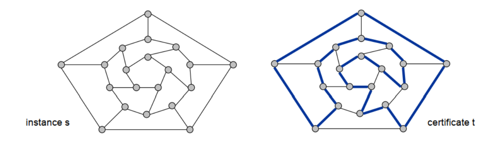
        - 结论:HAM-CYCLE 属于 NP

      - | Problem     | Description                                     | Algorithm                 | Yes                              | No                               |
        |-------------|------------------------------------------------|---------------------------|----------------------------------|----------------------------------|
        | LSOLVE      | Is there x with Ax = b?                        | Gauss-Edmonds elimination | [[0,1,1],[2,4,-2],[0,3,15]], [4,2,36] | [[1,0,0],[1,1,1],[0,1,1]], [1,1,1] |
        | PRIMES      | Is x prime?                                    | AKS (2002)                | 53                               | 51                               |
        | FACTOR      | Does x have a factor < y?                      | ?                         | (56159, 50)                      | (55687, 50)                      |
        | SAT         | Satisfiable formula?                           | ?                         | ¬x1∨x2, x1∨x2                    | ¬x2, ¬x1∨x2, x1∨x2               |
        | HAM-CYCLE   | Exists a Hamiltonian cycle?                    | ?                         | (has cycle)                      | (no cycle)                       |

  - P,EXP,NP
    - P. 存在多项式时间算法的判定问题
    - EXP. 存在指数时间算法的判定问题
    - NP. 存在多项式时间验证器的判定问题
    - P ⊆ NP
      - 设 X 是 P 中的任意问题,根据定义，存在一个多项式时间算法 A(s) 能解决问题 X。令 t = ℇ（空串），验证器 C(s, t) = A(s)
    - NP ⊆ EXP
      - 考虑任意一个属于 NP 的问题 X，根据定义，存在一个针对 X 的多项式时间验证器 C(s, t)，要解决输入 s，对所有满足 |t| <= p(|s|) 的字符串 t 运行 C(s, t)，如果 C(s, t) 对其中任何一个返回“是”，则返回“是”，算法时间为$$O(|Σ|^{p(|s|)})$$,Σ为字母表
  - P =? NP[Cook 1971, Edmonds, Levin, Yablonski, Godel]
    - 千禧年七大难题之一 
    - 决定性问题真的像验证那样简单吗？如果是，则存在3-COLOR、TSP、SAT、FACTOR(将破坏RSA加密技术,并可能导致经济崩溃) 等问题的有效算法；如果不是，3-COLOR、TSP、SAT 等问题不存在有效算法。
  - NP-Completeness
    - 多项式归约：
      - 若问题 X 的任意实例均可通过以下方式求解，则问题 X 可多项式归约为问题 Y：
        - 执行多项式数量的标准计算步骤
        - 向能求解问题 Y 的预言机发出多项式数量的调用
        - 由于记录发送到预言机的实例需要花费时间， y 的实例必须是多项式大小的
    - 多项式变换：
      - 若给定任意输入 x 到问题 X，我们能在多项式时间内构造出一个输入 y，使得 x 是 X 的“是”实例当且仅当 y 是 Y 的“是”实例，则问题 X 通过多项式变换（Karp）映射到问题 Y。
    - 多项式变换是一种多项式归约算法，它仅需对 Y 进行一次调用，且该调用恰好发生在 X 的算法结束时。几乎所有先前的归约算法都采用这种形式。那么，多项式变换是否真包含于多项式归约呢？
    - 开放性问题：多项式归约与多项式变换是等价的概念吗？或者说，能否找到一个问题，在多项式归约下为NPC,而多项式变换下不是NPC？
    - NP-Complete：NP类中的一个问题Y，具有如下性质：对于NP类中的任意问题X，X ≤p Y
      - 假设 Y 是一个 NP-Complete。那么，Y 能在多项式时间内求解当且仅当 P = NP。
        - <= 若 P = NP， Y 属于 NP ,则 Y 可在多项式时间内求解。
        - => 假设 Y 可在多项式时间内求解。设 X 为 NP 类中的任意问题。由于 X ≤ P，因此我们可在多项式时间内求解 X, NP ⊆ P。已知 P ⊆ NP,因此 P = NP
      - “首个”NP-Complete
        - CIRCUIT-SAT。给定一个由与门、或门和非门构成的组合逻辑电路，是否存在某种方式来设置该电路的输入，使得其输出为1？
          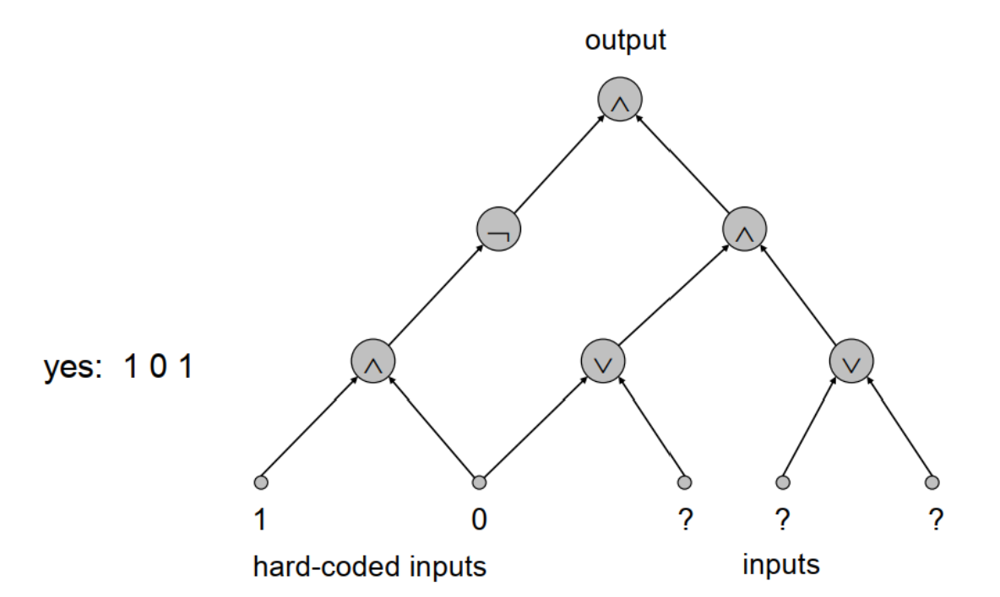
        - CIRCUIT-SAT 是 NP-complete. [Cook 1971, Levin 1973]
          - CIRCUIT-SAT是NP
          - 简略的证明：
            - 任何以固定输入长度 n 作为输入并输出“是”或“否”的算法，都可以用这样的电路来表示。此外，如果算法的运行时间是多项式级的，那么该电路的规模也是多项式级的。
              - 证明中的简略部分；固定输入长度很重要，这反映了**算法（图灵机，输入可变长）与电路（输入定长）之间的基本区别**，而在此情况下算法如何用电路表示原论文中有详细内容，在此省略。 
            - 考虑NP类中的某个问题X。该问题有一个多项式验证器C(s, t)。要判断s是否属于X，需要知道是否存在长度为p(|s|)的验证t，使得C(s, t) = yes
            - 将 C(s, t) 视为一个作用于 |s| + p(|s|) 位（输入 s，验证 t）的算法，并将其转换为一个多项式大小的电路 K：
              - 前 |s| 位硬编码为 s
              - 剩余的 p(|s|) 位表示 t，值未知
            - 电路 K 可满足当且仅当存在 t 使得 C(s, t) = yes
          - Ex：下面的构造生成了一个电路 K，当且仅当图 G 具有大小 ≥ 2 的独立集时，K 输出 true。
            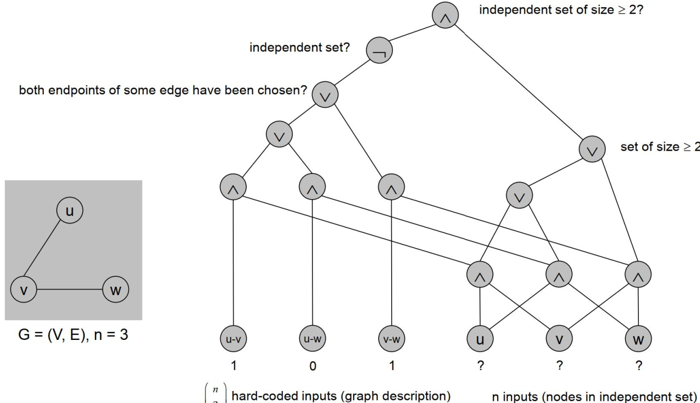
      - 构造NPC
        - 步骤： 
          - 证明 Y 属于 NP
          - 选择一个 NPC问题 X
          - 证明 X ≤p Y
          - Y为NPC
        - Ex
          - 3-SAT 是 NP-Complete
            - CIRCUIT-SAT ≤p 3-SAT
              - 3-SAT 属于 NP 
              - 设 K 为任意电路。
                  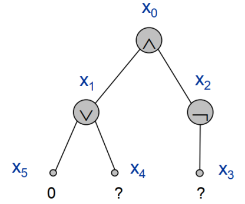
              - 为电路的每个元素 i 创建一个 3-SAT 变量 xi；
              - 使电路在每个节点计算出正确的值：
                  - X2 = ¬ X3，构造$x_2 \lor x_3,\ \overline{x_2} \lor \overline{x_3}$
                  - X1 = X4 ∨ X5，构造$x_1 \lor \overline{x_4},\ x_1 \lor \overline{x_5},\ \overline{x_1} \lor x_4 \lor x_5$
                  - X0 = X1 ∧ X2，构造$\overline{x_0} \lor x_1,\ \overline{x_0} \lor x_2,\ x_0 \lor \overline{x_1} \lor \overline{x_2}$
              - 硬编码输入值和输出值
                  - X5 = 0，构造$\overline{x_5}$
                  - X0 = 1，构造$x_0$
              - 将长度小于 3 的clause转换为长度恰好为 3 的clause
              - \(\Phi =
                  \begin{aligned}
                  & (x_2 \lor x_3 \lor z) \land (\overline{x_2} \lor \overline{x_3} \lor z) \\
                  \land\ & (x_1 \lor \overline{x_4} \lor z) \land (x_1 \lor \overline{x_5} \lor z) \land (\overline{x_1} \lor x_4 \lor x_5) \\
                  \land\ & (\overline{x_0} \lor x_1 \lor z) \land (\overline{x_0} \lor x_2 \lor z) \land (x_0 \lor \overline{x_1} \lor \overline{x_2}) \\
                  \land\ & (\overline{x_5} \lor z \lor z) \land (x_0 \lor z \lor z)
                  \end{aligned}\)
              - 𝛟 可满足当且仅当 K 的输入可以设置为 s，使其输出为 1 
                - <=
                  - 假设存在满足某些输入的 K，使得其输出为 1
                  - 计算 K 中所有节点的值
                  - 根据构造，这组值满足 𝛟
                - =>
                  - 假设 𝛟 是可满足的
                  - 𝛟 的变量赋值确定了 K 中所有节点的值
                  - 构造确保了 K 中所有节点都被正确计算，且输出为1
          - HAM-CYCLE是NPC
            - HAM-CYCLE：给定一个无向图 G = (V, E)，是否存在一个单环，其中包含 V 中的每个顶点？
            - DIR-HAM-CYCLE：给定有向图 G = (V, E)，是否存在一个包含 V 中所有节点的单向有向环？
            - 3-SAT ≤p DIR-HAM-CYCLE
              - DIR-HAM-CYCLE是NP
              - 给定一个包含 n 个变量 xi 和 k 个clause的 3-SAT instance 𝞍，构造一个具有 $2^{n}$ 个哈密尔顿环的图 G
              - 直观解释：沿路径 i 从左向右遍历，并将变量 xi 设为 1
              - 对于每个clause，添加一个节点和 6 条边
              - 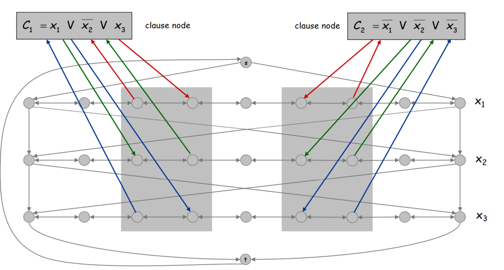
              - 𝞍 可满足当且仅当 G 存在一个哈密顿回路
                - =>
                  - 假设 3-SAT 实例有一个满足的赋值 x*：
                  - 在 G 中定义汉密尔顿环如下：
                    - 若 x*i = 1，则从左向右遍历第 i 行;
                    - 若 x*i = 0，则从右向左遍历第 i 行;
                    - 对于每个clause Cj，至少存在一行 i可以将节点 Cj 接入环路 
                - <=
                  - 假设 G 包含一个哈密顿环 T
                  - 如果环 T 进入clause节点 Cj，它必须通过配对边离开该节点
                  - 因此，Cj 节点的前后相邻节点在 G 中由边 e 连接起来
                  - 将 Cj 从环中移除，并用边 e 替换它，即可得到 G – { Cj } 上的哈密顿环
                  - 以此类推，最终得到 G – { C1, C2, …, Ck} 上的哈密尔顿环 T’
                  - 若 T’ 从左至右遍历第 i 行，则设 x*i = 1
                  - 由于 T 访问了每个clause节点 Cj，每个clause均被满足    
            - DIR-HAM-CYCLE ≤p HAM-CYCLE
              - HAM-CYCLE是NP
              - 给定一个有向图 G = (V, E)，构造一个具有 3n 个节点的无向图 G’
              - 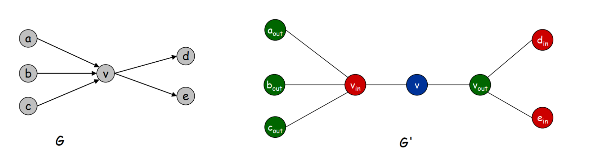
              - G 具有哈密顿环当且仅当 G’ 具有哈密顿环
                - =>
                  - 假设图 G 存在一个有向哈密顿回路
                  - 那么图 G’ 存在一个无向哈密顿回路（顺序相同） 
                - <= 
                  - 假设 G’ 包含一个无向哈密尔顿环
                  - 该环必须按以下两种顺序之一访问 G’ 中的节点：
                  - …, B, G, R, B, G, R, B, G, R, B, …
                  - …, B, R, G, B, R, G, B, R, G, B, …
                  - 该环中的蓝色节点在 G 中构成有向哈密尔顿环，或其逆环
              - 3-SAT ≤p HAM-CYCLE，3-SAT为NPC,HAM-CYCLE为NPC
          - TSP是NPC
            - TSP（旅行商问题，Traveling Salesperson Problem）。给定 n 个城市和距离函数 d(u, v)，是否存在一条长度 ≤ D 的环路？
            - HAM-CYCLE ≤p TSP
              - TSP是NP
              - 给定 HAM-CYCLE 的instance G = (V, E)，创建 n 个城市，其距离函数为
                $$d(u, v) = 
                \begin{cases} 
                1 & \text{if } (u, v) \in E \\
                2 & \text{if } (u, v) \notin E 
                \end{cases}$$
              - 令D=n，则G有哈密尔顿环当且仅当TSP长度 ≤ D 的环路存在
          - Longest Path是NPC
            - 最长路径问题。给定有向图 G = (V, E)，是否存在一条长度至少为 k 条边的简单路径？
            - 3-SAT ≤p Longest Path
              - 与3-SAT ≤p DIR-HAM-CYCLE类似，忽略t->s的边，设k为环路长度即可
          - 3-COLOR是NPC
            - 3-COLOR：给定一个无向图 G，是否存在一种方法，将节点分别染成红色、绿色和蓝色，且相邻节点颜色不同？
            - 应用：
              - 寄存器分配。将程序变量分配到寄存器中，确保使用的寄存器不超过 k 个，且任何两个需要同时访问的程序变量都不被分配到同一个寄存器中
                - 干扰图。节点是程序变量名，若存在某项操作使得 u 和 v 同时处于“活动”状态，则 u 和 v 之间存在边。
                - 当且仅当干扰图是k-可着色的，可解决寄存器分配问题[Chaitin 1982]
                - 对于任意常数 k ≥ 3，k-REGISTER-ALLOCATION ≤p 3-COLOR  
            - 3-SAT ≤p 3-COLOR
              - 对于每个literal，创建一个节点;
              -  将每个literal与其否定连接起来;
              -  创建 3 个新节点 T、F、B；将它们连接成一个三角形;
              -  将每个literal与 B 连接起来;
               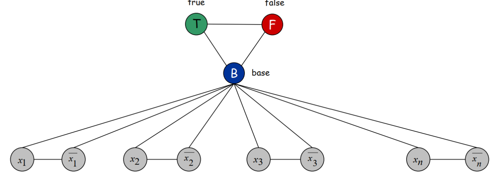
              -  对于每个clause，添加6 个节点和 13 条边
               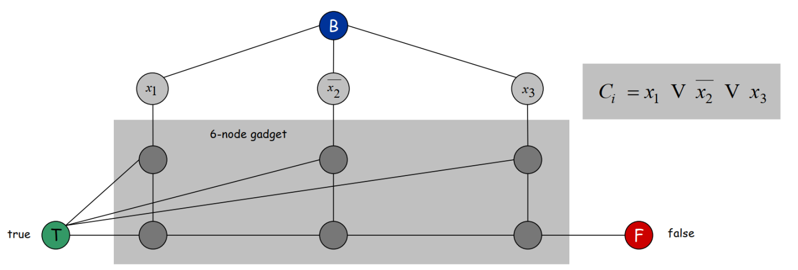
              - 图是三色的当且仅当 𝛟 是可满足的
              - => 
                - 将所有值为 T 的literal设为真
                - 确保每个literal均为 T 或 F
                - 确保一个literal与其否定为互补关系
                - 确保每个clause中至少有一个literal为 T
              - <=
                - 将所有真 literal 标记为 T，假literal 标记为 F
                - 将绿色节点下方的节点标记为 F，该节点下方的节点标记为 B
                - 将剩余的中间行节点标记为 B
                - 将剩余的底部节点标记为 T 或 F（根据强制关系）
          - 3D-MATCHING是NPC
            - 3D-MATCHING：给定三个互不相交的集合 X、Y 和 Z，每个集合的元素数均为 n，以及一个包含三元组的集合 T ⊆ X × Y × Z，是否存在一个由 n 个三元组组成的子集，使得 X ∪ Y ∪ Z 中的每个元素恰好属于其中一个三元组？
            - Ex：给定 n 名教师、n 门课程和 n 个时间段，以及一份包含每位教师愿意教授的课程和时间段的列表，是否可以制定一种排课方案，使得所有课程都在不同的时间段内进行？
            - 3-SAT ≤p 3D-MATCHING
              - 为每个literal xi 创建一个包含 2k 个core和 2k 个tip的小工具 xi。（k为clause数量）
              - 只有小工具内部的三元组会使用小工具内的core
              - 在小工具 i 中，3D-MATCHING必须使用所有灰色三元组（对应 xi = true）或所有蓝色三元组（对应 xi = false）
              - 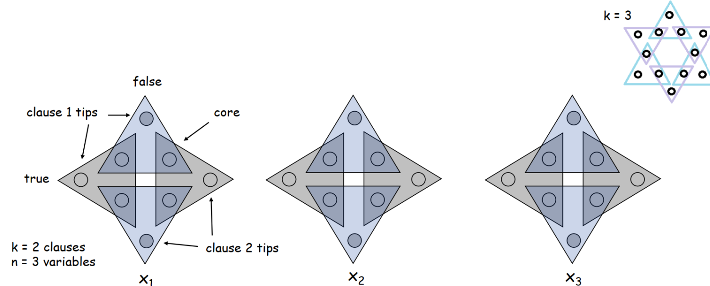
              - 对于每个clause Cj，创建一个包含两个元素和三个三元组的小工具Cj
              - 在任何 3D-MATCHING中，小工具Cj的三元组中仅有一个会被使用
              - 确保任何 3D-MATCHING都使用以下其中之一：(i) x1 的灰色核心，或 (ii) x2 的蓝色核心，或 (iii) x3 的灰色核心
              - 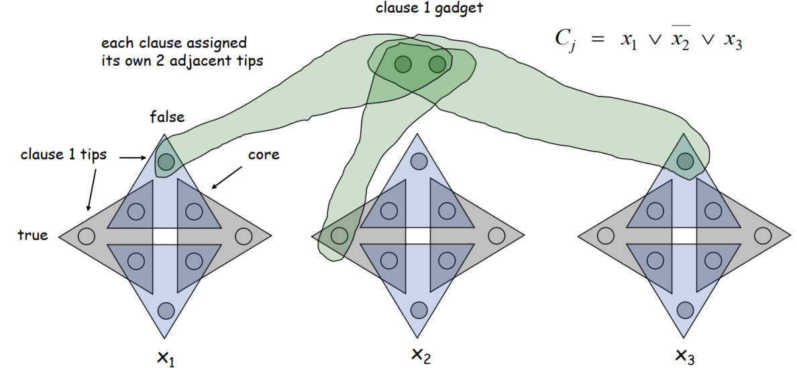
              - 共有 2nk 个tips。其中 nk 个由蓝色/灰色三元组覆盖，k 个由clause的三元组覆盖。
              - 为了覆盖剩余的 (n-1)k 个tips，创建 (n-1)k 个clean小工具，每个clean小工具都连接到**所有** 2nk 个tip，以满足3D-MATCHING条件
              - 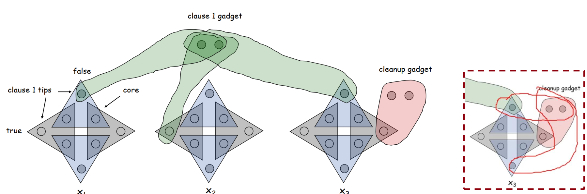 
              - X = 红，Y = 绿，Z = 蓝
              - 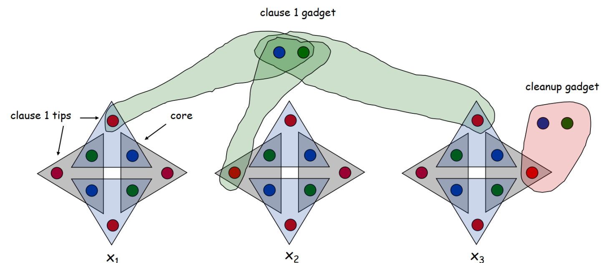
              - 此instance具有 3D-MATCHING当且仅当 𝛟 可满足
              - => 
                - 如果是 3D-MATCHING，则根据小工具 xi 中选中的三元组的颜色来赋值 xi
              - <=
                - 如果 𝛟 可满足，则使用 xi 的赋值来选择小工具 xi 的三元组，使用 Cj 中的真literal来选择小工具 Cj 的三元组
          - SUBSET-SUM是NPC
            - SUBSET-SUM。给定自然数 w1, …, wn 和一个整数 W，是否存在一个子集，其各元素之和恰好等于 W？
            - Ex：{ 1, 4, 16, 64, 256, 1040, 1041, 1093, 1284, 1344 }, W = 3754. 答案：1 + 16 + 64 + 256 + 1040 + 1093 + 1284 = 3754
            - **对于算术问题，输入整数采用二进制编码。多项式归约必须是二进制编码下的多项式。**
            - 3-SAT ≤p SUBSET-SUM
              - 给定一个包含 n 个变量和 k 个子句的 3-SAT 实例 𝛟，构造 2n + 2k 个十进制整数，每个整数由 n + k 位数字组成，具体如下所示：
              - 每个literal和每个clause对应一个十进制位；
              - 每个literal对应两个数字；
              - 每个clause对应两个木偶数字（确保每个clause的十进制位之和为 4）；
              - 每个literal的十进制位之和为 1；
              - 每个clause的十进制位之和为 4。
              - 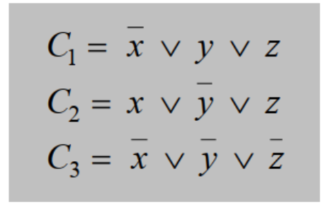
              - 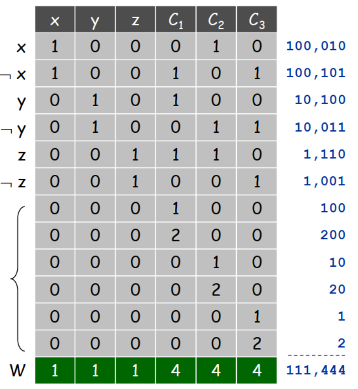
              - 𝛟 可满足当且仅当存在一个子集，其元素之和等于 W
                - => 
                  - 假设 𝛟 可满足，为每个真literal选择对应的数字：
                  - 根据所选数字，每个literal的十进制位之和为 1：
                  - 选择木偶数字，由于 𝛟 可满足，每个clause的各位数字之和可以等于 4
                - <=
                  - 假设有一个子集，其和为 W：
                  - 每个literal十进制位迫使该子集从 x 和 ¬x 中选择
                  且仅选择一个；
                  - 每个clause十进制位迫使该子集在该clause中选择至少
                  一个literal；
                  - 根据所选literal为每个变量赋值
            - 3D-MATCHING ≤p SUBSET-SUM
              - 设 X ∪ Y ∪ Z 是具有三元组集 T 的 3D-MATCHING instance。设 n = |X| = |Y| = |Z| 且m = |T|
              - 设 X = { x1, x2, x3, ...,xn }, Y = { y1, y2, y3,... ,yn }, Z = { z1, z2, z3,..., zn }
              - 对于每个三元组 t = (xi, yj, zk) ∊ T，构造一个 m+1 进制的，位数为 3n 的整数 wt，其第 i、n+j 和 2n+k 位上均为 1
              - 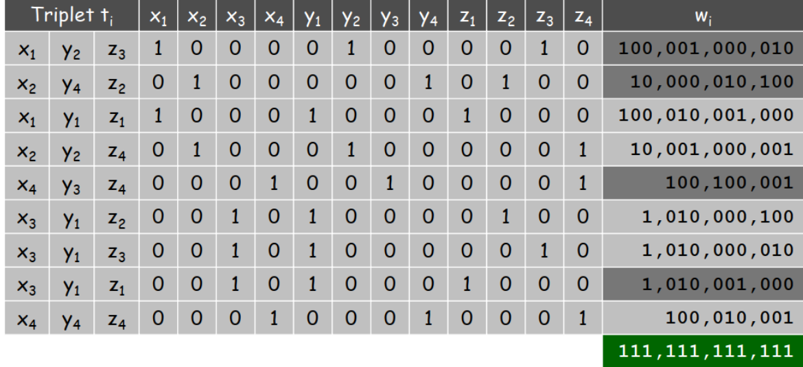
              - 3D-MATCHING 存在当且仅当存在某个子集之和等于 W = 111,…,111
              - => 
                - 假设 3D-MATCHING 存在，为每个选取的三元组选择对应的数字，构成子集
                - 可以确保子集之和等于 W
              - <=
                - 假设有一个子集，其和为 W
                - 选取子集中的数字对应的三元组
                - 可以确保X,Y,Z中每个元素被选取且仅选取一次
        - 对于困难问题的部分分类法     
          - 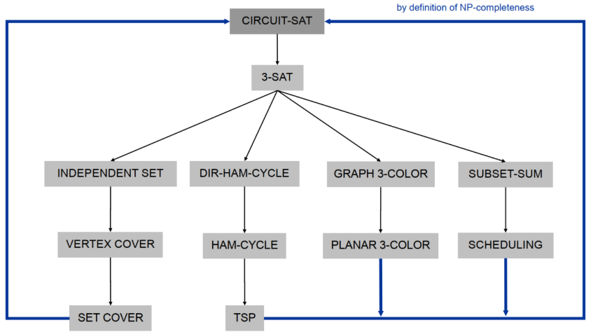
          - 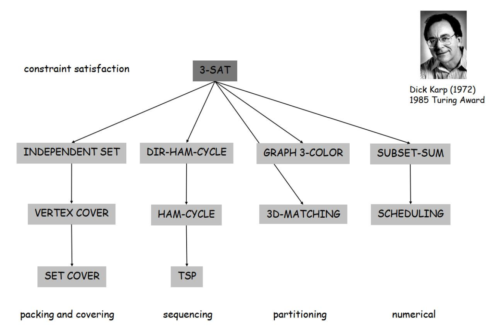       
        - NPC的六大基本类别及其典型示例
          - 装箱问题：集合装箱（SET-PACKING）、独立集（INDEPENDENT SET）
          - 覆盖问题：集合覆盖（SET-COVER）、顶点覆盖（VERTEX-COVER）
          - 约束满足问题：SAT、3-SAT
          - 排序问题：汉密尔顿环（HAMILTONIAN-CYCLE）、旅行商问题（TSP）
          - 划分问题：3D配对（3D-MATCHING）、三色问题（3-COLOR）
          - 数值问题：子集和（SUBSET-SUM）、背包问题（KNAPSACK）
      - 已知大多数NP问题要么属于P类，要么属于NPC问题,例外包括因式分解、图同构、纳什均衡
      - 除非P = NP，否则NP中存在既不属于P类也不属于NP完全问题的问题[Ladner 1975]
      - Ising Model
        - 1926年：伊辛提出了一个描述相变的简单模型;
        - 1944年：昂萨格找到了二维伊辛模型的闭式解;
        - 19xx年：费曼等顶尖科学家开始寻求三维伊辛模型的解;
        - 2000年：伊斯特里亚尔证明了三维伊辛模型是NPC问题；因此，寻找三维伊辛模型闭式解的努力注定要失败
      - 困难问题
        - 航空航天工程：有限元法的最优网格划分。
        - 生物学：蛋白质折叠。
        - 化学工程：换热器网络合成。
        - 土木工程：城市交通流的平衡。
        - 经济学：存在摩擦的金融市场中套利计算。
        - 电气工程：超大规模集成电路（VLSI）布局。
        - 环境工程：污染物传感器的最优布置。
        - 金融工程：在给定收益率下寻找风险最小的投资组合。
        - 博弈论：寻找能最大化社会福利的纳什均衡。
        - 基因组学：系统发育重建。
        - 机械工程：剪切流中的湍流结构。
        - 医学：根据双平面血管心电图重建三维形状。
        - 运筹学：最优资源分配。
        - 物理学：统计力学中三维伊辛模型的配分函数。
        - 政治学：夏普利-舒比克投票权。
        - 流行文化：扫雷游戏的一致性。
        - 统计学：最优实验设计
      - NP-Hard
        - 指这样一类问题：NP类中的每个问题都能归约到它[Bell Labs, Steve Cook, Ron Rivest, Sartaj Sahni]
        - NPC ≤p NPH
  - Co-NP 与 NP 的非对称性
    - NP的不对称性：NP是存在多项式时间验证器的决定性问题。我们只需对“是”的实例给出简短的验证，而对于“否”的实例可能难以给出验证
      - Ex:
        - 可满足性（SAT）与重言式（TAUTOLOGY）
          - 可以通过给出赋值来验证一个 CNF 是可满足的
          - 如何验证一个CNF不可满足？
          - 重言式属于哪类问题？
            - SAT 是 NPC问题，且 SAT ≡p TAUTOLOGY
            - 但目前甚至不知道重言式是否属于 NP（TAUTOLOGY不满足NPC的第一个条件）
        - 哈密尔顿环与非哈密尔顿环
          - 可以通过给出一个哈密尔顿环来验证一个图是哈密尔顿图
          - 如何验证一个图不是哈密尔顿图？ 
    - Co-NP
      - 对于给定的决定性问题X，其补问题$\overline{X}$是指X的“是”和“否”的答案被互换，其余不变的对称问题。
      - Ex 
        - $\overline{X}$ = {0, 1, 4, 6, 8, 9, 10, 12, 14, 15, …}
          X = {2, 3, 5, 7, 11, 13, 17, 23, 29, …}
      - Co-NP：NP决定性问题的补集。对于“否”实例，存在简洁的验证器
    - NP =? co-NP 
      - 所有“是”实例存在简洁的验证器等价于所有“否”实例存在简洁的验证器吗？
    - 若 NP ≠ co-NP，则 P ≠ NP
      - P 具有补集封闭性，若 P = NP，则 NP 具有补集封闭性，NP = co-NP
    - [Edmonds 1965] NP ⋂ co-NP
      - 如果问题 X 同时属于 NP 和 co-NP，那么对于“是”与“否”的实例，都存在简洁的验证
      - Ex
        - 给定一个二分图，是否存在一个完美配对？
        - 若存在，能否给出一个完美配对？
        - 若不存在，能否给出一个节点集 S，使得 |N(S)| < |S|
    - P ⊆ NP ⋂ co-NP
    - P =? NP ⋂ co-NP
      - 许多属于NP ⋂ co-NP的问题最初被认为非平凡，直到数年后
      才被发现属于 P
      - 线性规划 [Khachiyan, 1979]
      - 素数判定 [Agrawal-Kayal-Saxena, 2002]
      - 因式分解问题属于NP⋂co-NP，但尚未确定是否属于P。如果存在多项式时间因式分解算法，RSA密码系统不再理论安全

### PSPACE
- PSPACE
  - 地理游戏。艾米说出她所在国家的首都c。鲍勃说出一个以c结尾的字母开头的首都c’。艾米和鲍勃重复这个游戏，直到其中一名玩家无法继续。艾米是否必然获胜？
    - Ex：Budapest → Tokyo → Ottawa → Ankara → Amsterdam → Moscow → Washington → Nairobi → …（布达佩斯 → 东京 → 渥太华 → 安卡拉 → 阿姆斯特丹 → 莫斯科 → 华盛顿 → 内罗毕 → …）
    - 图论中的地理游戏。给定一个有向图 G = (V, E) 和一个起始节点 s，两名玩家轮流进行，在可能的情况下，沿当前节点的一条边前往一个未访问过的节点。第一位玩家能否保证能做出最后一步合法移动？
    - 某些问题（尤其是涉及双人游戏和人工智能的问题）无法根据 P、NP 和 NPC进行分类
  - PSPACE：可在多项式空间内求解的决定性问题
    - P ⊆ PSPACE：多项式时间算法最多只能消耗多项式空间
      - 多项式时间算法的运行步数是 \(O(n^k)\)，k 为常数；
      - 算法每一步最多只新开 / 占用常数大小的内存空间；
      - 总占用空间 ≤ 总运行步数 ⇒ 空间也是 \(O(n^k)\)，即多项式空间。 
    - 3-SAT 属于 PSPACE 
      - 变量总共有 \(2^n\) 种布尔赋值组合；
      - 递归枚举所有赋值：
        - 依次给每个变量赋 0/1
        - 递归栈深度最多 n
      - 每枚举一个赋值，检查所有子句是否全部满足；
      - 找到满足赋值则输出 Yes，全部遍历完无满足赋值输出 No。
    - NP ⊆ PSPACE
      - 考虑NP中的任意问题Y
      - 由于Y ≤p 3-SAT，存在一种算法，能在多项式时间内解决Y，并调用3-SAT预言机多项式次
      - 该预言机可在多项式空间内实现
    - QSAT（Quantified 3-SAT，带量词的3-SAT）:设 𝚽(X1,…Xn) 是一个布尔CNF范式。下列命题范式是否为真？
      - $\exists x_1\ \forall x_2\ \exists x_3\ \forall x_4\ \cdots\ \forall x_{n-1}\ \exists x_n\ \Phi(x_1, \dots, x_n)$（假定n为奇数）
      - Ex：艾米先为 X1 选定真值，然后由鲍勃为 X2 选定，接着由艾米为 X3 选定，依此类推。无论鲍勃如何选择，艾米都能满足 𝚽 吗？ 
        -  $$
          (x_1 \lor x_2) \land (x_2 \lor \overline{x_3}) \land (x_1 \lor \overline{x_2} \lor x_3)
          $$
        - Yes
        -  Amy sets $x_1$ true; Bob sets $x_2$; Amy sets $x_3$ to be same as $x_2$.
        - $$
          (x_1 \lor x_2) \land (\overline{x_2} \lor \overline{x_3}) \land (\overline{x_1} \lor \overline{x_2} \lor x_3)
          $$
        - No
        - If Amy sets $x_1$ false; Bob sets $x_2$ false; Amy loses.
          If Amy sets $x_1$ true; Bob sets $x_2$ true; Amy loses.
      - QSAT ∈ PSPACE
        - 递归尝试所有可能的情况
          - 每个子问题只需一个比特
          - 空间消耗与函数调用栈的深度成正比，最多n
          - 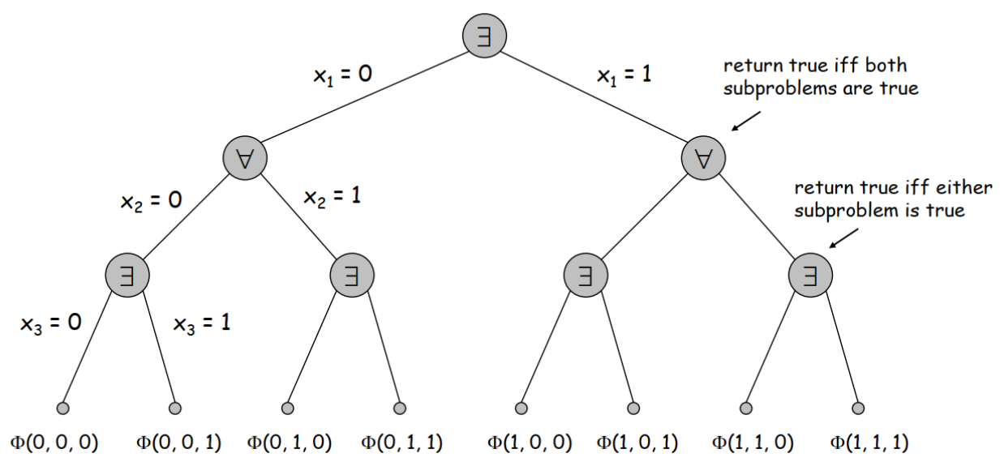
    - 规划问题
      - 8拼图、15拼图[Sam Loyd 1870s]
        - 棋盘：标有1至8的方块组成的3×3网格/标有1至15的方块组成的4×4网格
        - 合法走法：将相邻的方块滑入空白格中
        - 找出合法走法的序列，将初始布局转换为目标布局
        - 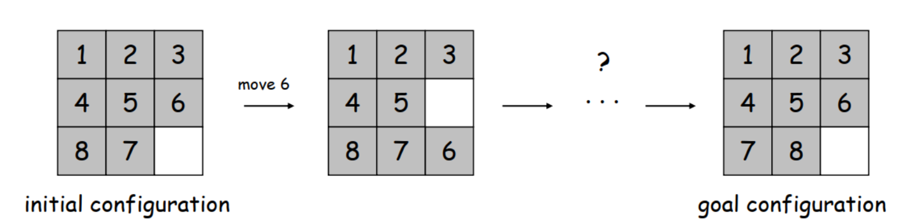 
      - 条件： C = { C1, …, Cn }
        - 初始布局：子集 c0 ⊆ C 表示初始满足的集合
        - 目标布局：子集 c* ⊆ C 表示我们试图满足的集合
        - 操作：设 O = { O1, …, Ok }
          - 调用操作符 Oi 时，必须满足某些先决条件
          - 调用 Oi 之后，某些条件变为真，某些条件变为假
      - 规划问题：能否可以通过应用一系列运算符，从初始布局推导出目标布局？
      - Ex：
        - 魔方
        - 人员、设备和物资的后勤调度
        - 8拼图
          - 条件定义
            $C_{ij},\ 1 \leq i, j \leq 9$。
            $C_{ij}$ 表示：数字 $i$ 的方块位于第 $j$ 个格子中。
          - 初始状态
            $c_0 = \{C_{11}, C_{22}, \dots, C_{66}, C_{78}, C_{87}, C_{99}\}$
          - 目标状态
            $c^* = \{C_{11}, C_{22}, \dots, C_{66}, C_{77}, C_{88}, C_{99}\}$
          - 操作算子
            - 应用操作 $O_i$ 的前提条件：$\{C_{78}, C_{99}\}$
            - 执行 $O_i$ 后，条件 $C_{79}$ 和 $C_{98}$ 变为真
            - 执行 $O_i$ 后，条件 $C_{78}$ 和 $C_{99}$ 变为假
          - 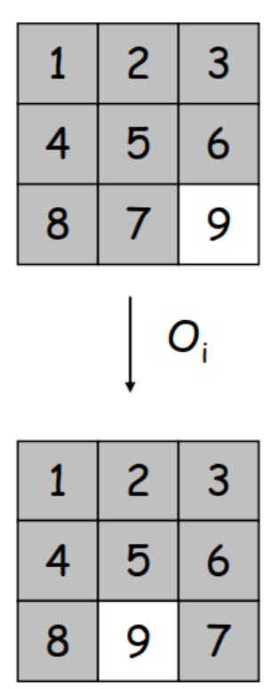
      - 布局图 G
        - 为每一种可能的布局创建一个节点，共 $2^n$ 个节点
        - 如果存在一个操作算子可以将布局 $c'$ 转换为布局 $c''$，则在图中添加一条从 $c'$ 指向 $c''$ 的边
      - 规划问题：在布局图中，是否存在一条从初始布局 $c_0$ 到目标布局 $c^*$ 的路径？
      - 规划问题属于 EXPTIME
        - 可以在布局图上BFS，寻找从 $c_0$ 到 $c^*$ 的路径（直接BFS的时间复杂度为O（V+E），空间复杂度为O(V)，目标比规划问题复杂，并不是最优算法）
      - 规划问题属于 PSPACE
        - 布局图最多可包含 $2^n$ 个节点，其最短路径的长度最多可达 $2^n - 1$
        - 假设存在一条从 c1 到 c2 的路径，其长度 ≤ L
        - 从 c1 到中点的路径以及从中点到 c2 的路径，各自的长度均 ≤ L/2
        - 枚举所有可能的中点
        - 递归深度 = $\log_2L=O(n)$
    - PSPACE-Complete：若满足以下两个条件，则问题 Y 为PSPACE-Complete：Y 属于 PSPACE，且对于 PSPACE 中的任意问题 X，X ≤p Y。                   
      - QSAT 是 PSPACE-complete[Stockmeyer-Meyer 1973]
      - PSPACE ⊆ EXPTIME
        - QSAT 为 PSPACE-complete，并且可用之前的算法在指数时间解答QSAT
      - P ⊆ NP ⊆ PSPACE ⊆ EXPTIME
        - 显然P ⊊ EXPTIME，但其余关系不清楚
      - Ex：
        - 许多游戏的自然推广
          - 黑白棋、六角棋、地理游戏、华容道, Instant Insanity，上海麻将连连看、五子棋、推箱子···
          - 这些游戏的广义版本
        - k 步停机问题？
        - 两个正则表达式是否描述了不同的语言？
        - 能否将带有附件的复杂物体移动并旋转，通过一条不规则形状的走廊？
        - 通信系统中是否可能出现死锁状态？
        - 竞争性设施选址
          - 输入：一个节点权重均为正的图，以及目标值 B。
          - 两名竞争玩家轮流选择节点。如果某个节点的任何邻居已被选中，则不得选择该节点。
          - 第二位玩家能否保证至少获得 B 单位的利润？
          - 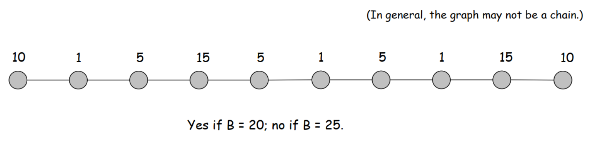
          - COMPETITIVE-FACILITY 是 PSPACE-complete
            - COMPETITIVE-FACILITY 是PSPACE
              - 要在多项式空间内解决该问题，可采用类似 QSAT 的递归方法，但每一步面临的选择数量最多为 n，而非 2
              - 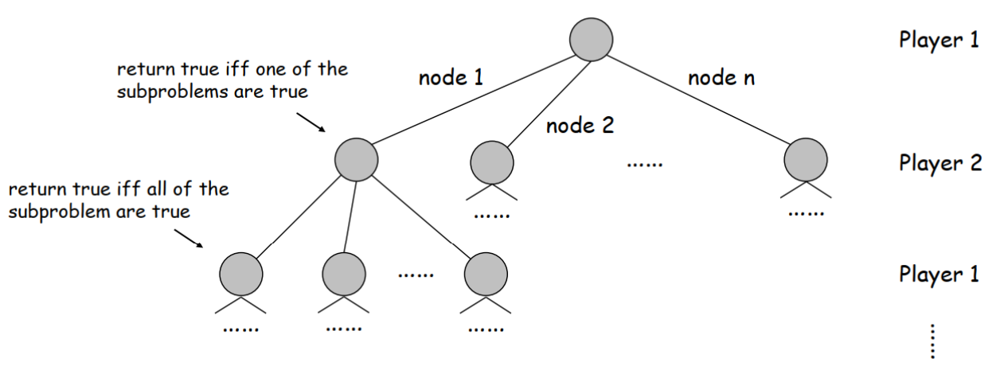  
            - QSAT ≤p COMPETITIVE-FACILITY
              - 给定一个 QSAT instance，构造一个 COMPETITIVE-FACILITY instance，使玩家 2能够获胜当且仅当 QSAT 为**假**（PSPACE具有补集封闭性）
              - 给定 QSAT 的instance 𝚽(X1, …, Xn ) = C1 ⋀ C2 ⋀ … Ck（假设n为奇数）:
                - 为每个literal及其否定添加一个节点，并将它们连接起来，使xi 与其否定至多只有一个可被选择
                - 选择一个大常数 c（例如 c ≥ k+2，保证 c > 1 即可），并将权重 $c^{n-i+1}$ 赋予文字 xi 及其否定；
                - 设 B = $c^{n-1} + c^{n-3} + … + c^{4} + c^{2} + 1$
                - 这确保变量按 x1, x2, …, xn 的顺序被选中
                - 按此规则，玩家 2 将输掉 1 个单位：$c^{n-1} + c^{n-3} + … + c^{4} + c^{2}$
                - 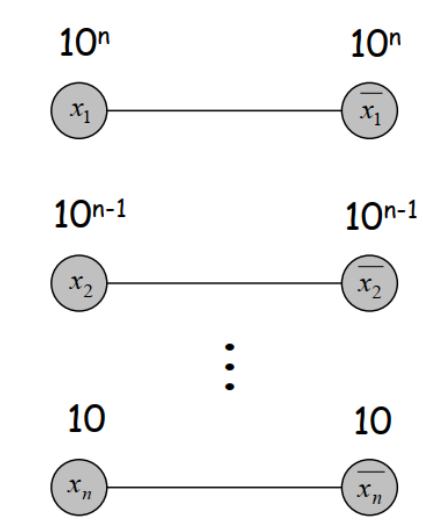              
                - 假设玩家 2 还有最后一步棋，她可以尝试借此获胜；
                  - 对于每个clause Cj，添加一个值为 1 的节点，并向其每个literal添加一条边
                  - 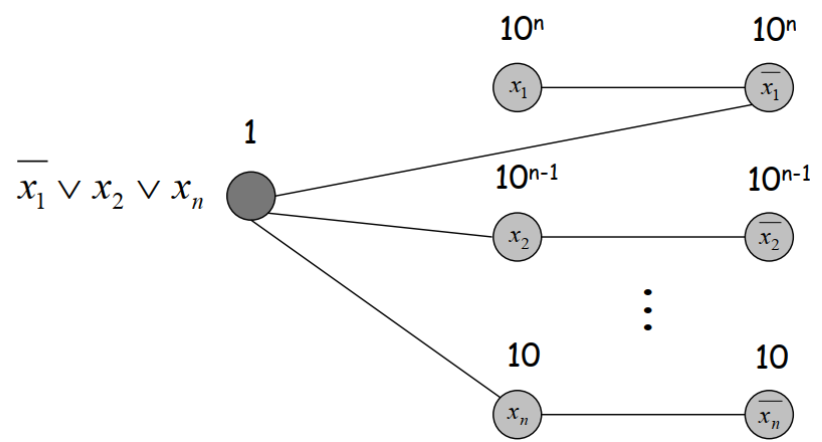      
                  - 玩家 2 能够进行最后一步操作从而获胜当且仅当由玩家交替定义的真值赋值未能满足某个clause，即：
                  - \[
                      \forall x_1\ \exists x_2\ \forall x_3\ \exists x_4\ \cdots\ \exists x_{n-1}\ \forall x_n\ \neg \Phi(x_1, \dots, x_n)
                      \]
                  - 由德摩根律，即：
                    \[
                       \neg \exists x_1\ \forall x_2\ \exists x_3\ \forall x_4\ \cdots\ \forall x_{n-1}\ \exists x_n\ \Phi(x_1, \dots, x_n)
                    \]
### 复杂度类别
- 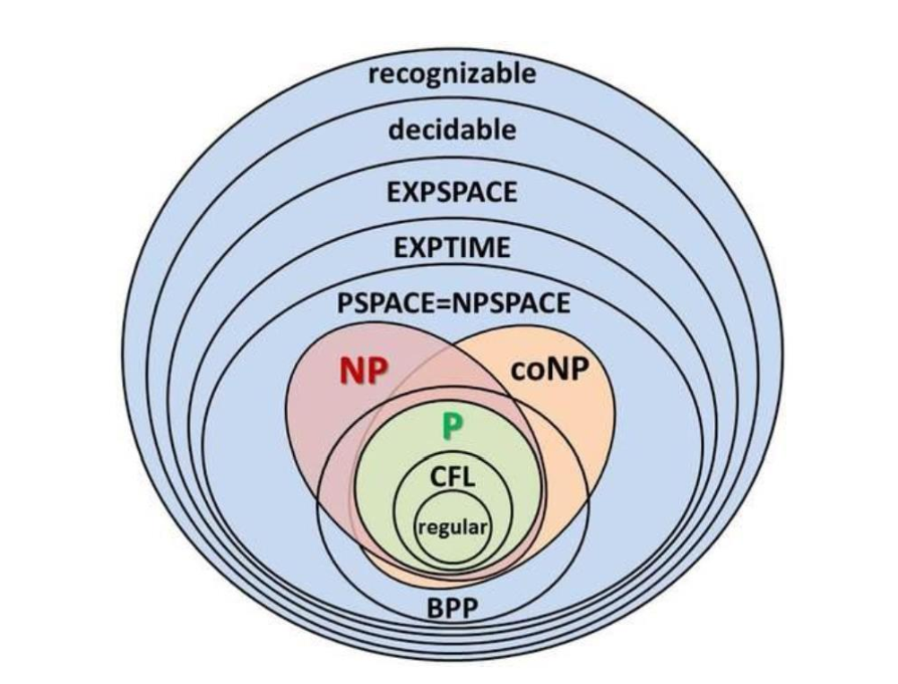
#### 1. Recognizable (可识别性，图灵机可计算性，递归可枚举语言)
- **定义**：存在图灵机可以**接受**该语言中的字符串，对非语言字符串可能无限循环
- **地位**：计算理论中**最广义**的语言类，包含所有其他复杂度类
- **核心**：图灵机可识别，但不一定可判定
- 停机问题的补集Unrecognizable

#### 2. Decidable (可判定性，递归语言)
- **定义**：存在图灵机对所有输入**必定停机**，并给出接受/拒绝结果
- **包含关系**：$\text{Decidable} \subsetneq \text{Recognizable}$
- **核心**：可判定 = 可识别 + 图灵机必然停机
- 对角线语言，停机问题是典型的Recognizable而Undecidable问题

#### 3. EXPSPACE
- **定义**：可在**指数级空间**内判定的问题类
- **包含关系**：$\text{EXPTIME} \subsetneq \text{EXPSPACE}$
- **核心**：空间复杂度最高的实用复杂度类之一

#### 4. EXPTIME
- **定义**：可在**指数级时间**内判定的问题类
- **典型问题**：五子棋、上海麻将连连看
- **包含关系**：$\text{PSPACE} \subsetneq \text{EXPTIME}$

#### 5. PSPACE = NPSPACE
- **核心定理**：**萨维奇定理 (Savitch's Theorem)**
  确定性多项式空间 = 非确定性多项式空间
- **定义**：可在**多项式空间**内解决的问题
- **典型问题**：QBF、黑白棋、六贯棋、推箱子、华容道
- **地位**：连接时间复杂度与空间复杂度的核心类

#### 6. NP 与 coNP
- **NP**：非确定性多项式时间，解可**多项式时间验证**
  典型问题：SAT、3-SAT
- **coNP**：NP 的补集，无解可多项式时间验证
  典型问题：重言式
- **关系**：$P \subseteq \text{NP} \cap \text{coNP}$

#### 7. P (确定性多项式时间)
- **定义**：可在**多项式时间**内求解的问题
- **地位**：计算机科学中“高效可解”的标准
- **包含关系**：$\text{CFL} \subsetneq \text{P}$

#### 8. CFL (上下文无关语言)
- **定义**：上下文无关文法生成、下推自动机识别
- **典型应用**：编程语言语法、括号匹配
- **包含关系**：$\text{Regular} \subsetneq \text{CFL}$

#### 9. Regular (正则语言)
- **定义**：有限自动机、正则表达式描述
- **地位**：**最受限**的语言类
- **典型应用**：词法分析、简单字符串匹配

#### 10. BPP (错误率有界概率多项式时间)
- **定义**：概率图灵机多项式时间判定，错误率有界
- **关系**：$P \subseteq \text{BPP} \subseteq \text{PSPACE}$

#### 已证明的包含关系
$$
\text{Regular} \subsetneq \text{CFL} \subsetneq \text{P} \subseteq \text{NP} \subseteq \text{PSPACE} \subsetneq \text{EXPTIME} \subsetneq \text{EXPSPACE} \subsetneq \text{Decidable} \subsetneq \text{Recognizable}
$$
#### 开放问题
1. $P \stackrel{?}{=} \text{NP}$
2. $\text{NP} \stackrel{?}{=} \text{coNP}$
3. $\text{BPP} \stackrel{?}{=} \text{P}$
#### 更多类型 
- 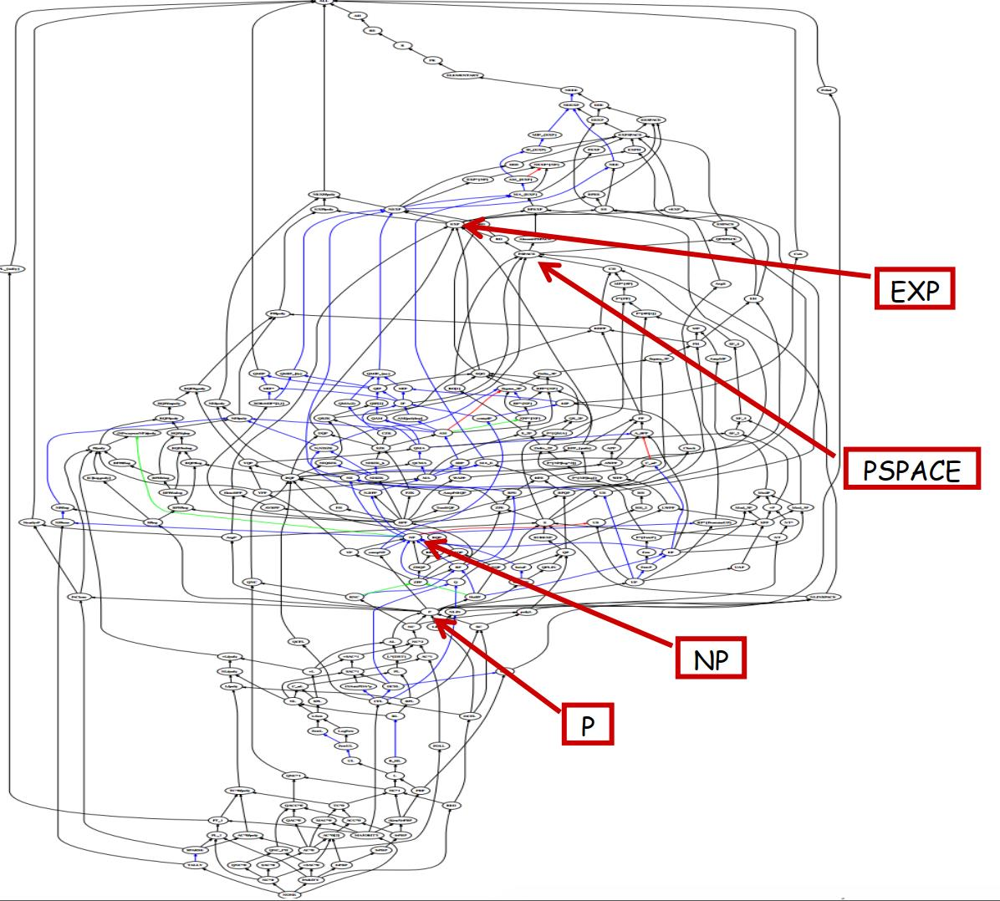
###
                     