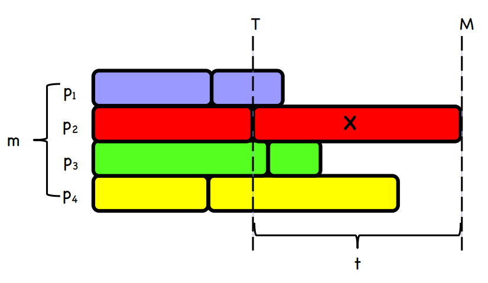
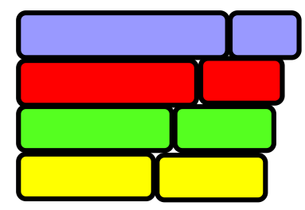
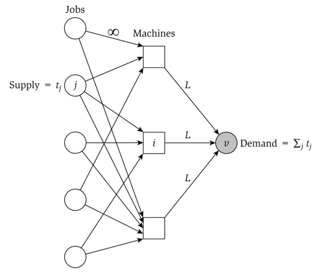
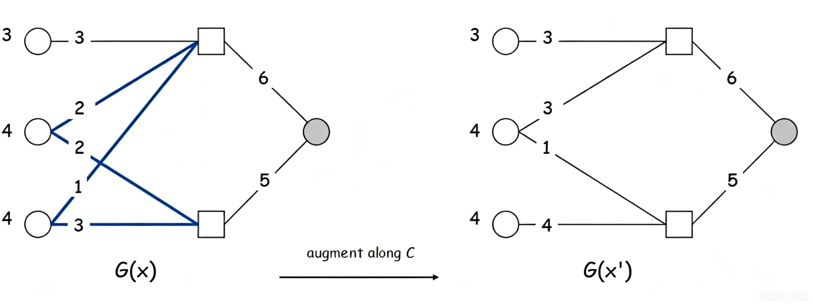

## 算法4

### 近似算法

- 近似算法
  - 假设需要解决一个NPC问题,必须牺牲以下三个特征中的至少一个：
    - 在多项式时间内解决问题。
    - 得到问题**最优解**。
    - 解决该问题的任意instance
  - 近似算法寻找近似最优解
  - 近似算法
    - 对于最大化问题X，如果算法A的返回值总是比最优解的1/a大，则称A为X的a-近似算法
    - 对于最小化问题X，如果算法A的返回值总是比最优解的a倍小，也称A为X的a-近似算法
    - a越接近1，算法越优秀
  - 最小成本覆盖问题
    - 覆盖问题
      - 设 Si 是第i个覆盖一些元素的集合。
      - 所有元素的集合为 X。
      - 我们希望选取最少数量的Si来覆盖X。
      - 设 T 为我们选取的教师集合。
      - 我们要求 Ui ∈ T Si = X，同时 T 应尽可能小。
    - 最小成本覆盖问题
      - 输入：集合族 F，每个集合都有一个成本，所有集合的并集为 X。
      - 输出: F 的一个子集 C，其并集为 X。
      - 目标：使集合 C 中各集合的总成本最小。
    - 最小成本覆盖问题是 NPC问题。
    - 我们将介绍一个 ln(n) 近似算法，其中 n=|X|。
    - 贪心近似算法
      - 一种自然的贪心启发式算法是选择覆盖成本最低的集合。
      - 对于每个集合，设 c 为其成本， p 为其覆盖的点数。
      - 我们希望使用 c/p 值最小的集合，因为这是覆盖点最便宜的方式。
      - 选定该集合后，移除其覆盖的所有点。
      - 对于剩余的点，继续选择成本最低的。

      ```presudo
        U = X
        C = ∅
        while 𝑈 ≠ ∅
        choose 𝑆 ∈ 𝐹 − 𝐶 with min |cost(S)|/|S∩U|
        C = C∪{S}
        U = U – S
        output C
      ```

    - 我们总是输出一个集合覆盖，因为 while 循环会持续进行直到 X 被覆盖。
    - 我们将证明近似比最大为 1 + 1/2 + 1/3 + ... + 1/n ≈ ln(n)。
    - 基本思路是利用每个元素的“平均成本”来对算法输出的集合覆盖成本进行上界估计
      - 按集合被加入 C 的时间对 C 中的集合进行排序，最早加入的集合排在最前面。
      - 设排序结果为 S1 , S2 , ..., Sm 。
      - 集合覆盖的成本为 L=Σi 𝑐𝑜𝑠𝑡(𝑆𝑖 )。
      - 按元素加入的时间对 X 中的元素进行排序，最早加入的元素排在最前。
      - 设排序为 e1 , e2 ,...,en 。
      - 则前几个 e 由 S1 添加，接下来的几个由 S2 添加，依此类推。
      - 由于 C 覆盖了 X，因此 X 中的每个元素都在该列表中。
      - 设 ni 表示 Si 所覆盖的新元素个数，则ni是 Si中包含的元素个数，但这些元素不属于 S1 …… Si-1。
      - 将 Si的成本平均分摊给它所覆盖的新元素。
      - 如果元素 e 是 Si 覆盖的新元素，则 cost(e) = cost(Si) / ni。
        $$
        \sum_{k} \operatorname{cost}\left(e_{k}\right)
        = \sum_{i} n_{i} \cdot \frac{\operatorname{cost}\left(S_{i}\right)}{n_{i}}
        = \sum_{i} \operatorname{cost}\left(S_{i}\right)
        = L
        $$
      - 每个元素都由某个 Si 覆盖，且 Si 覆盖 ni个新元素。
      - 对于任意 k， cost(ek) ≤ OPT/(n-k+1)。
        - 关注某个元素 ek，并令 Sj 表示首次覆盖 ek的集合。
        - 设 C1 、 ...、 Cm 为一个最优覆盖中的集合，且覆盖 U'={ek ,ek+1 ,ek+2 ,...,en }。
        - 设 n’1 ,…,n’m 分别表示 C1 ,…,Cm 所覆盖的 U' 中元素的个数。
        - 𝒄𝒐𝒔𝒕(𝑺𝒋)/𝒏𝒋 ≤ 𝑶𝑷𝑻/(𝒏 − 𝒌 + 𝟏)
          - 1. Σ𝒊 n′𝒊 ≥n-k+1。
            - C1 ,...,Cm 覆盖 U'。
          - 1. Σi 𝒄𝒐𝒔𝒕(𝑪𝒊 ) ≤ OPT。
            - C1 ,...,Cm 是成本为 OPT 的最优覆盖的一个子集。
          - 1. C1 ,...,Cm 均不在 S1 ,...,Sj-1之中。
            - 若某个 Ci 属于 S1 至 Sj-1 之中，则由于 Ci 覆盖了 U 中的某个 e， e 便会被 S1 至 Sj-1 所覆盖。因此， e 会出
            现在前 k-1 个被覆盖的元素之中，与假设矛盾。
          - 1. 在 \(C_1, \dots, C_m\)中，存在 \(C_i\) 使得
            \[
            \frac{\text{cost}(C_i)}{n'_i} \leq \frac{\text{OPT}}{n - k + 1}.
            \]
            - 如果\(C_1, \dots, C_m\)中的每个 \(C_i\) 都有
                \[
                \frac{\text{cost}(C_i)}{n'_i} \geq \frac{\text{OPT}}{n - k + 1},
                \]
            - 联合 a, b, 则
                \[
                \text{OPT}
                \geq \sum_i \text{cost}(C_i)
                = \sum_i n'_i \cdot \frac{\text{cost}(C_i)}{n'_i}
                \geq \sum_i n'_i \cdot \frac{\text{OPT}}{n - k + 1}
                = \frac{\text{OPT}}{n - k + 1} \sum_i n'_i
                \geq \frac{\text{OPT}}{n - k + 1} \cdot (n - k + 1)
                = \text{OPT}.
                \]
                矛盾
          - 在选择 Sj 时，算法唯一不允许选择的集合族是 S1 至 Sj-1。
            - 根据c， C1 ,…,Cm 不属于 S1 ,…,Sj-1。
          - 对于Sj，cost(Sj) / nj在所有不属于 S1 至 Sj-1 的集合中是最小值。
          - 根据d，存在某个 C ∈ {C₁, ..., Cm}，
              \[
              \frac{\text{cost}(C_i)}{n'_i} \leq \frac{\text{OPT}}{n - k + 1}.
              \]
          - 则
              \[
              \frac{\text{cost}(S_j)}{n_j} \leq \frac{\text{cost}(C_i)}{n'_i} \leq \frac{\text{OPT}}{n - k + 1}.
              \]
        - cost(ek) ≤ OPT/(n-k+1)
          - Sj 表示首次覆盖 ek的集合，则cost(ek) = 𝒄𝒐𝒔𝒕(𝑺𝒋)/𝒏𝒋
          - 则
            \[
            \text{cost}(e_k) \leq \frac{\text{OPT}}{n - k + 1}.
            \]
      - 若集合覆盖的最小成本为 V，则我们的集合覆盖成本至多为 ln(n)*V。
       \[
        L = \sum_{k} \text{cost}(e_k)
        \leq \sum_{k} \frac{\text{OPT}}{n - k + 1}
        \approx \ln(n) \cdot \text{OPT}
        \]
    - 任务调度
      - 如今的计算机都是并行的。
        - 系统中包含多个处理器。
        - 处理器需要运行多个任务。
      - 多处理器调度问题即决定哪些任务在何时由哪些处理器来运行。
        - 存在多种可能的目标。
          - 吞吐量：提升单位时间内可完成的任务总量
          - 公平性：均衡分配处理器资源，保障所有任务获取资源机会均等（**负载均衡**）
          - 能耗：合理调度降低处理器运行功耗，节约能源
          - **延迟**：缩短任务整体完工时长，尽可能快速完成全部任务
      - 任务调度
        - n 个独立的工作。
          - 工作有不同的大小，即执行工作所需的时间。
          - 工作可以按任何顺序完成。
          - 任何工作都可以在任何机器上完成。
        - m 个处理器。
          - 全部具有相同的速度。
          - 每个处理器一次只能完成一项工作。
          - 将作业分配给处理器。
          - 完工时间是最后一个处理器完成其所有作业的时间。
          - 要求最大限度地缩短完工时间，尽可能快速完成全部任务
      - NPC
        - SUBSET-SUM ≤p Scheduling
          - 令 (S,t) 为 SUBSET-SUM 的一个实例，S为集合，t为目标。令 s 为 S 中所有元素的总和。
          - 创建一组作业 J = S∪{s-2t}，并将它们调度到 2 个处理器上。
          - 如果 S 的某个子集之和为 t，则最小完工时间为 s-t。
            - 令S’⊆S 之和为 t。 将 S’ 中的作业和作业 s-2t 安排在处理器 1 上。因此 proc 1 在时间 t+s-2t=s-t 完成。 proc 2 执行 S-S' 中的工作，因此它也在时间 s-t 完成。
          - 如果最小完工时间为 s-t，则存在 S 的子集，其总和为 t。
            - 不妨令 proc 1 执行 s-2t 工作。由于 makespan 为 s-t，因此 proc 1 执行的其他作业的总大小必须为 s-t-(s-2t)=t。
          - (S,t) 是 SUBSET-SUM 的实例，当且仅当 makespan = s-t
      - Graham’s List Scheduling
        - 一种简单的贪心算法，是一种2-近似算法。
        - 如果有n个任务和m个处理器，与暴力法的 n!C(n+m-1, m-1) 时间相比，Graham’s List Scheduling只需要O(n log n + m)时间
        - 以任意顺序列出作业。只要还有未完成的工作，如果任何处理器现在没有工作，则将其分配给列表中的下一个工作。
        - 最坏情况
          - 假设有 m^2 个长度为 1 的作业，以及一个长度为 m 的作业。
          假设它们按 1,1,1,...,1,m 的顺序列出。
          - LS 的完工时间为 2m。OPT为 m+1。
          - makespan(LS) / makespan(opt) = 2m/(m+1) ≈ 2.
          - 对于列表调度来说，这是最坏的情况
        - LS 总是给出最多两倍于最优的时间表。
          - 假设 LS 给出的完工时间为 M，最优调度的完工时间为M*。
          - 证明 M ≤ 2M*
            - 考虑完成最晚的任务 X。 假设 X 从时间 T 开始，长度为 t
              
          - M*≥t
            - 最优解需要完成X，X至少需要t时间
          - M*≥T
            - X是完成最晚的任务，则所有处理器都工作了时间T，否则X会分配给在时间T之前就完成所有分配任务的处理器。则最优解也至少需要T时间
          - 则M* ≥ max(T,t)
          - X 是最后完成的作业，有M = T + t
          - 则M/M* ≤ (T+t)/max(T,t) ≤ 2
        - LPT(Longest processing time)
          - LS 最坏的情况发生在最长的作业最后安排的时候，排在最后的长作业是“危险的”。
          - 因此，可以先尝试安排最长的作业。
          - 最长处理时间 (LPT) 调度就像LS一样，不同之处在于它要求按大小非递增顺序对任务进行排序。
        - LPT 的近似比率为 4/3
          - 假设最佳完工时间为 M*，LPT 生成一个完工时间为 M 的计划。
          - 即证明 M ≤ 4/3 M*
          - 设 X 为最后完成的工作。 假设它在时间 T 开始并且大小为 t。
          - 不妨设 X 是最后启动的作业。
            - 如果不是，则有 Y 在 T 之后开始，T+t 之前完成，Y对LPT的makespan无影响。而且删除 Y不会增加OPT，对于证明来说提供了更严的要求，因此删除 Y可行
          - 1. X是最小的工作。
            - X 是最后启动的作业，因此由于 LPT 调度，它是最小的。
          - 1. M = T+t ≤ M*+t。
            - 与 LS 一样，在时间 T 之前没有处理器处于空闲状态
          - 若 t ≤ M*/3，则 M ≤ M* + t ≤ M*+ M*/3 = 4/3 M*
          - 若 t > M*/3
            - 由于 X 是最小的任务，因此所有任务的大小 > M*/3。
            - 因此，最佳调度中每个处理器最多有 2 个任务，n ≤ 2m。
            - 如果 1 ≤ n ≤ m，则 LPT 和最优调度都为每个处理器分配一个任务，makespan一致
            - 如果 m < n ≤ 2m，显然最佳调度的值与将任务按非递增顺序放在处理器 1,...,m上，然后 m,...,1得到的makespan一致。LPT正是这样安排任务的，所以LPT也得到最优解
                
        - LPT vs. LS
          - LPT比LS更快
          - 但是LS是在线算法
            - 想象一下工作一件接一件地到来。
            - LS可以将它们放在任何空闲的计算机上，不在乎顺序
          - 而LPT是离线算法
            - 它需要知道所有即将到达的作业，以便对它们进行排序。
          - 在现实的并行计算中，作业是即时获得的。
            - LS作为在线算法，通常更有用
  - 0-1背包问题
    - 我们有一组物品，每个物品都有一个重量和一个价值。
    - 我们有一个背包，最多可以承载 W 的重量。
    - 我们希望背包中放入的物品能够使总价值最大化，但又不超过重量限制。
    - **此处讨论令重量为常值**，通过所需价值一定，求最小负重问题的对偶转化求解问题
    - 所需价值一定，求最小负重
      - 算法：
        $$
        OPT(i, v) =
        \begin{cases}
        0 & \text{if } v ≤ 0 \\
        \inf & \text{if } i = 0, v > 0\\
        \min\left\{ OPT(i-1, v),\ w_i + OPT(i-1, v - v_i) \right\} & \text{otherwise}
        \end{cases}
        $$
    - 对偶问题转化：所需价值一定，求最小负重 => 负重一定，求最大价值
        \[
        V = \max_{v \le n v^*} v \quad \text{s.t.} \quad \text{OPT}(n, v) \le W
        \]
    - 运行时间：设物品价值最大值为v*，求解 OPT(i,v) 形式的所有子问题，其中 i ≤ n 和 v ≤ nv*。，则复杂度为O(n^2v*)
      - 问题大小为 O(n log(v*))，需要 log(v*) 位来表示每个物品的值。但 O(n^2v*)不是 n log(v*) 的多项式，是“伪多项式”。
    - PTAS（多项式时间近似方案，Polynomial Time Approximation Scheme）
      - 令 ε>0 为任意数字。我们将给出背包的 (1+ ε) 近似值。
      - 通过将 ε 设置得足够小，我们可以获得我们想要的尽可能好的近似值，这种类型的算法称为PTAS。
      - 与我们研究的早期算法进行对比，早期算法的近似率更差，例如 2 或 log n。
      - 但PTAS的运行时间为 O(n^3/ε)。 因此，我们不能设置ε=0来得到最优解。
      - 我们用准确性来换取时间。越准确（ε越小），算法花费的时间就越多
    - 由于我们只需要一个近似解，因此我们可以稍微更改物品的值（对值进行四舍五入），并且不会对解产生太大影响。
      - 我们对原始值进行缩放和舍入以使其变小。
      - 复杂度为O(n^2v*)， 因此如果舍入值很小，PTAS的速度会很快
    - 近似算法
      - 令 ε >0 为我们想要的精度。
      - 将 θ = εv*/2n 设置为缩放因子。
      - 将所有值按 θ 缩小，然后向上舍入。
        - v′ = \(\lceil v/θ \rceil\)
      - 将每个值 vi 替换为 v'i。 将价值被替换后的新问题称为缩放舍入问题。
      - 令 \(v`\)为缩放舍入问题中的最大值。则 \(v`\) = \(\lceil v^*/\theta \rceil = 2n/\epsilon\)
      - PTAS 在缩放舍入问题上的运行时间为 \(O(n^2v^{`}) =O(n^3/ε)\)
    - 提出另一个新问题，其中每个值 vi 被替换为 \(u = \lceil v/θ \rceil * θ\)，称为舍入问题。
      - ui ≥ vi 和 ui ≤ vi + θ。
      - u = v' * θ,因此舍入问题和缩放舍入问题的最优解是相同的。
      - 我们现在有 3 个问题，原始问题,缩放舍入问题和舍入问题。
      - 令 S 为缩放舍入问题的最优解，我们可以在 O(n^3/ε) 时间内找到它。则 S 对于舍入问题也是最优的。
      - 我们将证明 S 是原始问题的 1+ε 近似值。
        - \[
            \begin{align*}
            \sum_{i \in S^*} v_i &\leq \sum_{i \in S^*} u_i \ \ u_i \ge v_i\\
            &\leq \sum_{i \in S} u_i \ \ S是舍入问题最优解\\
            &\leq \sum_{i \in S} (v_i + \theta) \ \ u_i \le v_i + \theta\\
            &\leq \sum_{i \in S} v_i + n\theta \ \ |S| ≤ n\\
            \end{align*}
            \]
        - 假设物品 j 的价值最大，因此 $v^* = v_j$. 则
          $$
          n\theta = \frac{\varepsilon}{2} v_j \leq \frac{\varepsilon}{2} u_j \leq \frac{\varepsilon}{2} \sum_{i \in S} u_i
          $$
          - 最后一个不等式成立，因为j 本身是可行解，最优解 S 的总价值不小于uj
        - 则
          $$
          \sum_{i \in S} v_i \geq \sum_{i \in S} u_i - n\theta \geq \left( \frac{2}{\varepsilon} - 1 \right) n\theta
          $$

        - 设 $\varepsilon \leq 1$,则有
          $$
          n\theta \leq \varepsilon \sum_{i \in S} v_i
          $$

        - 得到
          $$
          \sum_{i \in S^*} v_i \leq \sum_{i \in S} v_i + n\theta \leq \sum_{i \in S} v_i + \varepsilon \sum_{i \in S} v_i = (1+\varepsilon) \sum_{i \in S} v_i
          $$
    - PTAS 也可以解决许多其他问题
      - 多处理器调度（缩放舍入）
      - 装箱问题（缩放舍入）
      - 欧几里得 TSP（缩放舍入）
    - 也有许多问题是不存在 PTAS 的，除非 P=NP。
  - 顶点覆盖
    - NPC
    - 给出简单的 2-近似算法
      - 令 D 为图中的所有边，C 为空集。
        - C 是我们最终的顶点覆盖。
      - 只要 D 中还剩下边，就重复操作：
        - 取 D 中的任意边 (u,v)。
        - 将 {u,v} 添加到 C。
        - 从 D 中删除与 u 或 v 相邻的所有边。
      - 输出C作为顶点覆盖
    - 证明
      - 输出是一个顶点覆盖。
        - 在每次迭代中，我们只删除被覆盖的边。
        - 不断添加顶点，直到覆盖所有边。
      - 证明它是 2-近似算法
        - 令C*为最佳顶点覆盖，A 为算法选取的边集
        - A 中的所有边都不互相接触。 
          - 每次我们选择一条边时，我们都会删除所有相邻的边。
        - 因此 C* 中的每个顶点最多覆盖 A 中的一条边。
          - 一个顶点覆盖的边是相互接触的。
        - A 中的每条边都被 C* 中的一个顶点覆盖
          - C*是顶点覆盖。
        - 由映射关系，|C*| ≥ |A|。
        - 该算法使用的顶点数为 2|A|。
        - 因此 (算法使用的#个顶点) / (opt cover 中的#个顶点) = 2|A| / |C*| ≤ 2|A| / |A| = 2。
  - 加权顶点覆盖
    - 给定一个具有顶点权重的图 G，找到最小权重的顶点覆盖。这是最小成本覆盖问题的特例，因此可以实现H(d*)近似比的贪心算法来，其中d* = max Degree
    - 当然，可以实现近似比更小的算法：定价算法
    - 定价算法：
      - 每条边一定会被某个顶点 i 覆盖。边 e 支付价格 pe ≥ 0 来使用顶点 i。
      - 公平性。与顶点 i 相关的边总共应支付 ≤ wi。
      - 对于任何顶点覆盖 S 和任何公平价格 pe：
      - \[
        \sum_{e \in E} p_e \leq w(S)
        \]
      - 证明：
        \[
        \sum_{e \in E} p_e
        \leq \sum_{i \in S} \sum_{e=(i,j)} p_e
        \leq \sum_{i \in S} w_i = w(S)
        \]
        - 第一个不等式：因为 S 是顶点覆盖，每条边 \(e=(i,j)\) 至少有一个端点在 S 中
      - 
        ```presudo
        Weighted-Vertex-Cover-Approx(G, w) {
          foreach e in E
              p_e = 0

          while (∃ edge i-j such that neither i nor j are tight(tight means ∑ e=(i,j)pe=wi))
              select such an edge e
              increase p_e without violating fairness

          S ← set of all tight nodes
          return S
          }
          ```
      - 定价算法是 2-近似算法
        - 由算法，每条边都至少有一个顶点是紧顶点，算法得到一个顶点覆盖S
        - 则有
          - \[
            w(S) = \sum_{i \in S} w_i
            = \sum_{i \in S} \sum_{e=(i,j)} p_e
            =2 \sum_{e \in E} p_e 
            \]
            - 第二个等式：S的顶点均为紧顶点
            - 第三个等式：S为顶点覆盖，相当于遍历边两遍
        - 设S*为最优覆盖，则
          - \[
            \sum_{e \in E} p_e \leq w(S^*)
            \]
        - 则
          - \[
            w(S) \leq 2w(S^*)
            \]
    - 对顶点覆盖问题的LP 舍入
      - ILP（整数线性规划）
        - 给定整数 \(a_{ij}\) 和 \(b_i\)，求满足以下条件的整数 \(x_j\)：
        - 矩阵形式：\[
        \begin{aligned}
        \text{(ILP) } \min \quad & c^T x \\
        \text{s.t.} \quad & Ax \ge b \\
        & x \ge 0 \\
        & x \text{ 为整数}
        \end{aligned}
        \]
        - 标量形式：\[
        \begin{aligned}
        \text{(ILP) } \min \quad & \sum_{j=1}^n c_j x_j \\
        \sum_{j=1}^n a_{ij} x_j &\ge b_i, \quad 1 \le i \le m \\
        x_j &\ge 0, \quad 1 \le j \le n \\
        x_j &\text{ 为整数}, \quad 1 \le j \le n
        \end{aligned}
        \]
      - LP
        - 在满足线性不等式约束的条件下，最大化或最小化一个线性目标函数。

        - 输入：整数 \(c_j, b_i, a_{ij}\)
        - 输出：实数 \(x_j\)

        - 矩阵形式
          \[
          \begin{aligned}
          \text{(LP) } \min \quad & c^T x \\
          \text{s.t.} \quad & Ax \ge b \\
          & x \ge 0
          \end{aligned}
          \]
        - 标量形式
          \[
          \begin{aligned}
          \text{(LP) } \min \quad & \sum_{j=1}^n c_j x_j \\
          \text{s.t.} \quad & \sum_{j=1}^n a_{ij} x_j \ge b_i, \quad 1 \le i \le m \\
          & x_j \ge 0, \quad 1 \le j \le n
          \end{aligned}
          \]

        - “线性”的含义
          - 目标函数和约束条件中不包含非线性项：
            - 二次项 \(x^2\)
            - 交叉项 \(xy\)
            - 非线性函数 \(\arccos(x)\)等

        - 求解算法
          - 单纯形法（Simplex algorithm） [Dantzig 1947]
            - 实践中可以高效求解线性规划问题。
          - 椭球法（Ellipsoid algorithm） [Khachian 1979]
            - 理论上证明了线性规划问题可以在多项式时间内求解。  
      - 形式化顶点覆盖问题为ILP
        - $$
            x_i =
            \begin{cases}
            0 & \text{如果顶点} i \text{不在顶点覆盖} \\
            1 & \text{如果顶点} i \text{在顶点覆盖}
            \end{cases}
          $$
        - \(\begin{aligned}
            \text{(ILP) } \min \quad & \sum_{i \in V} w_i x_i \\
            \text{s.t.} \quad & x_i + x_j \ge 1, \quad \forall (i,j) \in E \\
            & x_i \in \{0,1\}, \quad \forall i \in V
            \end{aligned}\) 
        - 顶点覆盖问题的整数线性规划建模说明整数线性规划是 NPH 的搜索问题。
      - 加权顶点覆盖的线性规划（LP）松弛形式
        - \[
            \begin{aligned}
            \text{(LP) } \min \quad  & \sum_{i \in V} w_i x_i \\
            \text{s.t.} \quad & x_i + x_j \ge 1, \quad \forall (i,j) \in E \\
            & x_i \ge 0, \quad \forall i \in V
            \end{aligned}
            \]
          - LP 的最优值 ≤ ILP的最优值
            - LP 比 ILP 约束更少（去掉了 \(x_i \in \{0,1\}\) 的整数限制，仅保留 \(x_i \ge 0\)），可行域更大，因此目标函数的最小值更小或相等
          - LP 与顶点覆盖问题并不等价，解可能是分数形式
            - 比如在三角形图中，每个顶点取 \(x_i = \frac{1}{2}\) 满足所有约束，但不是合法的顶点覆盖
          - 求解 LP 后，对分数解进行舍入操作，得到整数解
          - 若 \(x^*\) 是线性规划松弛问题（LP）的最优解，则定义顶点集合
            \[
            S = \{ i \in V : x^*_i \ge \tfrac{1}{2} \}
            \]
          - 该集合 \(S\) 是一个顶点覆盖，且其权重不超过最小权重的 2 倍。
            - \[
             \quad \forall (i,j) \in E, \ \max({x_i, x_j}) \ge  (x_i + x_j)/2 \ge 1/2 \\
             => x_i \in S \ or \ x_j \in S
            \]
          - S是一个顶点覆盖
          - 设 \(S^*\) 为最优顶点覆盖，则有
                \[
                \sum_{i \in S^*} w_i \ge \sum_{i \in V} w_i x^*_i \ge \frac{1}{2} \sum_{i \in S} w_i
                \]
                - 第一个不等式：LP 是 ILP 的松弛，因此 LP 最优值不大于 ILP 最优值。
                - 第二个不等式：由 \(x^*_i \ge \tfrac{1}{2}\)（对所有 \(i \in S\)）可得。
          - \(S\) 的权重不超过最优解的 2 倍
  - 广义负载均衡（Generalized Load Balancing）
    - 输入
      - 机器集合 \(M\)（共 \(m\) 台）；作业集合 \(J\)（共 \(n\) 个）
      - 作业 \(j\) 必须在其授权机器集合 \(M_j \subseteq M\) 上连续运行
      - 作业 \(j\) 的处理时间为 \(t_j\)
      - 每台机器同一时间最多处理一个作业
    - 定义：机器负载
      - 设 \(J(i)\) 为分配给机器 \(i\) 的作业集合，则机器 \(i\) 的负载为
          \[
          L_i = \sum_{j \in J(i)} t_j
          \]
    - 定义：完工时间（Makespan）
      - 所有机器中最大的负载，即
          \[
          \text{Makespan} = \max_i L_i
          \]
    - 将每个作业分配到其授权机器上，使完工时间最小化
    - 整数线性规划（ILP）建模
      - 变量定义：\(x_{ij}\) 表示机器 \(i\) 处理作业 \(j\) 的时间
      - \[
        \begin{aligned}
        \text{(ILP) } \min \quad & L \\
        \text{s.t.} \quad & \sum_{i} x_{ij} = t_j, \quad \forall j \in J \\
        & \sum_{j} x_{ij} \le L, \quad \forall i \in M \\
        & x_{ij} \in \{0, t_j\}, \quad \forall j \in J, i \in M_j \\
        & x_{ij} = 0, \quad \forall j \in J, i \notin M_j
        \end{aligned}
        \]

    - 线性规划（LP）松弛
      - \[
        \begin{aligned}
        \text{(LP) } \min \quad & L \\
        \text{s.t.} \quad & \sum_{i} x_{ij} = t_j, \quad \forall j \in J \\
        & \sum_{j} x_{ij} \le L, \quad \forall i \in M \\
        & x_{ij} \ge 0, \quad \forall j \in J, i \in M_j \\
        & x_{ij} = 0, \quad \forall j \in J, i \notin M_j
        \end{aligned}
        \]
    - 引理 1. 最优完工时间 L* ≥ maxj tj。
      - 必定有一台机器需要处理耗时最长的作业。
    - 引理 2. 设 L 为线性规划（LP）的最优解。则最优生产周期 L* ≥ L。
      - 线性规划（LP）的约束条件少于整数线性规划（ILP）的建模。
    - 引理 3. 设 \(x\) 为线性规划（LP）的一个解。定义图 \(G(x)\)：当且仅当 \(x_{ij} > 0\) 时，从机器 \(i\) 到作业 \(j\) 存在一条边。则 \(G(x)\) 是无环图。
      - 线性规划的网络流建模：
      \[
      \begin{cases}
      \sum_{i} x_{ij} = t_j & \forall\ j \in J \\
      \sum_{j} x_{ij} \le L & \forall\ i \in M \\
      x_{ij} \ge 0 & \forall\ j \in J,\ i \in M_j \\
      x_{ij} = 0 & \forall\ j \in J,\ i \notin M_j
      \end{cases}
      \]
      
      - 值为 \(L\) 的网络流问题的解，与值为 \(L\) 的线性规划解一一对应。
      - 设 \((x, L)\) 为线性规划的一个解。定义图 \(G(x)\)：当且仅当 \(x_{ij} > 0\) 时，从机器 \(i\) 到作业 \(j\) 存在一条边。则存在另一个解 \((x', L)\)，使得 \(G(x')\) 为无环图。
        - 设 \(C\) 为 \(G(x)\) 中的一个环。
        - 沿环 \(C\) 增广流（保持流守恒）。
        - 环 \(C\) 中至少会移除一条边（且不新增任何边）。
        - 重复上述过程，直到 \(G(x')\) 成为无环图。
         
    - 舍入解：找到满足 \(G(x)\) 为森林的线性规划解 \(x\)。任选一台机器节点 \(r\) 作为森林 \(G(x)\) 的根。
      - 若作业 \(j\) 为叶节点，则将 \(j\) 分配给其父节点机器 \(i\)。
      - 若作业 \(j\) 不是叶节点，则将 \(j\) 分配给它的任意一个子节点。
    - 引理 4. 舍入解仅将作业分配给授权机器。
      - 证明：若作业 \(j\) 被分配给机器 \(i\)，则 \(x_{ij} > 0\)。而线性规划解仅能对授权机器分配正值。
    - 引理 5. 若作业 \(j\) 为叶节点，且机器 \(i = \text{parent}(j)\)，则 \(x_{ij} = t_j\)。
      - 证明：由于 \(j\) 是叶节点，对所有 \(i \neq \text{parent}(j)\) 都有 \(x_{ij} = 0\)。而线性规划约束保证了 \(\sum_i x_{ij} = t_j\)。
    - 引理 6. 至多有一个非叶节点作业被分配到同一台机器上。
      - 证明：机器 \(i\) 上唯一可能被分配的非叶节点作业是它的父节点 \(\text{parent}(i)\)。
    - 舍入解是一个2-近似解。
      - 由 \(\sum_{i} x_{ij} = t_j, \quad \forall j \in J\)和引理4，作业都被分配且分配给授权机器
      - 设 \(J(i)\) 为分配给机器 \(i\) 的作业集合。
      - 由引理6，机器 \(i\) 上的负载 \(L_i\) 由两部分组成：
        - 叶节点作业  
        - \[
        \sum_{\substack{j \in J(i) \\ j \text{ 为叶节点}}} t_j
        \stackrel{\text{引理 5}}{=}
        \sum_{\substack{j \in J(i) \\ j \text{ 为叶节点}}} x_{ij}
        \le
        \sum_{j \in J(i)} x_{ij}
        \le
        L_{\text{OPT of LP}} \stackrel{\text{引理 2}}{\le} L^*
        \]
        - 对非叶节点部分，由引理 1 可得：
        - \[
        t_{\text{parent}(i)} \le L^*
        \]
      - 将两部分相加，可得机器 \(i\) 的总负载上界：
        \[
        L_i = \underbrace{\sum_{\substack{j \in J(i) \\ j \text{ 为叶节点}}} t_j}_{\le L^*} + \underbrace{t_{\text{parent}(i)}}_{\le L^*} \le L^* + L^* = 2L^*
        \]
      - 因此，机器 \(i\) 的总负载 \(L_i \le 2L^*\)。
      - 所以，makespan \(\max_{i \in M}{L_i} \le 2L^*\) 
  - K中心问题
    - 给定一座城市的 \(n\) 个站点集合 \(S\)，计划建造 \(k\) 个服务中心，记服务中心集合为 \(C\)。
    - 服务规则：每个站点由距离最近的中心提供服务。站点 \(s\) 到最近中心的距离定义为：
      \[
      d(s, C) = \min_{c \in C} d(s, c)
      \]
    - 优化目标：确保没有站点距离其服务中心过远，即最小化所有站点到最近中心的最大距离（半径）：
      \[
      \text{Minimize } r(C) = \max_{s \in S} \min_{c \in C} d(s, c)
      \]
    - 集合 \(C\) 称为集合 \(S\) 的一个覆盖
    - \(r(C)\) 称为覆盖 \(C\) 的半径
    - 如何选址 \(k\) 个中心，使半径 \(r(C)\) 最小？
      - 距离函数 \(d(\cdot,\cdot)\) 满足三角不等式。
    - NPC
      - 支配集 ≤p K中心问题
    - 我们将给出一个简单的2-近似算法。
      - 如果存在一个站点距离所有中心都最远，它会导致整体半径变大。我们在这个站点上新建一个中心，以此来降低半径。
      - Gonzalez’s Algorithm
         ```
          C is set of centers, initially empty.
          choose site s with maximum d(s,C)
          add s to C
          repeat k times
          return C
          ```
      - 允许将中心设置在与站点相同的位置。
    - 设 \(C\) 为算法的输出，\(r\) 为 \(C\) 的半径：
      \[
      r = \max_{s \in S} \min_{c \in C} d(s, c)
      \]
    - 引理 1：对任意 \(c, c' \in C\)，有 \(d(c, c') \ge r\)。
      - 由半径定义，必存在一个点 \(s \in S\)，它到所有中心的距离都 \(\ge r\)（若不存在这样的点，则 \(C\) 的半径会小于 \(r\)，矛盾）。
      -  因此，\(s\) 到 \(c\) 和 \(c'\) 的距离均 \(\ge r\)。
      -  不妨设 \(c'\) 是在 \(c\) 之后被加入 \(C\) 的。
      -  若 \(d(c, c') < r\)，则算法在迭代时会选择距离更远的 \(s\) 加入中心集合，而非 \(c'\)，与算法的选择矛盾。因此必有 \(d(c, c') \ge r\)。
    - 推论：存在 \(k+1\) 个点，两两之间的距离均 \(\ge r\)。
      - 由引理可知，算法输出的 \(k\) 个中心两两之间的距离 \(\ge r\)。
      - 此外，存在一个点 \(s \in S\)，它到所有中心的距离均 \(\ge r\)（否则 \(C\) 的覆盖半径会小于 \(r\)，矛盾）。
      - 因此，这 \(k\) 个中心加上点 \(s\)，就构成了 \(k+1\) 个两两距离 \(\ge r\) 的点。
      - 记这 \(k+1\) 个点的集合为 \(D\)。
    - 引理 2：设 \(C^*\) 为最优覆盖，半径为 \(r^*\)。若 \(r > 2r^*\)，则对每个 \(c \in D\)，都存在唯一对应的 \(c' \in C^*\)。
      - 对每个 \(c \in D\)，以 \(c\) 为圆心、\(r/2\) 为半径作圆。
      - 圆内必存在 \(c' \in C^*\)：
        - 由于 \(r^*\) 是最优半径，\(c\) 到其最近的最优中心距离不超过 \(r^*\)；
        - 又因为 \(r > 2r^*\)，即 \(r/2 > r^*\)，所以该最近的最优中心必然落在圆内。
      - 对任意 \(c_1, c_2 \in D\)，它们对应的圆互不相交：
        - 因为 \(d(c_1, c_2) \ge r\)，而两圆半径均为 \(r/2\)，故无交集。
      - 因此，两圆内的最优中心 \(c'_1, c'_2\) 必然不同，即所有 \(c'\) 是唯一的。
    - 设 \(C\) 为 Gonzalez 算法的输出，\(C^*\) 为最优 \(k\)-中心解，则：
      \[
      r(C) \le 2r(C^*)
      \]
      - 反证法，假设 \(r(C) > 2r(C^*)\)。
      - 根据引理 2，此时集合 \(D\) 中的每个点 \(c \in D\) 都对应一个唯一的 \(c' \in C^*\)。
      - 但根据之前的推论，集合 \(D\) 中包含 \(k+1\) 个点。
      - 这意味着最优解 \(C^*\) 中也必须包含 \(k+1\) 个不同的点，这与 \(C^*\) 是一个 \(k\)-中心（大小为 \(k\)）的定义相矛盾。
      - 因此，假设不成立，必有 \(r(C) \le 2r(C^*)\)。                                                    

